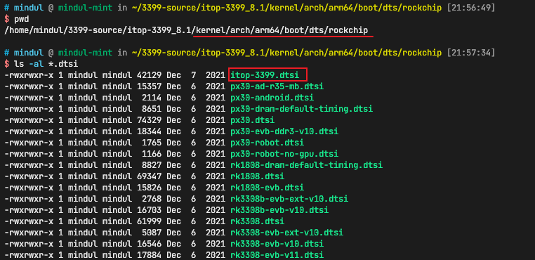
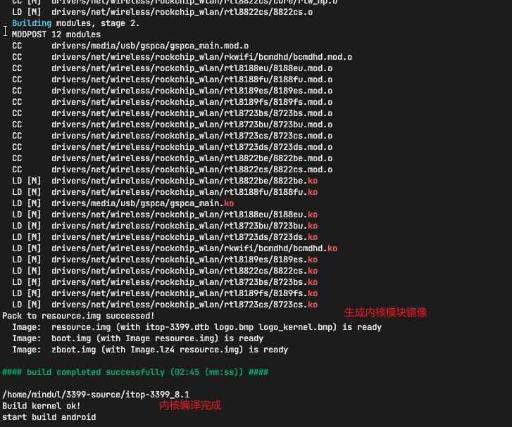

## 3399启动模式介绍
rk3399一共有3种启动模式
1. maskrom模式
2. loader模式
3. Normal boot模式
   
三种模式的功能如下：


我们主要关注第二种Loader模式即可，第三种模式是当机器成砖的时候才需要的。

## Windows驱动安装

下载Windows上的驱动程序
[DriverAssitant_v4.5.zip](https://pan.baidu.com/s/1gZp4Yo-2RKwing-3ffj3Ew?pwd=pd5n)

下载后，点击DriverInstall.exe执行，点击“安装驱动”即可。

## 烧写Android系统固件
1. 下载[烧写工具](https://pan.baidu.com/s/1YHOoBcz0pdNG14xIazMiog?pwd=wakc)后解压缩
2. 下载[Android8.1系统固件](https://pan.baidu.com/s/1uKzmjmlRzMETi9YXzvwzFg?pwd=642r) 选择*2021年8月2日之后购买屏幕的用户请下载这里的镜像*
3. 将第2步的系统镜像拷贝到rockdev/Iamge目录下
4. 打开AndroidTool_Release_v2.54/AndroidTool.exe，如果该应用启动或者使用时有报错，可以查看同目录下的**Android开发工具手册_v1.2.pdf**进行排查
5. 如果板子上有Android操作系统，应用显示“**发现一个ADB设备**”如下：
   
    

    此时点击“**切换**”按钮，如下：
    
    

    此外也可以按照上一节中描述的音量键和开关键来进入Loader模式。
6. 进入Loader模式后，点击“**执行**”，结果如下：

    

    烧写结束后系统会自动重启，设备会被再次识别成一个，如下：

    

    
### loader模式探索
进入Loader模式后，可以读取分区表，如下：


切换到“**高级功能**”，可以点击不同的按钮查询各种信息，如下：


## 编译rk3399的Android8.1系统
> 参考书籍的13.1

### 1. 根据屏幕修改dts
下载对应的[Android源码](https://pan.baidu.com/s/16IZMBE1YGxlDFV_PgXIquw?pwd=n3nw)，解压缩后如下：


屏幕的dtsi文件所在的路径如下：



itop3399开发板支持以下屏幕：
* 7寸lvds屏
* 9.7寸lvds屏
* 10.1寸lvds屏
* hdmi屏
* mipi屏（7寸）

我使用的是mipi7寸屏。打开itop-3399.dtsi文件，将下边几行修改下：


### 2. 编译
编译前执行：
```bash
sudo apt-get install liblz4-tool openjdk-8-jdk libxml2-utils
```
安装依赖，由于我的电脑是ubuntu16，官方apt源提供的jdk版本最高就是openjdk-9-jdk，不过编译Android8.1要求的是openjdk-8版本。此外，jdk运行时可能出现jack的问题，先按照[blog](https://blog.csdn.net/sui1005316018/article/details/118934443)配置下。

进入源码根目录，直接执行
```bash
bash ./build.sh
```

等待一段时间，编译成功，整个编译过程的大致流程如下：
1. 开始编译uboot
   
    

    编译uboot结束

    

2. 开始编译Linux内核
   
    

    编译Linux内核结束

    

3. 开始编译Linux内核模块
   
    

    编译Linux内核模块结束

    

4. 开始编译Android
   
    
    编译Android结束

    

5. 最终编译结束
    
可以看到从编译开始到结束，一共花了26分钟，我的内存频率之前设置成了1666Hz，所以可能有点慢。

## 将编译得到的镜像烧录到开发板上
编译生成的镜像会被build.sh保存到rockdev目录下，如下：


将这些镜像文件保存到Windows下的烧录工具的rockdev/Iamge目录下，按照之前章节的步骤操作烧写镜像即可。


## 参考书籍

[iTOP-3399 开发板使用手册](https://kdocs.cn/l/cvLYejf1PdPC)

## 参考视频
### 硬件连接 
* [iTOP-3399 开发板连接调试终端](https://www.bilibili.com/video/BV1Np4y147dP?share_source=copy_web)
* [iTOP-3399 开发板核心板拆卸](https://www.bilibili.com/video/BV1Np4y147dP?p=2&share_source=copy_web)
* [iTOP-3399 开发板 1320 万 MIPI 摄像头连接](https://www.bilibili.com/video/BV1Np4y147dP?p=3&share_source=copy_web)
* [iTOP-3399 开发板屏幕连接](https://www.bilibili.com/video/BV1Np4y147dP?p=4&share_source=copy_web)


### 编译系统镜像 
在编译系统镜像之前，需要先搭建编译环境，参考如下视频。具体编译请参考“第四部分 开发板固件 
编译”
* [加载虚拟机 Ubuntu16.04 系统](https://www.bilibili.com/video/BV1rQ4y1R7Xw?p=5&share_source=copy_web)
* [编译 Android8.1 系统](https://www.bilibili.com/video/BV1rQ4y1R7Xw?p=6&share_source=copy_web)
* [编译 Android7.1 系统 ](https://www.bilibili.com/video/BV1rQ4y1R7Xw?p=7&share_source=copy_web)
* [编译 Linux 系统](https://www.bilibili.com/video/BV1rQ4y1R7Xw?p=8&share_source=copy_web)


### 开发板烧写镜像 
iTOP-3399 开发板目前支持六种系统
* Android7 系统
* Android8 系统
* Linux+QT 系统
* Debian 系统
* Ubuntu16 系统 
* Ubuntu20 系统

具体烧写请参考“第三部分 开发板固件烧写” 首先我们参考以下视频了解开发板的启动模式

* [3399 启动模式介绍](https://www.bilibili.com/video/BV1rQ4y1R7Xw?share_source=copy_web)

然后参考以下视频安装 RKTool 驱动，只有安装了此驱动，才可以烧写镜像。 

* [安装 RKTool 驱动](https://www.bilibili.com/video/BV1rQ4y1R7Xw?p=2&share_source=copy_web)

烧写 Android7 Android8 的参考视频如下所示： 

* [烧写 Android 系统固件](https://www.bilibili.com/video/BV1rQ4y1R7Xw?p=3&share_source=copy_web)

烧写 Linux+QT 系统，Debian 系统，Ubuntu16 系统 Ubuntu20 系统的烧写方法都是一样的，参考以下视频进行烧写。

* [烧写 Linux 系统固件](https://www.bilibili.com/video/BV1rQ4y1R7Xw?p=4&share_source=copy_web)

