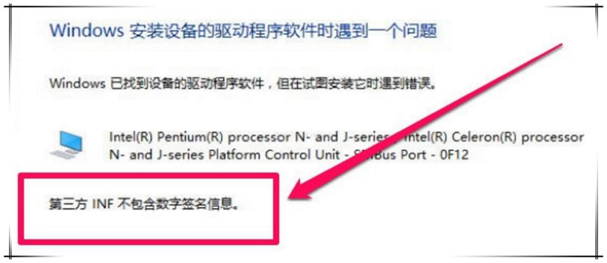

## 0.oflash软件及驱动
软件由百问网提供
链接：https://pan.baidu.com/s/1dUELy2gEx_V3SX98BHSAvw 
提取码：nroy 

## 1.EasyOpenJTag的使用方法（简称eop）
eop是百问网开发的，比较容易使用。它的优点什么的，参考官网 100ask.net。

eop长成这个样子

eop和开发板的连接方法

## 2.oflash在ubuntu上的使用
oflash其实在ubuntu上使用时并不需要驱动软件，直接使用即可。
> 这里需要注意的是，在ubuntu上使用oflash烧写文件时，需要root权限。而在centos上并不需要，普通用户即可。

如果在虚拟机中，需要将OpenJtag设备连接到虚拟机上。

然后切换到root用户，执行oflash来烧写。

> 烧写方法在后面有详细说明

## 3.oflash在windows上的使用

### a.安装驱动
将开发板通过EasyOpenJTag连接到PC上后，需要安装驱动，设备管理器显示如下。

右键->更新驱动程序软件->浏览计算机以查找驱动程序软件

接下来需要找到资料中提供的驱动程序，目录如下

如果你是64位windows系统，选择amd64；32位系统，选择i386。

>安装时，会出现一些问题，如下。
>
> 
>
>以及
>
>
>
>参考 《windows驱动安装问题》

### b.执行
驱动安装完成。在命令行中，直接执行oflash即可。

## 4.oflash的使用方法
oflash的使用方法

如图中所示
标号|作用
-|-
1|JTAG Type
2|选择CPU（因为是百问网开发的，只支持这几种CPU）
3|选择烧写到那个flash上
4|选择要烧写的可执行文件
5|选择烧写到nandflash后的选项，是读写类型（这里只是简单介绍，以后再说更详细的的）
6|从第0块开始烧写（注意source size 其实就是我们要烧写的可执行文件的大小）

 
 
 

参考： https://blog.csdn.net/thisway_diy/article/details/52808038
> 部分图片来自韦东山老师的博客，比如驱动程序安装，因为我已经装过了，这里直接用的人家的。
