> 1.mmd，感觉什么错误都让我遇到了，所以写个博客。  
> 2.openocd在ubuntu上可以使用apt来安装，而且依赖也自动给解决了。


## 1.configure错误
我一开始直接执行了./configure，make和make install。安装成功，但是这个时候，执行命令的时候就出现了问题。

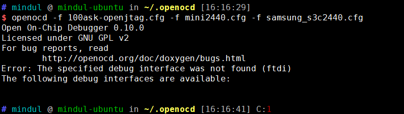

可以看到，当前的命令不光不支持ftdi，而且没有任何支持的interface。所以，我觉得自己编译安装的过程中，肯定犯了错误。
查看历史记录（感谢xshell提供的最大200000行的显示记录），可以找到如下情况

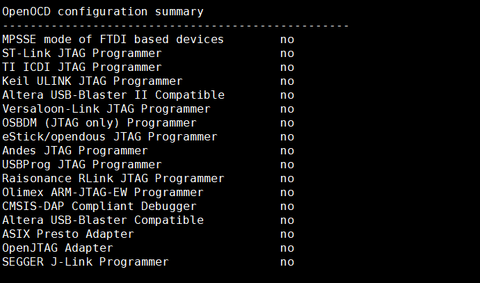

可以看到，不支持任何interface。既然有这种问题，再看看configure过程中有哪些东西缺失了。

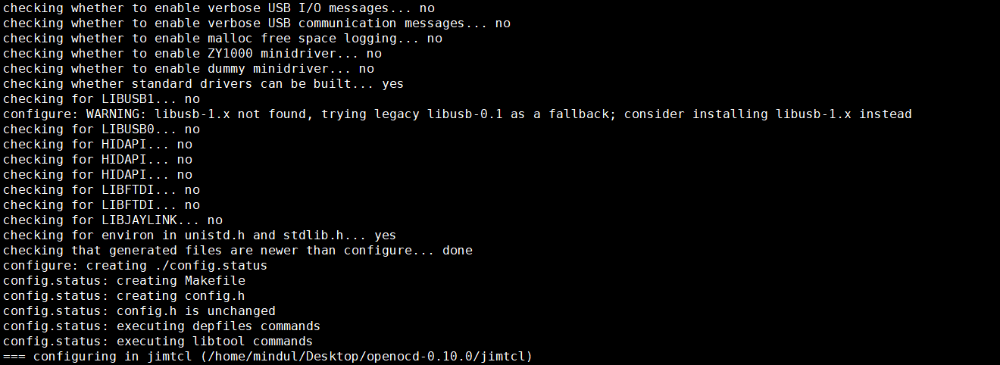

而且，再查看./configure命令的帮助，发现有--enable-ftdi选项。

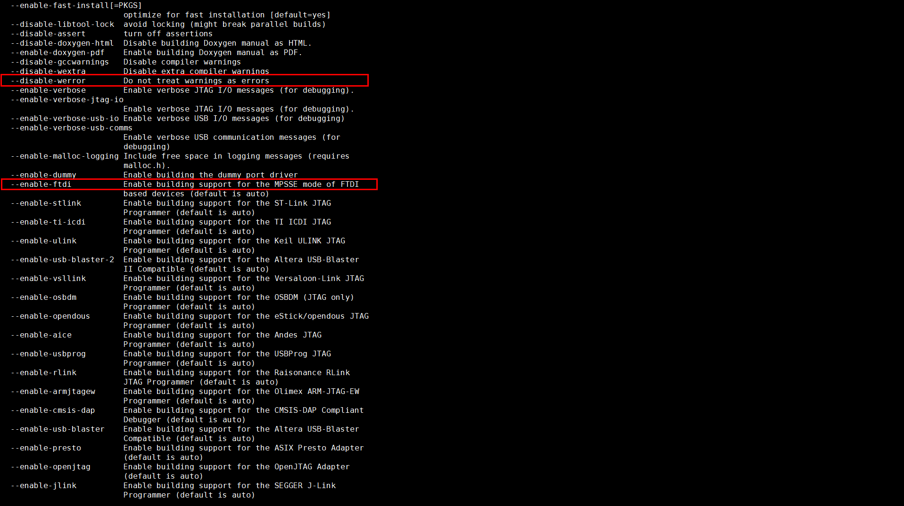

使用apt安装相应的缺少的包：libusb1，hidapi，libjaylink，libftdi。

``` shell
sudo apt-get install libusb-1.0
sudo apt-get install libhidapi-dev
sudo apt-get install libjaylink-dev
```
这个时候，再重新configure时，发现并没有解决问题。别急，这是因为你安装了库，但是/etc/ld.so.cache并没有你安装的新的库的信息，你还需要重新更新下这个文件。
``` shell
ldconfig -p | grep libusb
ldconfig -p | grep libhidapi
ldconfig -p | grep libjaylink
```
使用这个命令就可以知道/etc/ld.so.cache应该刷新哪些目录中的信息了。
然后再使用```ldconfig```将这个cache文件更新。

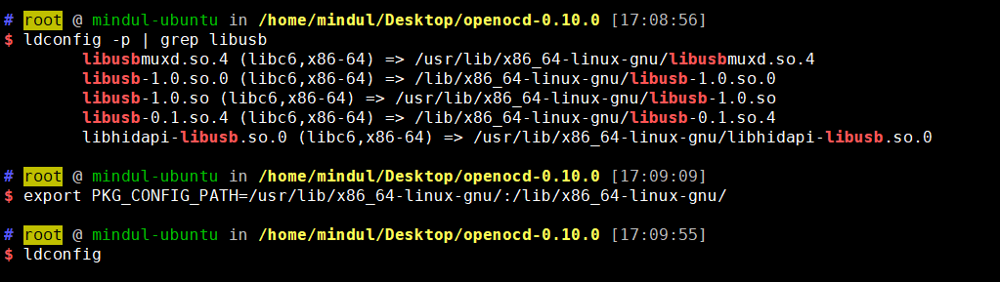

>（图中的PKG_CONFIG_PATH变量是用来配置ldconfig的搜索目录的，和/etc/ld.so.conf文件的功能一样，不过我发现虽然/usr/lib)

这样一来，新安装的库的信息，就可以被./configure检测到了。
（这个问题其实可以使用重启来解决，因为/etc/ld.so.cache中的内容，每次重启都会重新生成。）

重新执行
```shell
./configure --enable-ftdi
```
可以看到问题解决了

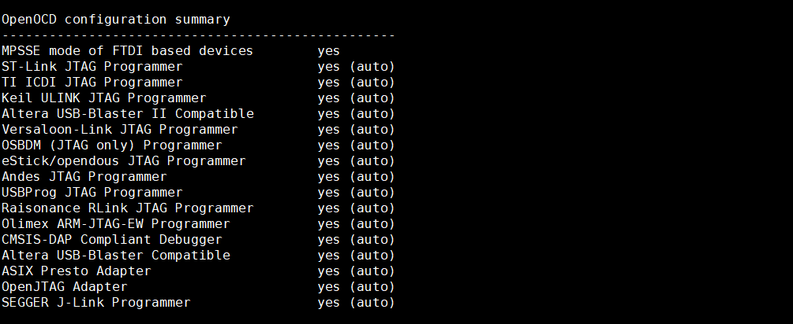

## 2.make错误
make的时候，出现以下错误。

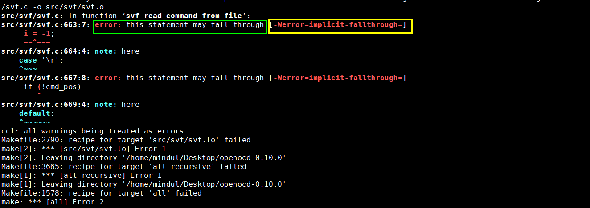

可以看到```-Werror=implicit-fallthrough=```
这个问题还是configure时候的问题，说是什么把警告当成错误，中断编译。需要重新configure下，加上如下选项，把werror给禁止掉就行了。
```shell
./configure --enable-ftdi --disable-werror
```
重新make && make install就可以了。

> 这里只是简单地看下结果，想要运行起来，需要先看第三节。

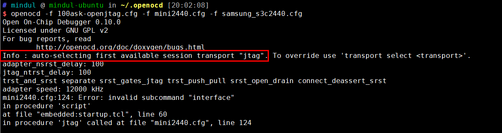

可以看到图中运行结果，已经成功选择了jtag设备。
> 但是还是没有成功连接，因为mini2440.cfg文件有点问题。
> 以.cfg结尾的文件，都是openocd运行的时候需要的，下一节详细说明。


## 3.运行及运行时的各种问题

### a.命名规则

openocd想要运行起来，需要先配置设备命名规则。
设备命名规则文件在openocd源码中有提供，即解压缩后的contrib/60-openocd.rules，文件注释中写着# Copy this file to /etc/udev/rules.d/。照做，然后使用lsusb命令，查看设备的ID。

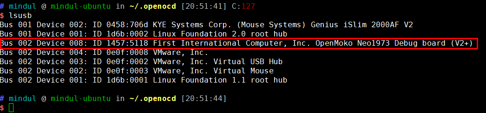

记下来 ID 1457:5118

编辑刚刚复制过去的文件如下

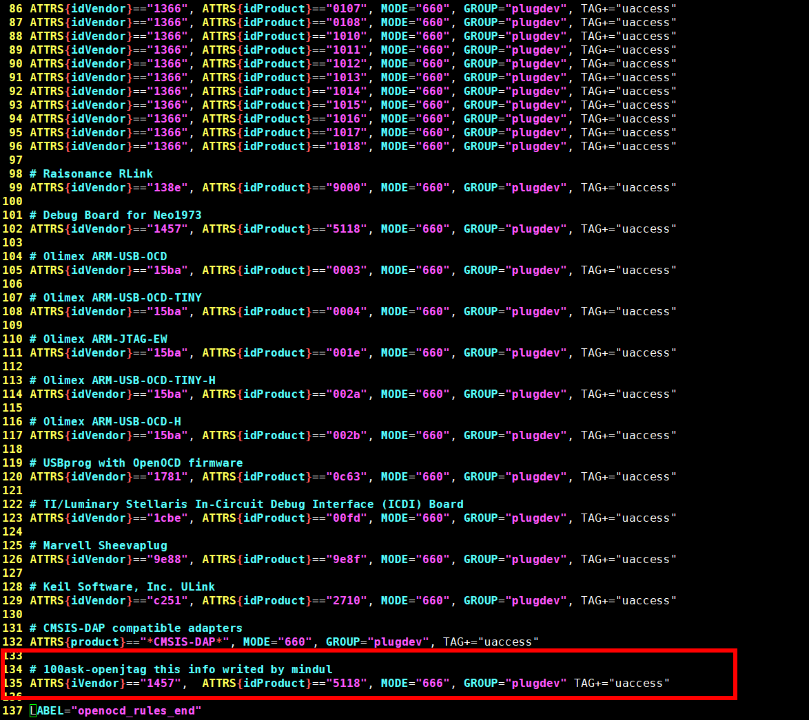

然后``` service udev restart```重启udev服务。

> 这个只是一个设备文件命名规则而已，更多的内容，我自己也不是很懂。只是这么用而已。以后有空了，专门再研究一下。

### b.openOcd配置文件
openocd配置文件，在解压缩后的tcl/目录下。可以从中选择并复制到~/.openocd/中，这样一来，在任何地方都可以直接使用。
具体的目录结构如下，而我们需要的也只有这三项？
目录|作用
-|-
board|开发板配置文件
interface|适配器配置文件
target|CUP配置文件

我在翻这么一堆文件的时候，找到了

>tcl/interface/ftdi/100ask-openjtag.cfg
>tcl/board/mini2440.cfg
>#因为我的开发板是jz2440v3，貌似差别不是很大，所以相中了这个
>tcl/target/samsung_s3c2440.cfg


如图
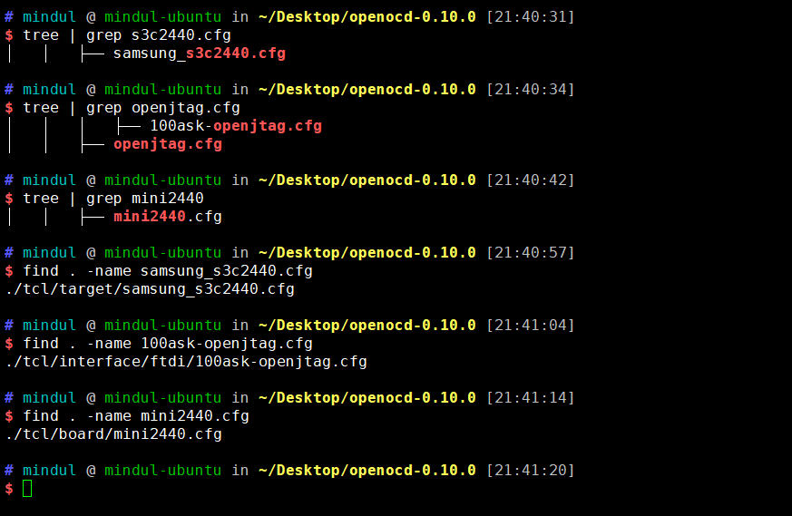

这里我又对比了一下mini2440.cfg和samsung_s3c2440.cfg两个文件，如下

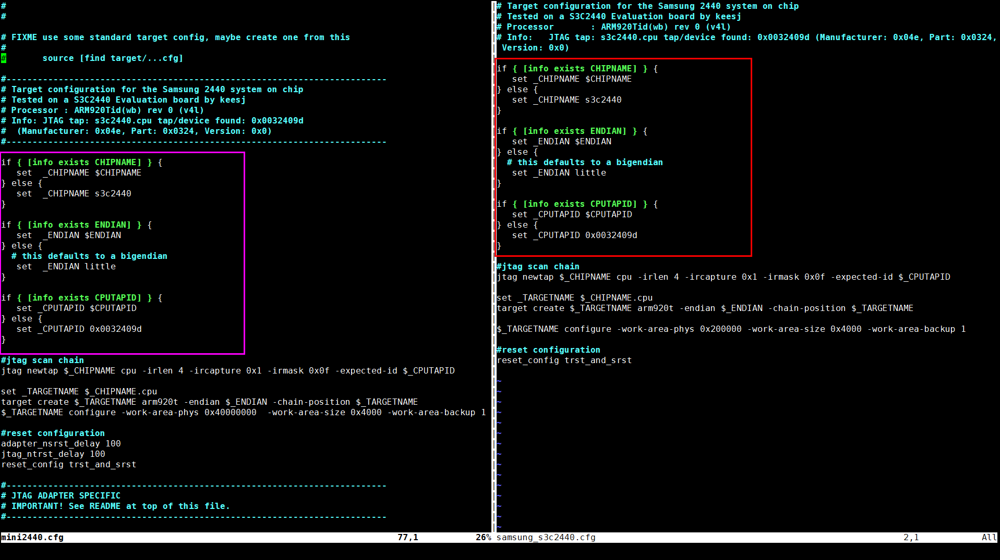

可以看到，其实mini2440.cfg的target部分，就是抄的samsung_s3c2440.cfg的。所以，可以不再使用samsung_s3c2440.cfg

在使用openocd时，格式如下。
```shell
openocd -f CFG_FILE -f CFG_FILE1 -f CFG_FILE2
#可以使用多个cfg文件
```
执行情况如下

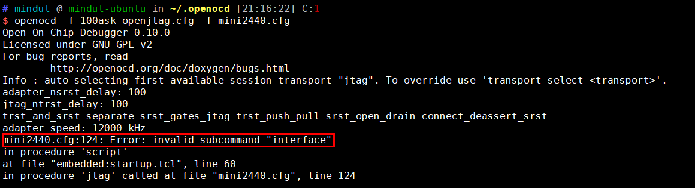

这破问题，为难了我一个晚上，最后，抱着蒙一把的心态，把124行给注释掉了。居然就可以了。

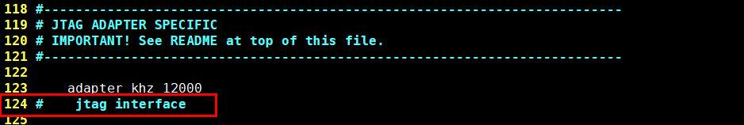

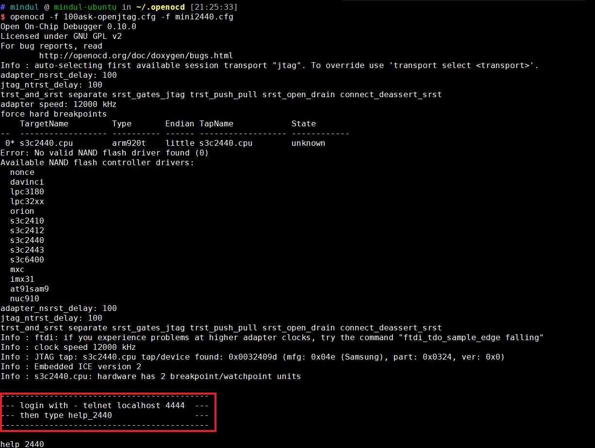

这下就跑通了。

如图中所示，使用```telnet localhost 4444```即可登录并调试了。

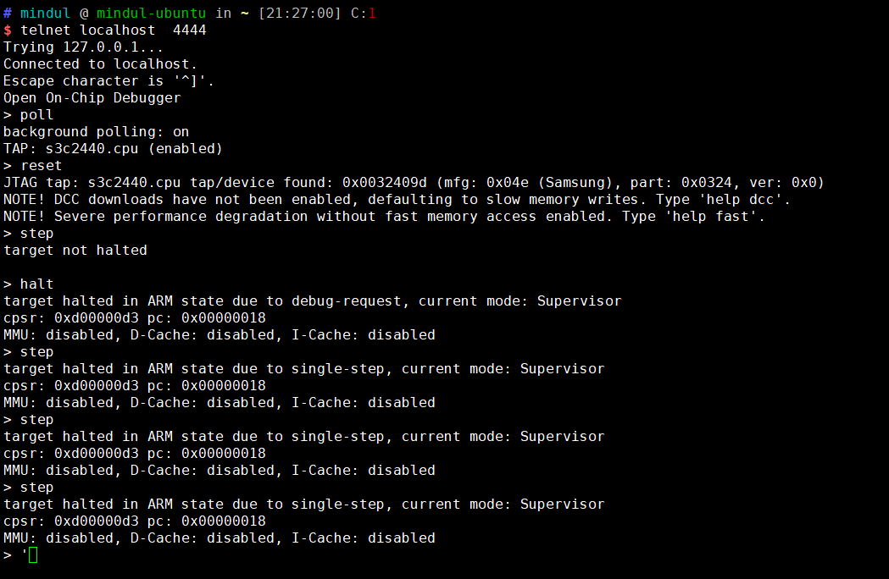

使用```help_2440```查看帮助


    openocd搜索配置文件的目录顺序：
    1.当前工作目录
    2.命令选项-s后面跟随的目录地址
    3.使用add_script_searchpdf_dir（在telnet登录之后）命令定义的目录地址
    4.$HOME/.openocd（非Windows）
    5.OPENOCD_SCRIPTS环境变量设置
    6.$pkgdatadir/site站点中的脚本
    7.$pkgdatadir/scriptsOpenOCD支持的脚本库

现在可以将100ask-openjtag.cfg和mini2440两个文件拷贝到同一个文件openocd.cfg中，并且放到~/.openocd中，以后在任何目录都使用
```shell
openocd -f openocd.cfg
```
即可。

>关于openocd_onchip_debug调试的更加详细的信息，在以后的3_3节中。

<br>
<hr>

>参考
>
> https://zhuanlan.zhihu.com/p/41517198
>
> https://www.embbnux.com/2014/02/01/linux_stm32_use_openocd_openjtag/#comment-2627
>
> http://blog.chinaunix.net/uid-24565138-id-2127551.html
>
> https://blog.51cto.com/famian/1951295?source=drt   
>
> 个人认为第四个的方法也是可以的，我没有尝试。说是可以直接支持ft2232，不过需要ft2232的库。


