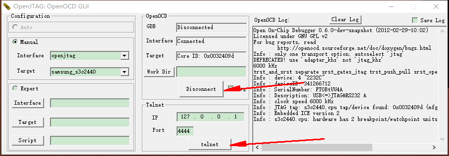

> 其实openocd可以使用源码编译，就像3.1节中的那样，只要按照install-windows的方法照做就可以了。不过这里有更加简单的一个办法。

## 1.使用OpenOCD GUI for OpenJTag替代openocd

软件下载（来自百问网提供的资料中）
链接：https://pan.baidu.com/s/1YNmEnAQacsW1nRqRjty-lA 
提取码：efn8 

如果你安装过EasyOpenJtag的驱动了，这个软件安装好之后直接就可以使用了。
打开后界面如下。

先点击connect连接EasyOpenJtag，然后点击telnet，弹出界面如下

可以看到，第一幅图中的内容和ubuntu上的内容几乎一模一样。

## 2.问题
我遇到的问题其实很多使用win10的人也会遇到，win10默认没有启用telnet功能。只要在启动windows功能中选择安装telnet客户端即可。

