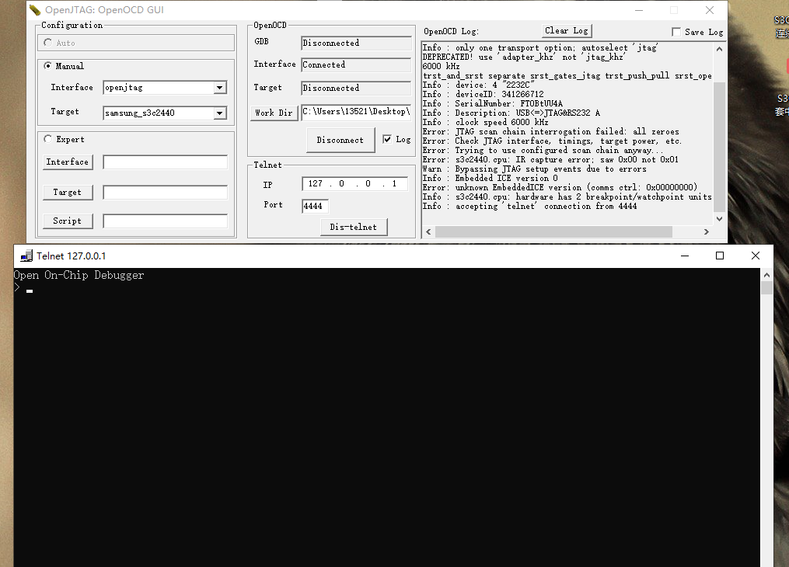

使用openocd_debug调试的方法和gdb调试的方法不太一样，openocd_debug的功能更多，（比如可以烧写较小的elf文件或bin文件到SDRAM上，然后执行。）而且是通过telnet来连接的。


## 示例代码
我们使用test/1_gpio/code/4_led_blink.S来测试
```armasm
.text
.global start
start:
        ldr r0,=0x56000050
        mov r1,#0x00000500      @实际上是16位0100
				@选择led1的口GPF4为输出
        str r1,[r0]

        ldr r0,=0x56000054

main_loop:
        mov r1,#0x00000020      @实际上是8位的00
				@如果换成0x10，则可以使led1灭
        str r1,[r0]

        ldr r3,=80000
little_loop:
        subs r3,r3,#1
        bne little_loop

        mov r1,#0x00000010
        str r1,[r0]

        ldr r3,=80000
little_loop1:
        subs r3,r3,#1
        bne little_loop1
        
        b main_loop
```
它的配套makefile
```makefile
led_blink:4_led_blink.S
	arm-linux-gcc -g -c -o 4_led_blink.o 4_led_blink.S
	arm-linux-ld -Ttext 0x0000000 -g 4_led_blink.o -o 4_elf
	arm-linux-objcopy -O binary -S 4_elf 4.bin 
	arm-linux-objdump -D -m arm 4_elf > 4.dis
```
编译后得到 4_elf，4.bin，4.dis。将得到的4_elf烧写到NAND FLASH上。4.dis内容如下

4.dis的.text段
```armasm

4_elf:     file format elf32-littlearm


Disassembly of section .text:

00000000 <start>:
   0:	e59f0034 	ldr	r0, [pc, #52]	; 3c <little_loop1+0xc>
   4:	e3a01c05 	mov	r1, #1280	; 0x500
   8:	e5801000 	str	r1, [r0]
   c:	e59f002c 	ldr	r0, [pc, #44]	; 40 <little_loop1+0x10>

00000010 <main_loop>:
  10:	e3a01020 	mov	r1, #32
  14:	e5801000 	str	r1, [r0]
  18:	e59f3024 	ldr	r3, [pc, #36]	; 44 <little_loop1+0x14>

0000001c <little_loop>:
  1c:	e2533001 	subs	r3, r3, #1
  20:	1afffffd 	bne	1c <little_loop>
  24:	e3a01010 	mov	r1, #16
  28:	e5801000 	str	r1, [r0]
  2c:	e59f3010 	ldr	r3, [pc, #16]	; 44 <little_loop1+0x14>

00000030 <little_loop1>:
  30:	e2533001 	subs	r3, r3, #1
  34:	1afffffd 	bne	30 <little_loop1>
  38:	eafffff4 	b	10 <main_loop>
  3c:	56000050 	undefined instruction 0x56000050
  40:	56000054 	undefined instruction 0x56000054
  44:	00013880 	andeq	r3, r1, r0, lsl #17

```


## 连接
现在在windows上做示范：
参看3_2_windows上使用openocd，使用telnet的方法连接上。



此时板子上的led1，led2在交互闪烁。


## 命令及命令的使用

命令|作用
-|-
reset|用来复位开发板，使程序从0x0处重新开始执行，也会清楚所有信息（如断点）
halt|暂停程序的执行
resume \<addr\> |halt之后，用来恢复程序的执行
bp \<addr\> \<ins_len\> |相当于gdb中的break，给程序设置断点，addr为地址，ins_len为指令长度

可以从以下视频中看出各个指令的作用：


以下是各条指令
```
reset
halt
resume
halt
bp 0x14 4
bp 0x28 4
resume
resume
resume
```
这样就可以知道各条指令的作用了。
 ```bp 0x14 4```和```bp 0x28 4```当中的0x14和0x28是如何确定的呢?我们查看dis文件的.text段，可以看到以下两条指令

```armasm
14:	e5801000 	str	r1, [r0]

28:	e5801000 	str	r1, [r0]
```
这两条指令就是用来改变GPFDAT的，最终反映到LED的显示上。在这两条指令前设置断点，当使用```resume```运行时，遇到断点会自动暂停（相当于```halt```），再次使用```resume```时，就可以执行断点标注的这条指令，也就是更改显示状态。


以上就是使用openocd_debug调试时的基本过程。openocd_debug还有很多指令，如```load_image```可以直接烧写程序等等。这些都在韦东山老师提供的资料中有。更多参看资料如下
> book/Eclipse,OpenOCD,OpenJTAGv3.1嵌入式开发教程版本5   | 韦东山教程
> book/openocd.pdf | 官网提供
