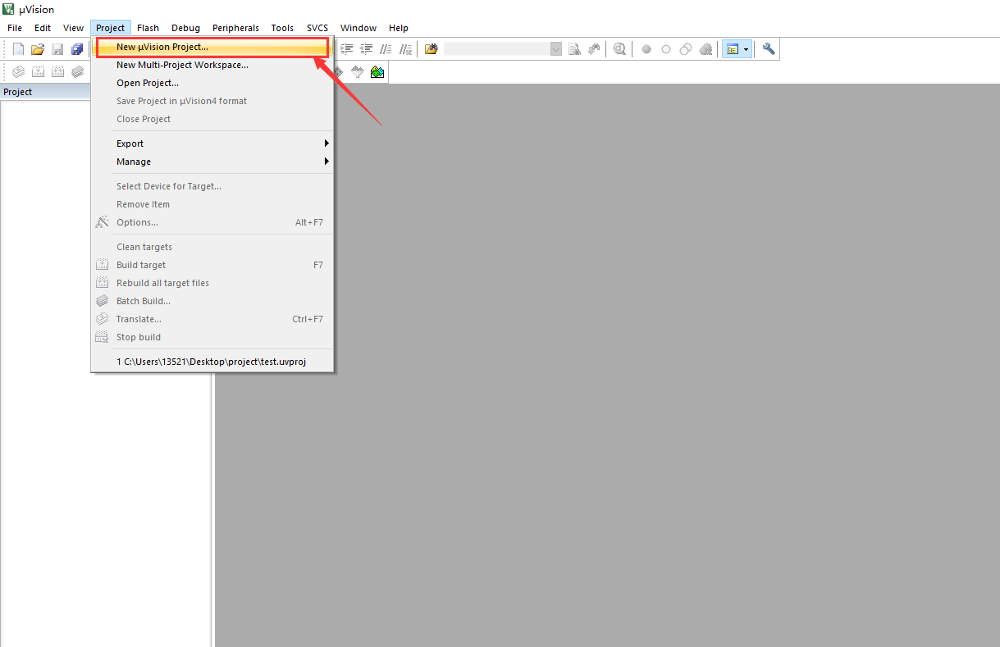
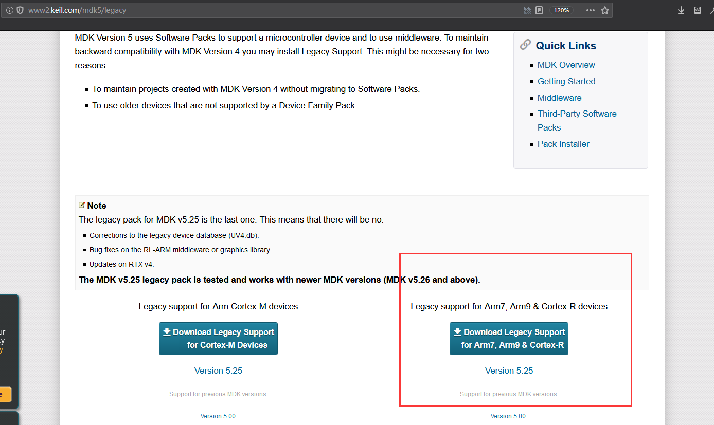
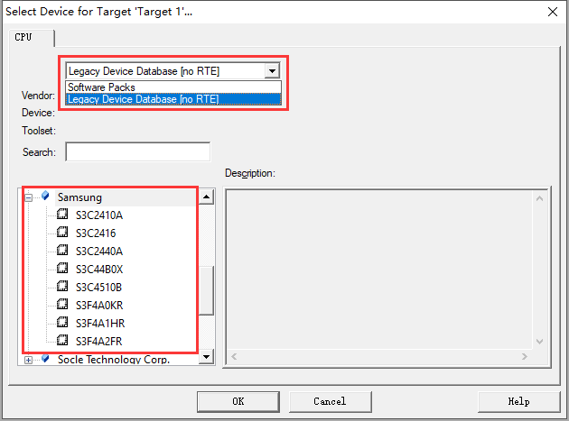
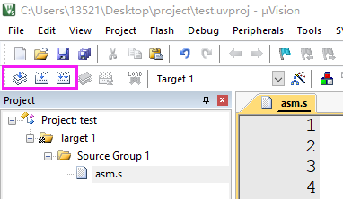
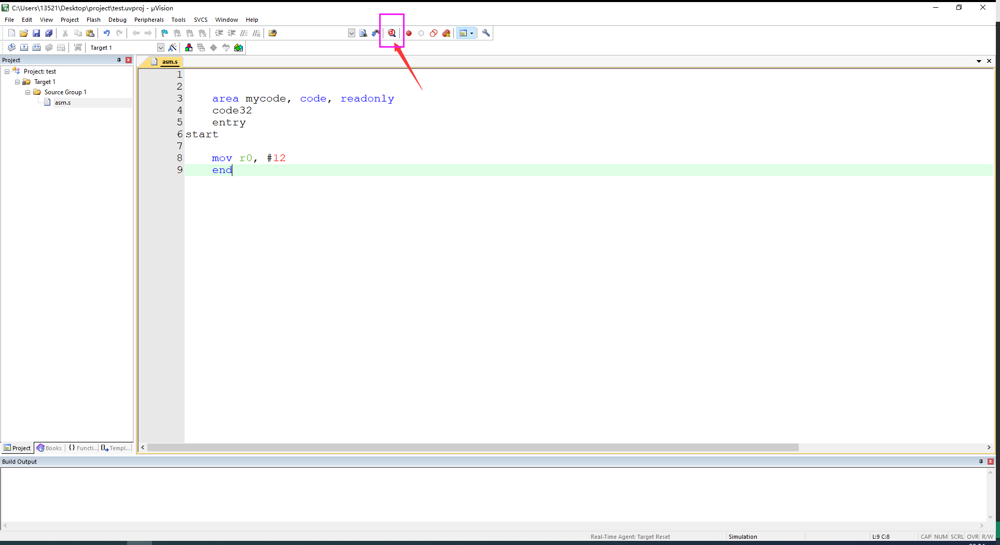
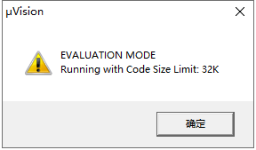
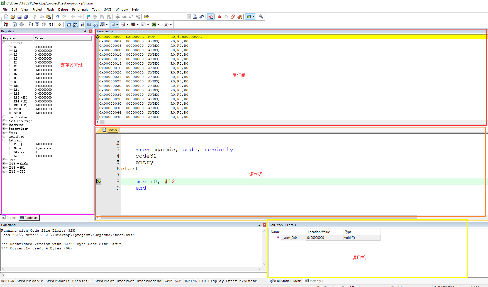

> 个人认为mdk相比DS5好用点

在米尔科技官网（国内代理商，网速快点）可以下载mdk的安装程序，链接如下：

http://www.myir-tech.com/download.asp?nid=25

选择合适的安装包即可。这里我选择的是mdk5.12。双击运行，一直下一步即可。安装成功后会有一个pack installer。这是安装对各种处理器的支持包，让它去下载即可。

最后我们使用mdk创建一个适配S3C2440的项目。如图所示：

接下来选择项目目录、填写名称。但接下来在选择设备时会发现，并没有Samsung厂商，其它厂商当然也没有S3C2440啦。我们需要的是Samsung的S3C2440，这是一件已经很有年头的设备了。mdk5把老设备的适配包全部打包放到一个额外的包里，需要从官网下载并安装。这里给出官网链接：

http://www2.keil.com/mdk5/legacy

选择我们需要的arm9系列，以及合适的版本来下载。官网下载很慢，如果你有迅雷会员会很快。如果没有，这个是我的 https://pan.baidu.com/s/1SJqPXrUOtXJgtdsg_aiCog  提取码：i84m。

注意安装目录要和我们的mdk的安装目录相同。然后我们重启系统，此时再执行同样的步骤，这时下拉图中菜单，就可以看到刚才安装的包，而里面也确实有Samsung的设备。选择S3C2440即可。

接下来，会询问你是否需要把S3C2440.s放进工程当中，这个文件相当于一个启动文件，写的很好，自由选择。我这里选择NO。

新建文件，保存并添加到项目中。

随便写一段代码，然后我们点击编译链接按钮：

接下来点击**启动或关闭调试回话（Start/Stop Debug SessionS）**，如图所示：

显示如下，这是没有登录导致的，此时code段大小不可超过32KB：

暂时不用管，确定过去。以下就是调试界面。

这个软件，感觉有点牛逼哦。

我们宿舍有个大傻逼，所以我今晚得在工作室通宵写博客了。（2019/9/17）