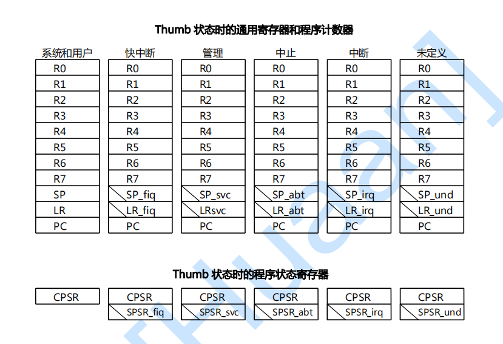

# 中断
## ARM的7种工作模式及各种模式下的寄存器
### 1. 模式
ARM体系CPU有7种工作模式，通常在发生各类中断、异常时CPU自动进入相应的模式。但也可以通过软件来切换（具体方法后续会说）。这7种模式中，除了用户模式（usr）之外，其他的模式都是特权模式。这是因为大多数程序运行于用户模式（usr），不需要特权。在需要处理中断、异常，或者需要访问被保护的系统资源时，需要进入相应模式，也因此需要获得特权。

模式|作用|权限
:-| :-: | :-:
用户模式（usr）| ARM处理器正常的程序执行状态 | 非特权
快速中断模式（fiq）| 用于高速数据传输或通道处理 | 特权
中断模式（irq）| 用于通用的中断处理 | 特权
管理模式（svc）| 操作系统使用的管理模式 | 特权
数据访问终止模式（abt）|当数据或指令预取终止时进入该模式，可用于虚拟存储及存储保护| 特权
系统模式（sys）| 运行具有特权的操作系统任务 | 特权
未定义指令终止模式（und）| 当未定义的指令执行时进入该模式，可用于支持硬件协处理器的软件仿真| 特权

### 2. 寄存器
ARM920T有31个通用的32位寄存器和6个程序状态寄存器。这37个寄存器分为7组，对应7个工作模式。每个工作模式需要的寄存器数目和种类都相同，但不同的寄存器在不同模式下可以有不同的副本，这是为了在模式转换时进行数据保存和数据恢复，或者加快寄存器模式转换速度，进而提高中断服务的速度（降低中断响应时间）。如图


可以发现以下4点：
1. 每种模式下的R0 ~ R7都是同一个物理寄存器
2. 每种模式下的R13、R14，都不是同一个物理器件
3. 快速中断模式（fiq）下的R8 ~ R12也与其他6种模式种的R8 ~ R12不同
4. 除系统与用户两种模式没有SPSR之外，其他5中模式各有一个物理SPSR寄存器
   
以下做解释：
1. R0 ~ R7都相同，可以方便参数传递等等
2. 每种模式下R13都用作本模式下堆栈指针SP，R14则用作本模式下的子程序链接寄存器LR。它们是程序上下文恢复的关键。
3. 快速中断模式（fiq）对于中断响应时间要求很高，以达到“**快速**”，当然退出本模式也会更快。R8 ~ R12可以直接使用，不需要入栈来保存上一模式的上下文，也不需要出栈来恢复。
4. SPSR寄存器用来保存模式转换前的CPSR中的内容，以便异常返回后恢复异常发生时的程序状态。但发现系统模式没有SPSR寄存器，因为用户模式无权直接切到系统模式，必须先依赖其他各种异常事件切入到相关的异常模式，再由异常模式通过改变CPSR的值到系统模式。异常处理过程中是有机会保存用户模式的寄存器的值的，用户模式的CPSR保存在相应异常的SPSR中，所以恢复的时候可以把之前的值恢复到CPSR中，就又回到了用户模式。

上面介绍的都是普通的ARM状态下的寄存器，ARM920T的**T**的含义是```Thumb```，这是ARM920T工作的另一种状态：

状态| 特点
-|-:
ARM状态|此时处理器执行32位的、字对齐的ARM指令
Thumb状态|此时处理器执行16位的、半字对齐的Thumb指令

CPU一上电就处于ARM状态，想要使用Thumb状态可以通过更改CPSR中的标志位。Thumb状态的寄存器与ARM状态的寄存器也是有很大区别的：



ARM和Thumb状态的寄存器之间有映射关系如下：


### 3. ARM的程序状态字（程序状态寄存器）（PSW/PSR)CPSR


CPSR(Current Program Status Register）的功能：
1. 保存最近已处理的 ALU 操作的信息
2. 控制中断的使能与禁止
3. 设置处理器的运行模式和运行状态

#### 3.1 ARM的ALU操作标志位
N、Z、C、V为ALU操作标志位，算术或逻辑操作可能会改变这些位。这些位是指令条件执行的判断因素。在ARM状态下，所有的指令都可以条件执行。

#### 3.2 ARM的控制位
I、F、T、M[4:0]被称为控制位。当发生异常时会改变这些位，如果处理器运行在特权模式，它们也可以由软件控制。
标志位| 作用 | 1 | 0
:-:|:-: | :-: | :-:
T | 反映了当前的运行状态（ARM状态还是Thumb状态）。 | Thumb | ARM
I | 中断禁止位 | 禁止IRQ中断 | 允许IRQ中断
F | 快速中断禁止位| 禁止FIQ中断 | 允许FIQ中断

#### 3.3 ARM模式位M[4:0]
M[4:0] | 模式 
-| :-:
10000 | 用户模式（USER）
10001 | 快速中断（FIQ)
10010 | 中断（IRQ)
10011 | 管理（SRV)
10111 | 数据访问终止模式（ABT)
11011 | 未定义指令（UDF)
11111 | 系统（SYS）

## ARM的状态切换
程序在执行时，如果发生异常，将切换进入相应的工作模式，这个过程将发生：
1. 在异常工作模式的链接寄存器R14中保存前一个工作模式中即将执行的下一条指令的地址。对于ARM状态，这个值是当前PC值加4或加8。（参考下表）
2. 将CPSR的值复制到相应异常模式的SPSR。
3. 将CPSR的工作模式位设为这个异常对应的工作模式。
4. 将PC值设为这个异常模式在异常向量表中的地址，即跳转去执行相应的异常向量表中的相应指令。
相反，在从异常工作模式返回之前的工作模式时，需要通过软件完成如下事情：
1. 前面进入异常工作模式时，链接寄存器R14中保存了前一个工作模式的一个指令地址，将它减去一个适当的值（参考下表）后赋给PC。
2. 将SPSR的值复制回CPSR。

进入/退出异常模式时的PC地址计算：
异常模式 | 进入异常模式时R14中保存的值 | 退出异常模式时PC的计算方法 | 异常原因
- | :-: | :-: | :-:
管理模式（通过SWI指令进入） |  PC+4 (1) | MOVS PC, R14 |-
未定义指令终止模式 | PC+4 (1) | MOVS PC, R14 | -
快速中断模式 | PC+4 (2) |  SUBS PC, R14, #4 | -
中断模式 | PC+4 (2) | SUBS PC, R14, #4 | -
数据访问终止模式 | PC+4 (1) |  SUBS PC, R14, #4 | 指令预取终止
数据访问终止模式 | PC+8 (3) | SUBS PC, R14, #8 | 数据访问终止

> 注：
> 这里需要说明的是，此处的PC并不是处理器实际执行程序时的PC值，而是代表当前正在执行的指令的地址。
>
> 而需要注意的是，处理器的PC总是指向当前正在执行的指令的后两条指令的地址即（当前正在执行指令地址+8），这是因为ARM的流水线特性造成的。当前正在执行指令地址+4处的指令此时正在被**预处理**。
> 
>> (1) PC值是这些指令的地址：SWI、未定义的指令、在预取值时就失败的指令
>>
>>> 这些指令在发生异常时，PC还来不及更新，即为当前指令+8；那么异常处理结束，就应该执行PC-4处的指令，即当前指令+4处。
>>
>> (2) PC值是这些指令的地址：进入快速中断模式、中断模式前，被打断而未执行的指令
>>
>>> 通常处理器在执行完一条指令后会查询是否有中断请求发生，而此时PC的值已经更新，所以下一条指令的值应该是PC-8。
>>> 要知道ARM和x86并不一样，它的指令执行时间都很短，所以只有在指令结束后才会查询是否有中断请求；而x86的数据传输指令，会在当前指令执行过程中查询是否有中断请求，并在特定的可以中断的地方服务中断。
>> 
>> (3) PC值是这些指令的地址：导致数据访问终止的加载/存储指令（LDR、STR、LDM、STM）
>> 
>>>发生数据访问异常中断时，程序要返回到该有问题的指令处，重新访问该数据，因此数据访问异常中断应该返回到产生该数据访问中止异常中断的指令处，而不是当前指令的下一条指令。当数据访问异常中断发生时，程序计数器pc的值已经更新，即指向当前指令+12处指令的地址。
>>
>更多详细的关于不同中断异常后，PC和LR的值如何设置的信息参考下一章，或者：https://blog.csdn.net/tigerjibo/article/details/7758780
>
> 软件软终端（SWI）
>> ARM工作模式中，处理器模式切换可以通过软件控制进行切换，即修改CPSR模式位，但**这是在特权模式下**，当我们处于用户模式下，是没有权限实现模式转换的。若想实现模式切换，只能由另一种方法来实现，即通过外部中断或是异常处理过程进行切换。于是ARM指令集中提供了两条产生异常的指令，通过这两条指令可以用软件的方法实现异常，其中一个就是中断指令SWI 。


