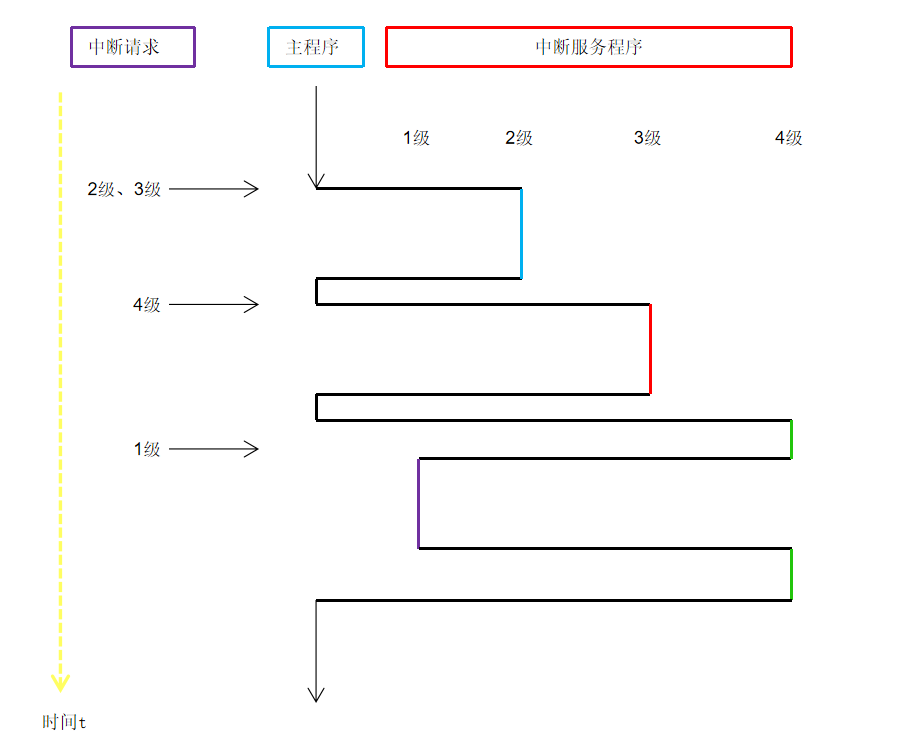

# 中断补充
## 1. 中断源的种类与分类及中断源的优先级
引起中断的各种事件称为中断源。中断系统的复杂性实际上是由中断源的多样性引起的，中断源可以来自系统外部，也可以来自机器内部，甚至处理器本身。中断可以是硬件引起的，也可以是软件引起的。把各种各样的中断源分类并分级组织好是设计中断系统时首先要做好的一件事。
### 中断源的种类
常见的中断源有以下几类:
> 1. 由外围设备引起的中断。
>> 低速外围设备的数据缓冲寄存器已经准备好接收或发送数据
>> 高速外围设备采用DMA方式完成一个数据块传送之后的处理工作
>> 外围设备的启动和停止
>> 完成对外围设备的控制(如磁盘和磁带存储器的定位)
>> 输入输出过程中任何一个环节出现错误的。
> 2. 由处理器产生的中断。
>> 算术运算操作溢出
>> 除数为零
>> 数据校验错
>> 非法数据格式
>> 响应中断后进入监控程序，处理机处于动态停机状态，等待操作员给予处理
>> 返回到用户程序，等待用户修改程序和数据
> 3. 由存储器产生了中断。
>> 非法地址（包括地址越界、地址不存在、写ROM地址）
>> 动态随机存储器（DRAM）刷新
>> 主存储器页面失效
>> 数据或地址检验错
>> 访问主存储器超时错
> 4. 由控制器产生的中断。
>> 非法指令
>> 未定义的操作码
>> 用户程序执行了特权指令
>> 堆栈溢出分时系统中时间片道
>> 操作系统用户态与特权态的切换
> 5. 由总线产生的中断
>> 输入输出总线出错
>> 存储器总线出错
> 6. 实时过程控制产生的中断
>> 实时检测设备的采样中断
>> 为某些实时控制设备发送控制信号
> 7. 实时钟的定时中断
>> 多处理机系统中，从其他处理机发送来的中断
>> 为某些实时设备发送控制信号
> 8. 多处理机系统中，从其他处理机发送来的中断，控制台开关终端
> 9. 程序调试过程中执行完一条指令或程序运行到一个之前设置的断点时，通过中断进入监控程序以便对调试程序进行跟踪和监测
> 10. 硬件故障中断，通过监控程序调用诊断程序，对机器的各个部分进行诊断，如果诊断没有错误，则重新引导机器，否则停机
> 11. 电源故障中断，这时必须停止其他一切工作保存处理机全部状态信息和挥发性存储器中的内容

### 中断的分类
在现代计算机系统中，中断源的数目很多，一般有几十个至几百个，为了在响应中断后处理机能够尽快找到中断入口，以便为中断源提供服务，必须对这些中断源进行分类。通常根据中断时间的紧迫程度，中断源工作速度的高低中断源性质进行分类，对每一类中断源分配一个硬件的中断入口，从这个入口进入之后，再通过软件找到具体的中断源。

IBM通常做如下分类：

> 1. 重新启动中断
>> 这是为操作人员重新启动一个程序用的，在一般情况下，处理机不能禁止这类中断。
> 2. 机器检验出错中断，当发生硬件或软件故障时产生。用一个64位的机器检验中断码保存中断的原因及其严重程度。 同时在机器的检验保存区中，还存储有更加详细的中断原因和故障位置的说明。
>> 电源故障
>> 运算器误动作
>> 主存储器检验错
>> 输入输出通道硬件故障
>> 处理机的各种其他故障
> 3. 程序性错误引起的中断
>> 包括指令或数据格式错误
>> 在程序执行过程中出现非法操作码储存保护错误
>> 地址越界错误
>> 各种运算溢出错误
>> 除数为0错误
>> 有效位为0错误
>> 用户态下使用管态指令错误
>> 另外还有程序的事件记录
>> 监督程序对事件的检测引起的中断
> 4. 访问管理程序中断。当用户要调用管理程序时，执行访管指令引起的中断。处理机一般不能禁止这类中断。
> 5. 外部事件中断。事件可以来自机器外部，也可能来自机器内部。
>> 包括各种用于计时、计费、控制的定时器中断
>> 各种用于与其他机器和系统联系的外来信号中断
>> 用于操作员对机器进行干预的中断键的中断
> 外部事件中断又分为两类，一类中断在没有得到处理机响应时能继续保留，一类在不再保留。
> 6. 输入输出中断。用于处理机管理各种外围设备，管理通道处理机。 

对于后四类的中断源各有一个16位的中断码。这个中断码用来区分各个具体的中断源，当处理机响应中断从硬件入口进入各类中断源之后，可以通过这个中断码来找到哪个中断源发出的中断请求。

许多机器把中断源分为**可屏蔽中断**和**不可屏蔽中断**两大类。或称为**一般中断**和**异常中断**。

对不可屏蔽中断，不能通过软件屏蔽，他一旦申请中的服务，处理机必然会响应。对于可屏蔽中断可以通过软件把他屏蔽掉。例如，如果不希望某一台打印机工作，可以通过一条指令向这台打印机发出一个中断屏蔽码。在这以后，即使这台打印机申请中断服务，这个中断申请信号也不能送往处理机。

在异常中断中有一类称为**自陷（trap）中断**，它的中断请求发生在一些特殊指令的末尾，经中断服务程序处理后，返回到正常执行程序的下一条指令继续执行；

另一类称为**故障（fault）中断**，它的中断请求可能发生在任何一条指令的执行过程中，经中断服务程序处理后，要返回到原先发生故障的那条指令处，重新执行引起故障的那条指令；

还有一类称为**失效（abort）中断**，它的中断请求也可能发生在一条指令的执行过程中，但是除非强制干预或系统重新复位，否则机器无法继续正常工作下去。

### 中断的优先级
#### 1.判断因素
中断源的中断请求一般是随机的，在中断源比较多的情况下，很可能同时发生多个中断请求，CPU必须安排一个响应和处理中断的优先顺序。中断优先级的确定是一个涉及计算机系统全局的问题。主要由下列因素来确定：
1. **中断源的急迫性**。如电源故障、总线错、CPU的地址错、数据错等。这些机器检验性错误引起的中断，一般要安排在最高优先级，他们一旦出现必须及时处理，否则整个系统都将无法正常运行；而那些仅影响局部的故障，其优先级可以安排在低一些的级别，如程序性错误引起的中断请求、外部设备的输入输出中断请求等。

2. **设备的工作速度**。快速设备由于数据存在的时间短，必须及时响应，以避免数据丢失。其优先级应安排的高一些，比如在一些常用的外围设备中，优先级从高到低的次序一般如下： 实时钟->磁盘存储器（包括软磁盘）->行式打印机->控制台终端输出->控制台终端输入。

3. **数据恢复的难易程度**。数据丢失后无法恢复的设备其优先级应高于能自动和手动恢复数据的设备。

4. **要求处理机提供的服务量**。能够大部分时间独立工作，而较少要求处理机干预的事件，其优先级应高于需要处理机连续提供服务的事件，两个极端的例子是DMA请求和执行主程序。

#### 2.不同计算机系统采用的优先级
IBM370系列机中，把7类中断分为5级，从高到低依次是：重新启动引起的中断->紧急的机器检验错误引起的中断->（程序性错误/调用管理程序/可以抑制的机器检验错误（这三类中断是互斥的不可能同时发生））引起的中断->外部事件引起的中断->外围设备的中断。

在DEC公司的机器中中断优先级从高到低分别是：总线错误引起的中断->主存刷新中断->指令错误引起的中断->程序跟踪中断->电源掉电中断->在线停机中断->在线事件（如实时钟等）中断->外围设备的中断->用户程序中断。

#### 3.中断优先级的实际意义
在现代计算机系统中，中断优先级一般是由硬件的排队器实现的，因此当有多个中断源同时请求中断服务时，中断响应次序的高低是固定死的。

优先级高的中断源先被处理，处理机在执行某一个级别的中断源的中断服务程序时，与它同级或比它低级的中断源的中断请求不能中断它的服务程序，只要比他高级的中断源的中断请求才能中断其服务程序，这时处理机响应这个高级的中断源的中断请求转去为它服务，待服务完成后再返回继续执行原先的那个中断服务程序。

下面举个例子，已知各级中断从低到高4->3->2->1。下面为处理机在执行主程序或者中断服务程序时，接收到中断后的执行情况。可以看到2不会被3中断，4会被1中断。

