# GPIO练习

## 练习1：使用GPIO来点亮LED。

### 1.首先查看开发板电路图，了解板子上的LED在哪一个GPIO口

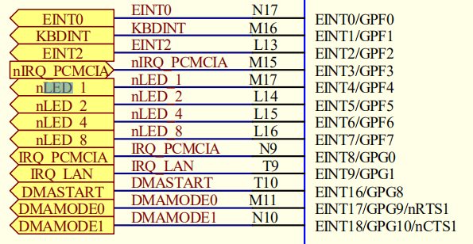

这样我们知道，LED1、LED2、LED4依次在GPF4、GPF5、GPF6

但是，我们仍然需要知道的还有：LED1、LED2、LED4是如何连接在3个口上的，当输出电平为高时亮还是为低时亮。

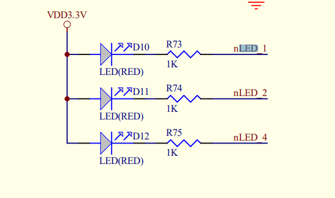

由上图可以知道：**LED1、LED2、LED4都是低电平时亮**

### 2.接下来我们就要知道如何操作GPF4、GPF5、GPF6的输出。

控制GPIO口，需要对两个寄存器进行设置，查看S3C2440用户手册，有

寄存器|作用
:-:|-
GPxCON|选择输入还是输出
GPxDAT | 一位对应一个GPIO口，依据输入还是输出模式，用来读或写数据

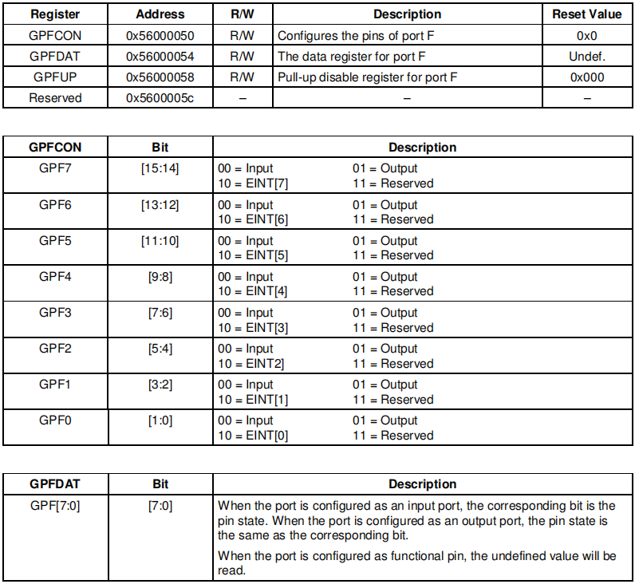

由图中所示，我们可以知道：

>GPFCON使用两个bit控制一个I/O口
>>  00-输入
>>01-输出
>
>GPFDAT则配合GPFCON来使用
>>输出模式：1表示输出高电平，0表示输出低电平。
>>输入模式：1表示输入高电平，0表示输入低电平。


### 3.信息综合

外设|外设状态|端口|端口输出
-|-|-|-
LED1|亮/灭|GPF4|高/低
LED2|亮/灭|GPF5|高/低
LED4|亮/灭|GPF6|高/低

### 4.写程序

>a.点亮LED1

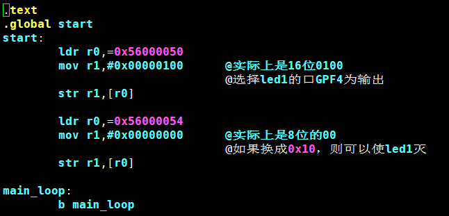

>b.点亮LED1 LED2 LED4

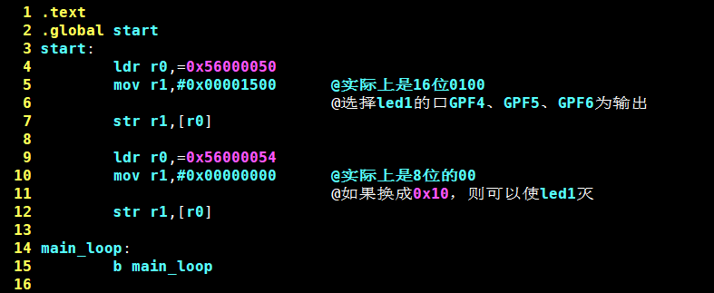


## 练习2：通过GPIO，使用按键来控制led

### 1.查电路图，找到按键对应的GPIO口
在电路板上可以看到按键对应的标号为s2,s3,s4

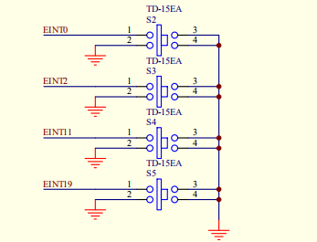

从电路图可以知道其对应的输出口：EINT0，EINT2，EINT11。并且当按键按下时，输入应该为低电平。继续查找EINT0，EINT2，EINT11：

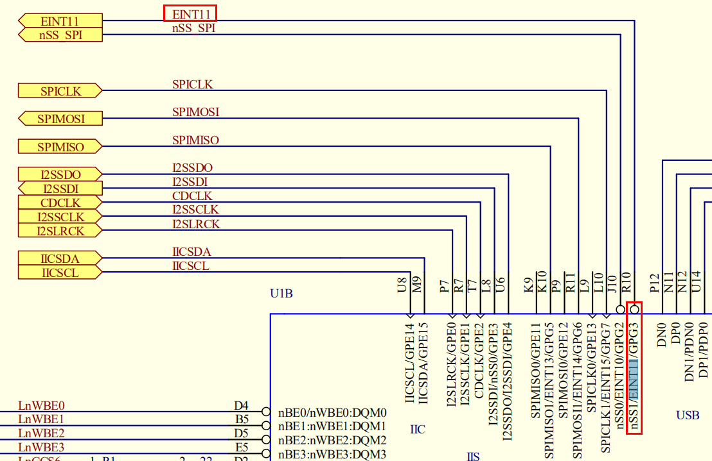  

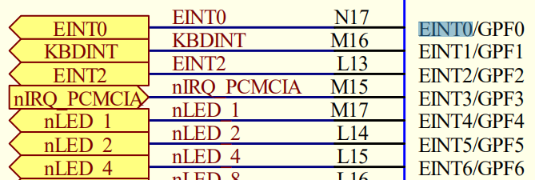

可以知道KEY0、KEY1在GPF0、GPF2上，KEY2在GPG3上

### 2.再查看GPG的操作方式

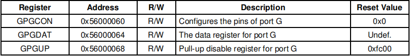

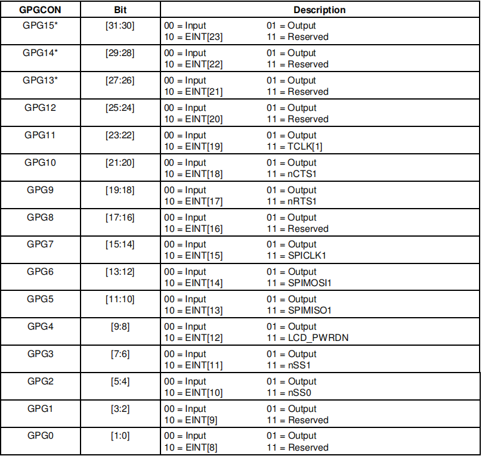

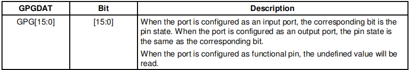

发现GPG和GPF其实是一样的，只不过个数不一样而已

### 3.信息综合

外设|外设状态|端口|输出|输入
:-:|:-:|:-:|:-:|:-:
LED1|亮/灭|GPF4|低/高|-
LED2|亮/灭|GPF5|低/高|-
LED3|亮/灭|GPF6|低/高|-
key0|按下|GPF0|-|低
key1|按下|GPF2|-|低
key2|按下|GPG3|-|低

### 4.写程序
>a.按键与LED一一对应，按下按键灯亮，否则灯灭
```armasm
.text
.global start

start:
	ldr r0,=0x56000050
	mov r4,#0x00001500		@设置GPF456为输出，GPF02为输入
	str r4,[r0]

	ldr r1,=0x56000060
	mov r4,#0x00000000		@设置GPG3为输入
	str r4,[r1]

	ldr r0,=0x56000054
	ldr r1,=0x56000064

loop:
	@GPG3按下，低电平，led2亮
	ldr r2,[r0]
	ldr r3,[r1]
	tst r3,#0x00000008					@测试GPG3是否为0

	movne r4,#0x0000007f				@未按下
	moveq r4,#0x0000006f				@按下

	tst r2,#0x00000001					@测试GPF0是否为0
	andeq r4,#0xffffffbf

	tst r2,#0x00000004					@测试GPF2是否为0
	andeq r4,#0xffffffdf


	str r4,[r0]
	b loop
```
>b.led灯交替亮灭
```armasm
.text
.global start
start:
        ldr r0,=0x56000050
        mov r1,#0x00000500      @实际上是16位0100
				@选择led1的口GPF4为输出
        str r1,[r0]

        ldr r0,=0x56000054


main_loop:
        mov r1,#0x00000020      @实际上是8位的00
				@如果换成0x10，则可以使led1灭
        str r1,[r0]

        ldr r3,=80000
little_loop:
        subs r3,r3,#1
        bne little_loop


        mov r1,#0x00000010
        str r1,[r0]

        ldr r3,=80000
little_loop1:
        subs r3,r3,#1
        bne little_loop1
        
        b main_loop

```


# makefile分析

使用```make all```可以构建所有GPIO程序，或者使用```make 
$num```来构建$num表示的目标

