# 存储管理器及sdram的使用

首先我们需要知道的是，CPU封装中，除了cpu核心之外，还有一些其他的外设。这里引用三星官方手册上的话：
     
S3C2440A 集成的以下片上功能：
>1.2V 内核供电, 1.8V/2.5V/3.3V 储存器供电, 3.3V 外部 I/O 供电，具备 16KB 的指令缓存和 16KB 的数据缓存和 MMU的微处理器

>外部存储控制器（SDRAM 控制和片选逻辑）

>LCD 控制器（最大支持 4K 色 STN 和 256K 色 TFT）提供 1 通道 LCD 专用 DMA

>4 通道 DMA 并有外部请求引脚

>3 通道 UART（IrDA1.0, 64 字节发送 FIFO 和 64 字节接收 FIFO）

>2 通道 SPI

>1 通道 IIC 总线接口（支持多主机）

>1 通道 IIS 总线音频编码器接口

>AC’97 编解码器接口

>兼容 SD 主接口协议 1.0 版和 MMC 卡协议 2.11 兼容版

>2 通道 USB 主机/1 通道 USB 设备（1.1 版）

>4 通道 PWM 定时器和 1 通道内部定时器/看门狗定时器

>8 通道 10 位 ADC 和触摸屏接口

>具有日历功能的 RTC

>摄像头接口（最大支持 4096×4096 像素输入；2048×2048 像素输入支持缩放）

>130 个通用 I/O 口和 24 通道外部中断源

>具有普通，慢速，空闲和掉电模式

>具有 PLL 片上时钟发生器


另附上官方手册上的图片：

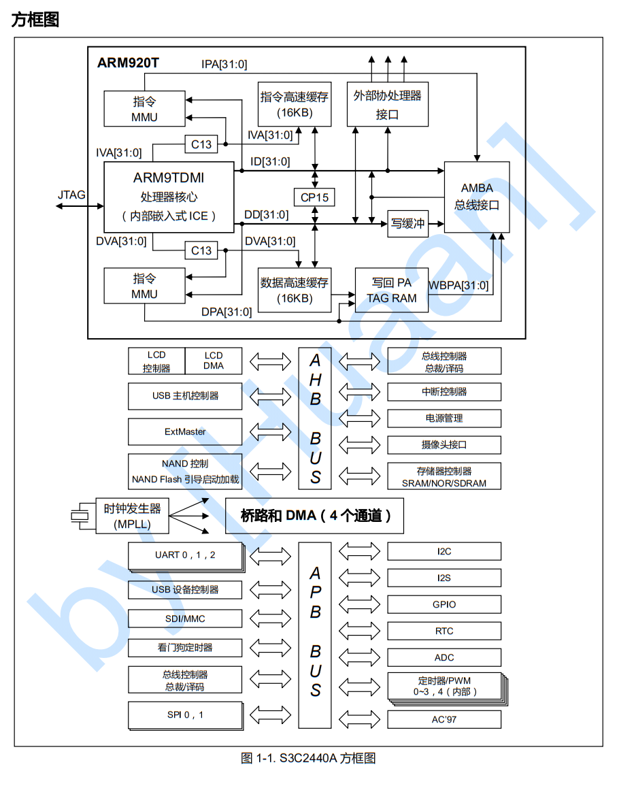

CPU进行内存访问时，需要做的仅仅就是将访问地址传递给**存储管理器**。随后由存储管理器依据给定的设置参数（即控制存储管理器的寄存器中的内容）以相应的方式访问相应的存储设备并进行指定操作。如图

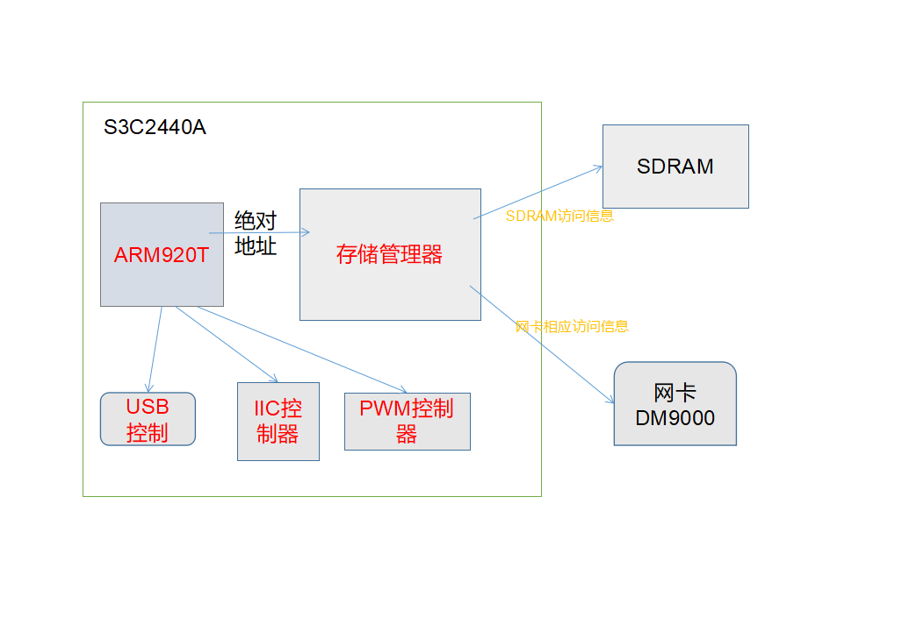


## 存储管理器

---------------------------------
---------------------------------

顾名思义，存储管理器就是用来管理存储设备的，我们的jz2440v3上的存储设备有NOR Flash、IDE接口命令块控制器、IDE接口控制块寄存器、10M网卡CS8900、10/100M网卡DM9000、扩展串口、SDRAM。这些设备都需要通过**存储管理器**来访问，CPU核心仅仅只需提供绝对地址而已。由此可见，存储管理器可以大大简化CPU核心访问存储设备时的工作。


### 1.S3C2440内存分布
<hr>
S3C2440对外引出了27根地址线ADDR0~ADDR26，访问范围为0~128MB；另外还向外引出了8根片选信号nGCS0~nGCS7，即可以外接8个存储设备（又称为BANK0~BANK7）。这样一来，存储空间就达到了8*128MB=1G```（0x00000000~0x47ffffff）```。另外S3C2440是一个32位的处理器，本身可以访问4G的存储空间，剩余的存储空间中的一部分分配给了CPU内部寄存器```（0x48000000~0x5fffffff）```，另外一部分没有使用。如图

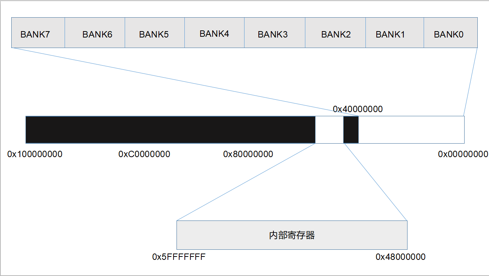

### 2.存储管理器
<hr>
S3C2440的存储器映射如图

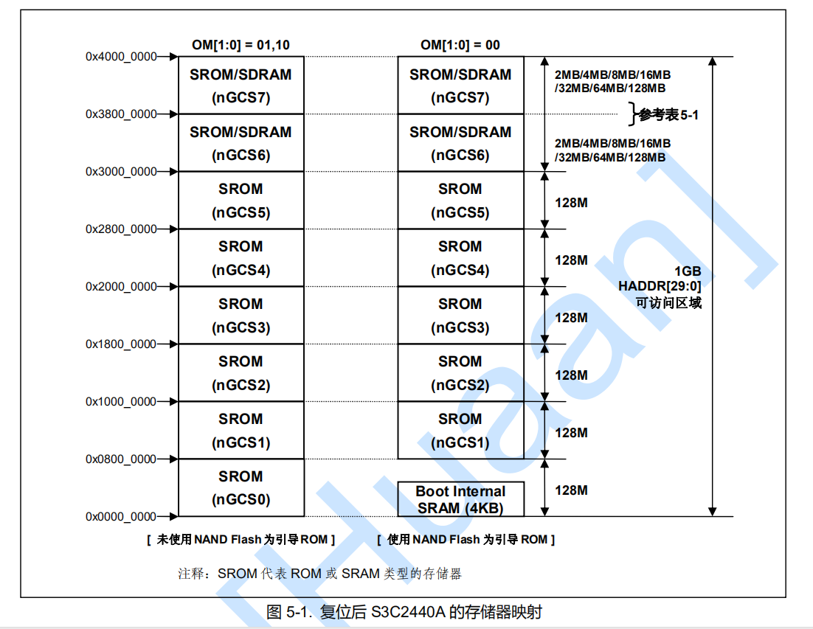

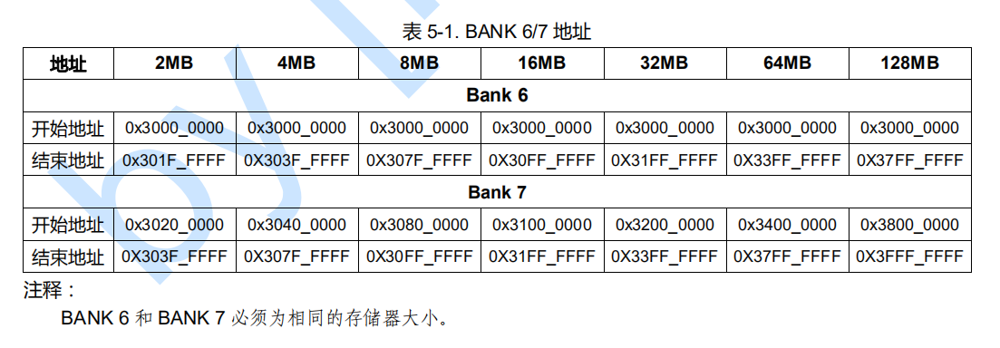


从图中可以看出来，当使用NAND启动方式时，地址```0x000000000```处的设备就是SRAM；使用NOR启动方式时，地址```0x000000000```处的设备是NOR FLASH。

另外它的特性如下：

1. 支持小字节序、大字节序（通过软件选择）；
2. 每个BANK的地址空间为128MB，总共1GB（8 BANKs）；
3. 可编程控制的总线位宽（8/16/32-bits)，不过BANK0只支持（16/32-bits）两种位宽；
4. 总共8个BANK，BANK0~BANK5仅支持外接ROM，SRAM等，BANK6~BANK7则支持ROM，SRAM，SDRAM等（sdram的访问方式和rom、sram的不一样）；
5. BANK0~BANK6共7个BANK的起始地址是固定的；
6. BANK7的起始地址可以编程选择（如上图）；
7. 每个BANK的访问周期均可编程控制；
8. 可以通过外部的```wait```信号延长总线的访问周期;
9. 在外接SDRAM时，支持自刷新（self-refresh）和省电模式（power down mode）。

### 3.JZ2440v3的存储设备
<hr>
存储控制器所接外设及对应的访问地址

BANKx | 外设名称 | 起始地址 | 结束地址 | 大小（字节） | 位宽
:-:|:-:|:-:|:-:|:-:|:-:
BANK0 | NOR FLASH | 0x0000000 | 0x001FFFFF | 2M |16
BANK1 | IDE接口命令快寄存器 | 0x08000000 | 0x0800000F | 16 | 16
BANK2 | IDE接口控制块寄存器 | 0x10000000 | 0x1000000F | 16 | 16
BANK3 | 10M网卡CS8900A | 0x19000000 | 0x190FFFFF | 1M | 16
BANK5 | 扩展串口A | 0x28000000 | 0x28000007 | 8 | 8
BANK5 | 扩展串口B | 0x29000000 | 0x29000007 | 8 | 8
BANK6 | SDRAM | 0x30000000 | 0x33FFFFFF | 64M | 32

另外bank4如下
BANKx | 外设名称 |地址| 位宽
:-:|:-:|:-:|:-:|:-:|:-:
BANK4 | 10/100M网卡DM9000 | 只有两个地址0x20000000和0x20000004 | 16
<br>
<br>

存储控制器与所接外设的连线图

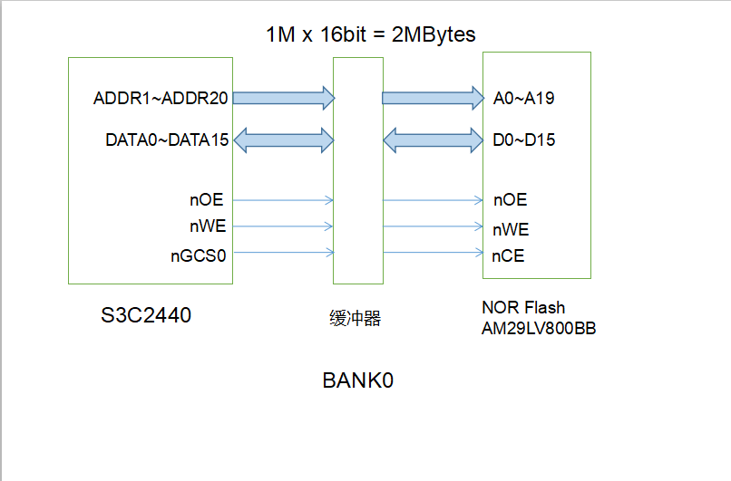

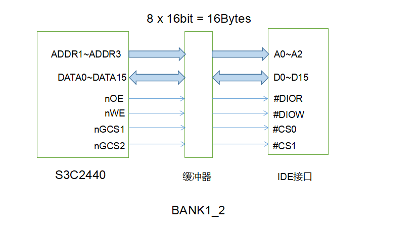

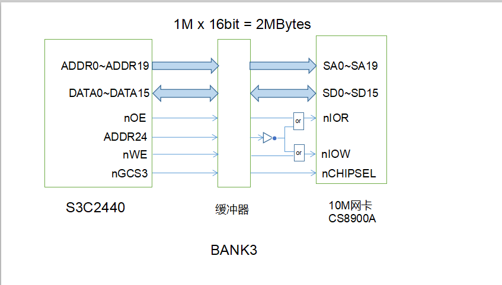

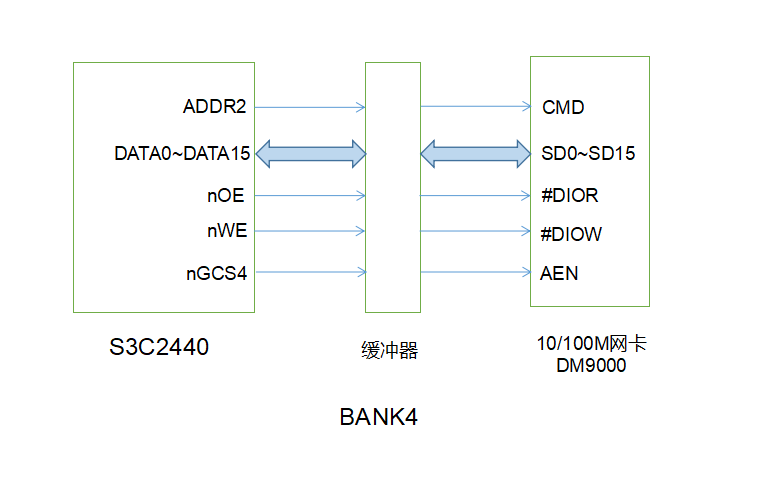

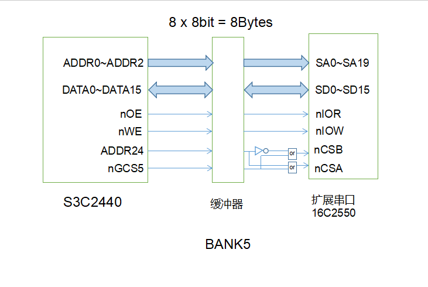

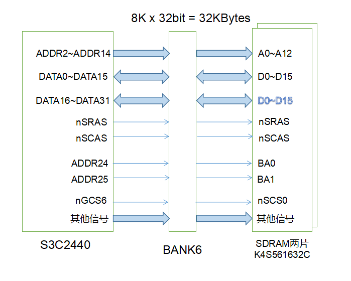

### 4.存储控制器的使用方法（各个寄存器的使用方法）
<hr>

当使用**存储控制器**访问外设时，首先需要**初始化**存储控制器，这通过改写内部13个寄存器的值来实现。

我们使用的开发板是JZ2440v3，其上的存储设备已经是固定的了，那么13个寄存器的值就可以是固定的。（这里先不研究存储控制器每个寄存器的值都是什么含义，因为搞明白了，也不能更改进行其他实验）。

13个寄存器的值如下：

    @存储控制器的13个寄存器的设置值
    0x22011110      @ BWSCON        0x48000000

    0x00000700      @ BANKCON0      0x48000004
    0x00000700      @ BANKCON1      0x48000008
    0x00000700      @ BANKCON2      0x4800000c
    0x00000700      @ BANKCON3      0x48000010
    0x00000700      @ BANKCON4      0x48000014
    0x00000700      @ BANKCON5      0x48000018
    0x00018005      @ BANKCON6      0x4800001c
    0x00018005      @ BANKCON7      0x48000020

    0x008C07A3      @ REFRESH       0x48000024
    0x000000B1      @ BANKSIZE      0x48000028
    0x00000030      @ MRSRB6        0x4800002c
    0x00000030      @ MRSRB7        0x48000030


## SDRAM的访问
<hr>
<hr>

使用上一节的寄存器的设置值设置好存储控制器后，就可以直接访问SDRAM了。根据上节的图，知道它的起始地址为```0x30000000```，它的容量为32KB。

### 1.系统启动过程
<hr>

系统启动（从NAND FLASH启动）的过程中，先将NAND FLASH 前4KB的内容复制到内部SRAM上，再将PC寄存器设为```0x00000000```后开始执行。如图

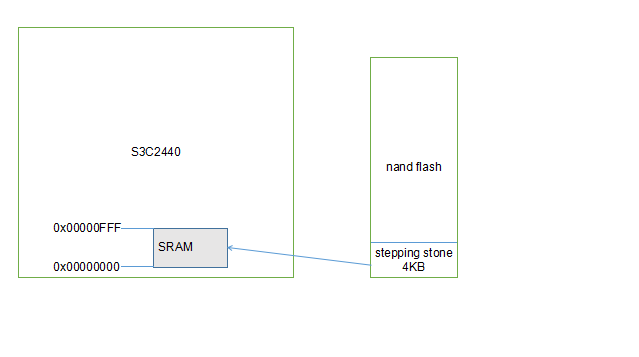

这是因为NAND FLASH无法由存储控制器直接访问，即它并不在存储空间上。所以首先需要将其上的启动程序复制到SRAM上（使用NAND启动方式时，SRAM的起始地址```0x0000000```），再设置PC指向SRAM即可。而执行的程序就是烧写到NAND FLASH上的程序。

### 2.程序的拷贝
<hr>

SRAM容量小，只有4KB，如果程序比较大，无法在4KB的存储限制内完成所有任务。这时候可以使用4KB的程序将NAND FLASH上的程序拷贝到SDRAM上，再跳到SDRAM上执行。SDRAM的容量为32KB，对于一般程序而言足够了。

不过本节主要研究如何使用SDRAM，所以只拷贝SRAM上的4KB即可。即将```0x00000000```处的4KB复制到```0x30000000```处，再继续执行。


### 3.程序内符号地址设置及跳转
<hr>

当程序执行时，其内部的符号都是相对第一条程序设置好了相对地址的。比如，第一条指令地址是```0x30000000```，则其后的指令地址都是基于```0x30000000```依次叠加的。现在我们需要将程序的基地址设置为```0x30000000```，这样在使用标号地址设置PC进行跳转时，就可以直接跳到SDRAM上执行。

在写代码之前有两点内容需要注意：
1. 区分两种不同的跳转形式

    ```ARM
    bl label
    ldr pc, =label
    ```

    bl指令中只有24位用来存储**label相对PC的偏移地址**，所以并不能实现直接从SRAM跳到SDRAM上的要求。

    而ldr伪指令最终可以将标号**label的值赋给PC**，这样一来就直接跳转到SDRAM上了。
2. 程序基地址如何设置

   我们使用的编译器时arm-linux-gcc系列的编译器，可以通过arm-linux-ld的-Ttext来设置程序基地址。

以下是代码：
``` arm
.equ            MEM_CTL_BASE,       0x48000000
.equ            SDRAM_BASE,         0x30000000

.text
.global _start
_start:
    bl          disable_watch_dog                @关闭看门狗
    bl          memsetup                         @设置存储控制器
    bl          copy_steppingstone_to_sdram      @复制代码到SDRAM中
    ldr         pc, =on_sdram                    @跳到SDRAM中继续执行
                    @所以需要把text段的首地址设置为0x30000000(使用ld -Ttext 0x30000000)

on_sdram:
    ldr         sp,=0x34000000                  @设置跳到SDRAM执行后的堆栈（如果使用c语言，就必须设定堆栈）
    bl          main

halt_loop:
    b           halt_loop 


disable_watch_dog:
    mov         r1,#0x53000000
    mov         r2,#0x0
    str         r2,[r1]
    mov         pc,lr    @返回调用函数

copy_steppingstone_to_sdram:            @复制stepping stone（只有4KB）到SDRAM上
    mov         r1,#0x0
    mov         r2,#SDRAM_BASE
    mov         r3,#1024*4
loop:
    ldr         r4,[r1],#4
    str         r4,[r2],#4
    cmp         r1,r3
    bne         loop

memsetup:                               @设置存储控制器以便使用SDRAM等外设
    mov r1,     #MEM_CTL_BASE
    adrl r2,    mem_cfg_val
    add r3,     r1,#52
loop2:
    ldr r4,[r2],#4
    str r4,[r1],#4
    cmp r1, r3

.align 4
mem_cfg_val:
    @存储控制器的13个寄存器的设置值
    .long   0x22011110      @ BWSCON
    .long   0x00000700      @ BANKCON0
    .long   0x00000700      @ BANKCON1
    .long   0x00000700      @ BANKCON2
    .long   0x00000700      @ BANKCON3  
    .long   0x00000700      @ BANKCON4
    .long   0x00000700      @ BANKCON5
    .long   0x00018005      @ BANKCON6
    .long   0x00018005      @ BANKCON7
    .long   0x008C07A3      @ REFRESH
    .long   0x000000B1      @ BANKSIZE
    .long   0x00000030      @ MRSRB6
    .long   0x00000030      @ MRSRB7
```

以下是Makefile：
```makefile
sdram.bin : head.S led_blink.c
	arm-linux-gcc -g -c -o head.o head.S
	arm-linux-gcc -g -c -o led_blink.o led_blink.c
	arm-linux-ld -Ttext 0x30000000 head.o led_blink.o -o sdram_elf   
    #重点在这里，-Ttext 后就是程序段的基地址
	arm-linux-objcopy -O binary -S sdram_elf sdram.bin
	arm-linux-objdump -D -m arm sdram_elf > sdram.dis

clean:
	rm -f sdram.dis sdram.bin sdram_elf *.o
	
```

## （附）SDRAM的工作原理
<hr>
<hr>
SDRAM的工作原理在本文档中并不重要，但是这里还是简单说下

S3C2440与SDRAM连接图如下


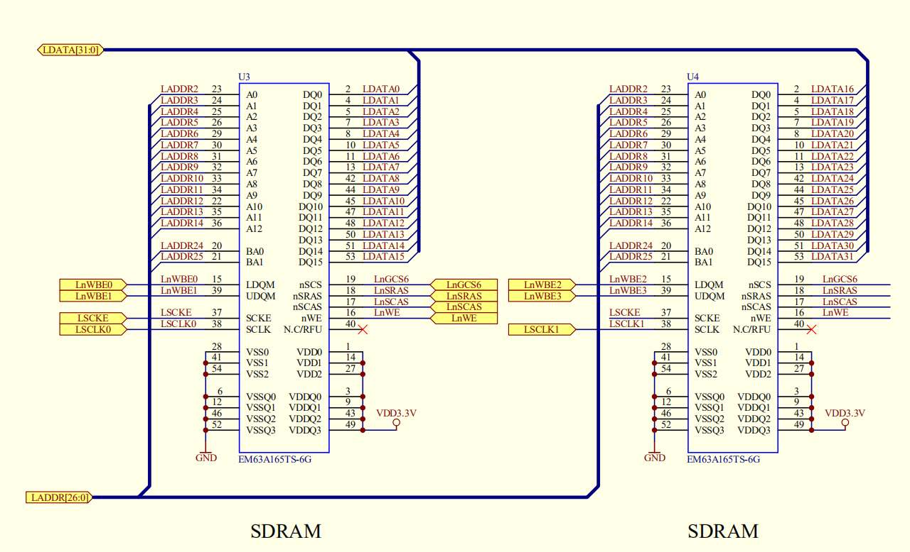

sdram内部是一个存储阵列，如同一个表格一样，要想访问其中的一个单元，首先指定行地址，然后指定列地址，就可以准确的找到要访问的单元。我们将单元格称为存储单元，将表格称为逻辑块（logical Bank（L-Bank））。JZ2440的SDRAM中有四个L-Bank。

内部结构如图所示

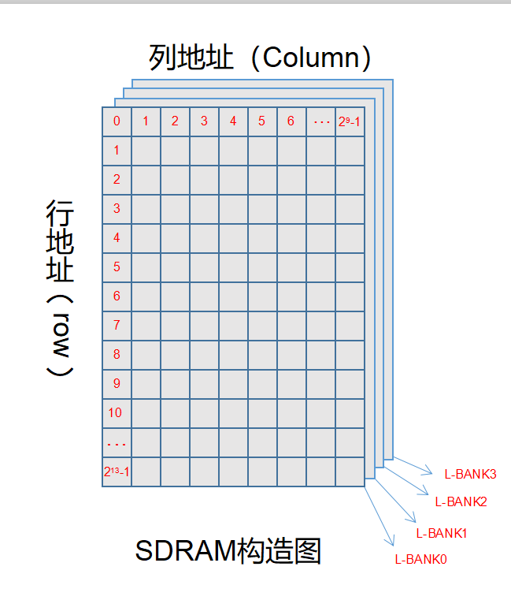


这样一来，SDRAM的访问可以分为如下4个步骤
1. CPU发出片选信号nGCS6，选中SDRAM芯片
2. SDRAM中有4个L-Bank，需要2根地址信号来选择其中的一个，从BANK6连线图中可知，ADDR24、ADDR25提供了L-Bank选择信号。
3. 对被选中的L-Bank进行行/列地址（存储单元）寻址。

        首先需要根据SDRAM芯片的行/列地址线数目设置存储控制器的相关寄存器，这样一来，存储控制器就可以从32bit的地址中自动分出L-Bank选择信号、行地址信号、列地址信号，然后先后发出行地址信号、列地址信号，而L-Bank选择信号在发出行地址信号的同时发出，维持到列地址信号结束。

        从BANK6连线图可以看出，行/列地址共用地址线ADDR2~ADDR14（BANK6位宽为32，所以ADDR0/1没有使用），使用nSRAS、nSCAS两个信号来区分它们。JZ2440v3使用的SDRAM芯片K4S561632C行地址数为13，列地址数为9，所以当nSRAS信号有效时，ADDR2~ADDR14上发出的是行地址信号，它对应32位地址空间的bit[23:11]；当nSCAS信号有效时，ADDR2~ADDR10上发出的时列地址信号，它对应32位地址空间的bit[10:2]。

4. 找到存储单元后，进行数据传输。

        由BANK连线图可以看出，SDRAM由两片，且通过位扩展方式连接起来，这样，每个存储单元就是32bit（16bit+16bit）。

这里顺便计算一下总大小，**2<sup>9</sup> * 2<sup>13</sup> * 4 * 32bit = 64MB**。它的地址范围是```0x30000000~0x33FFFFFF```。

以上的过程其实存储控制器都帮我们做好了，我们只在程序中直接访问那个地址范围即可。


