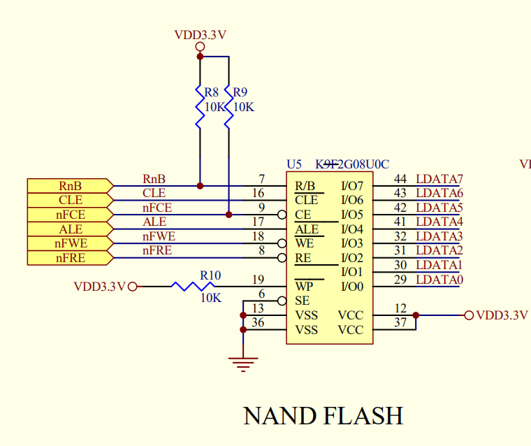
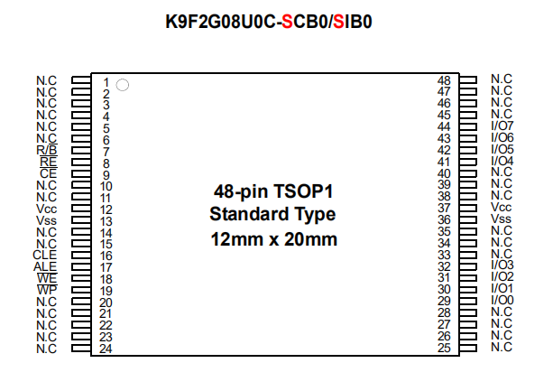
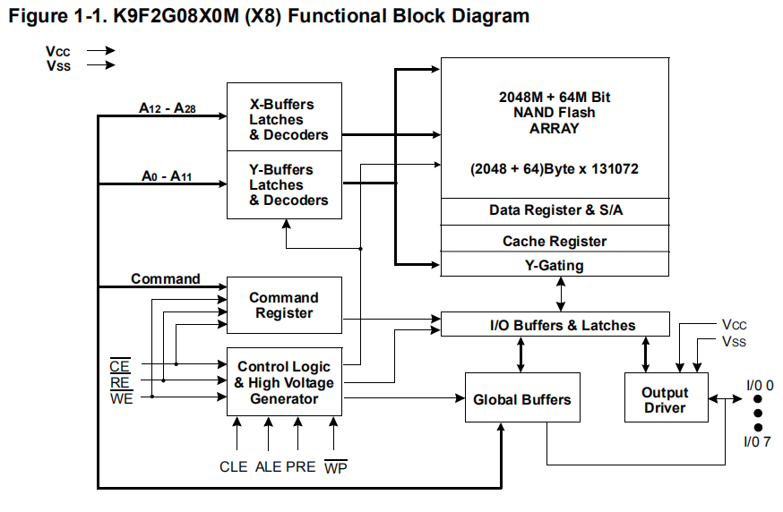
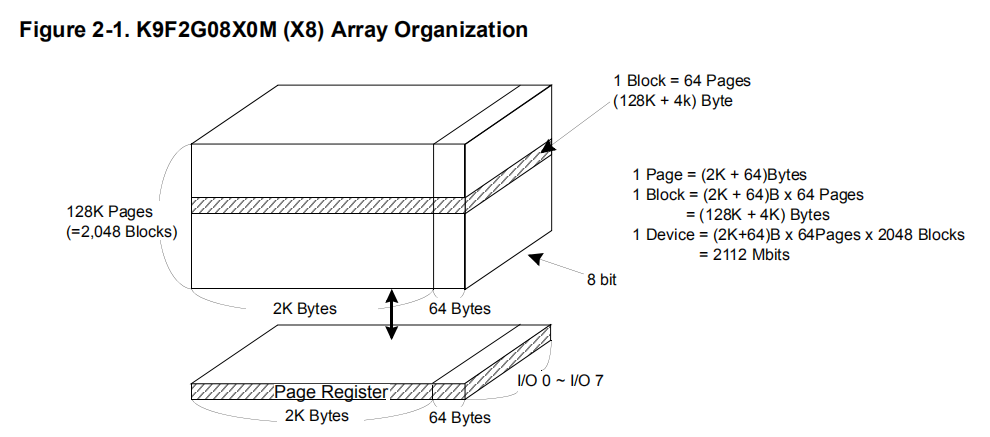
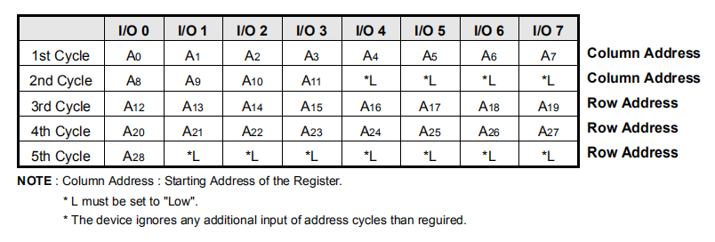
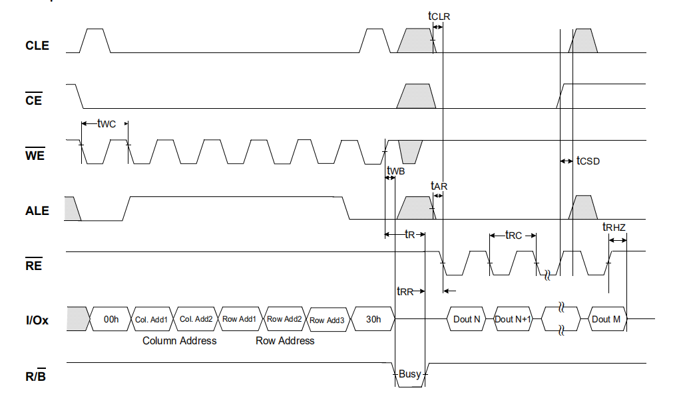
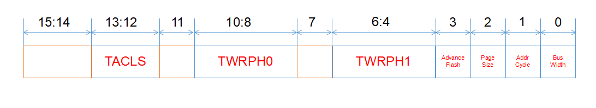
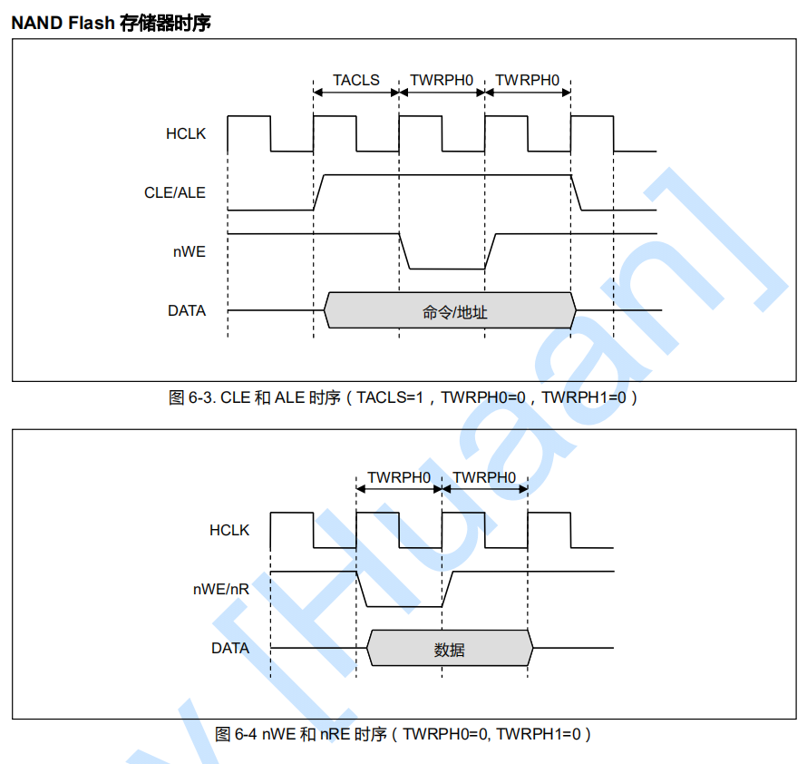
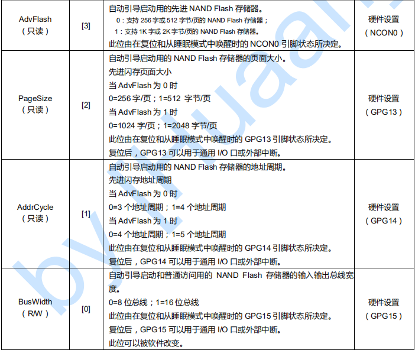

# NAND FLASH的使用

## NAND FLASH的原理与连线
<hr>
<hr>

NAND FLASH并不是通过存储管理器来访问的，因为它采用另外一种访问方式。JZ2440v3采用的NAND FLASH是三星公司生产的**K9F2G08U0C**，采用2KBytes为一页的大页结构，总容量为2Gbits。如图1所示，是NAND FLASH的引脚图：



如图2所示，是芯片的俯视图



NAND FLASH的地址、命令、数据都通过8个DATA(I/O)引脚传入（这样可以减少芯片引脚个数，同时使得系统很容易升级到更大的容量（只需要在软件层面改变控制逻辑））；使用ALE、CLE信号来区分地址和命令；R/B引脚为Ready/nBusy状态引脚，用来判断芯片当前是否忙；nWE和nRE两个引脚，则是用来控制DATA口是输入还是输出。具体如下表所示：

引脚名称 | 引脚功能
:-|:-:
I/O<sub>0</sub>~I/O<sub>7</sub> | 命令、地址、数据输入/输出
CLE | 命令锁存使能
ALE | 地址锁存使能
nCE | 芯片使能
nRE | 读使能
nWE | 写使能
nWP | 写保护
R/nB | 就绪/忙状态引脚
V<sub>CC</sub> | 电源
V<sub>SS</sub> | 地
N.C | 不接

这样一来，我们很容易就可以想到NAND FLASH的访问方式，就是

1. 输入命令(CLE nWE)
2. 输入地址(ALE nWE)
3. 在地址指定的单元执行命令(读，写，擦除)

## NAND FLASH 内部构造
<hr>
<hr>

NAND FLASH内部构造如下图所示



我们列出部分内部部件的功能如下
内部部件 | 功能
:- | -:
X-Buffers Latche & Decoders | 用于缓冲行地址
Y-Buffers Latche & Decoders | 用于缓冲列地址
Command Register | 用于命令字
Control Logic & High Voltage Generator | 根据引脚输入发出控制逻辑 & 产生Flash所需的高电压
NAND FLASH ARRAY | 存储部件（待会详细介绍）
Page Register & S/A | 页寄存器，用于缓冲读写时传输的数据，大小为2K+64字节

用来存储数据的内部部件就是NAND FLASH ARRAY，它的构造图如下



K9F2G08U0C容量为2Gbit+64Mbit（512MB+8MB），分为128K页、2048+64列，其中每列大小为8bit。可以看到，每页都有64Bytes的额外空间，但是他们并不会被记入地址空间中。

NAND FLASH是按行列形式访问的，直观的看，它的行地址、列地址就匹配到了128K页，2048列了。于是行地址为17bit，列地址为11bit。但是I/O口只有8bit，这就需要分批传入地址信号。这个传输过程的时序如图所示




## NAND FLASH的控制

### *1.NAND FLASH的指令集

nand flash使用命令来表示要执行的操作。它的命令及命令时序关系如下：

Function | 1st Cycle | 2nd Cycle | Acceptable Command During Busy
:-|:-:|:-:|:-:
Read | 00H | 30H | x
Read for Copy Back | 00H | 35H |x 
Read ID | 90H | - | x
Reset | FFH | - | O
Page Program | 80h | 10h | x
Copy-Back Program | 85h | 10h | x
Two-Plane Page Program(2) | 80h---11h |  81h---10h | x
Block Erase | 60h | D0h | x
Random Data Input(1) | 85h | - | x
Random Data Output(1) | 05h | E0h | x
Read Status | 70h | - | O
Read Status 2 | F1h | - | O

可以看到有些命令需要两个周期，这两个周期其实并不是挨着的，而是存在一定的关系。更加详细的信息需要参看命令时序图（K9F2G08U0C.pdf和K9F2G08U0M.pdf)，这里仅仅放Read的时序图：



可以看到00H和30H之间还有地址信息的传送。

> 本节中关于命令的详细时序图，见K9F2G08U0C.pdf

### 2.使用寄存器来控制NAND FLASH

虽然NAND FLASH自身提供了很多指令，但是如果我们使用指令来访问NAND FLASH，无疑会增加难度，因为那需要控制时序和电平等很细小的操作。S3C2440提供了NAND FLASH控制器，来使简化NAND FLASH的使用。用户只需要改变寄存器的值就可以实现自己想实现的操作。

S3C2440的NAND FLASH控制器提供了以下寄存器，用来访问NAND FLASH。以下列出一些简单的信息，更加详细的信息请参考S3C2440的芯片手册。

1. NFCONF(NAND FLASH配置寄存器)
    
    

    TACLS、TWRPH0、THRPH1三个bit控制的是NAND FLASH 信号线CLE/ALE与写控制信号nWE的时序关系。如图所示
    
    

    剩下四个信号用来表示是否支持其他类型的NAND FLASH，这四个信号不是由软件控制的（对软件是只读的），而是由外部引脚决定（复位或从睡眠模式唤醒时这些引脚的值）

    

2. NFCONT(NAND FLASH控制寄存器)
    
    用来使能/禁止NAND FLASH控制器（bit0）、使能/禁止片选信号nFCE（bit1）、初始化ECC（bit4）。

3. NFCMD: 命令寄存器
4. NFADDR: 地址寄存器
5. NFDATA: 数据寄存器
6. NFSTAT: 状态寄存器

    只用到bit0，0：busy；1：ready。

### 3.读FLASH
使用第2节的寄存器直接可以访问NAND FLASH，但我们通常倾向于写几个API，在程序中直接调用。以下使用读NAND来做实例，其步骤如下：
1. 对NAND进行初始化

    1. 时间参数设为：TACLS=0，TWRPH0=3，TWRPH1=0。NFCONF寄存器的值如下：

        ```C
        NFCONF = 0x300;
        ```
        
    2. 使能NAND控制器、片选禁止（为了防止错误）、初始化ECC编译器

        ```C
        NFCONT = (1<<0) | (1<<1) | (1<<4);
        ```
    
2. 复位NAND

    NAND在使用之前应该先复位，要复位需要先选中芯片，之后再关闭芯片（防止意外错误）

    ```C
    NFCONT &= ~(1<<1);  //选中芯片
    NFCMD = 0xff;       //reset命令
    NFCONT |= (1<<1);      //禁止芯片
    ```

3. 发出读命令
    
    ```c
    NFCONT &= ~(1<<1);
    NFCMD = 0;
    ```

4. 发出地址信号

    此前我们介绍NAND的地址写入时，有时序表如下。需要将col和row 拆分出来。然后在不同周期依次传入I/O接口。

    

   ```c
    NFADDR = col & 0xff;
    NFADDR = (col >> 8) & 0xff;
    NFADDR = page & 0xff;
    NFADDR = (page>>8) & 0xff;
    NFADDR = (page>>16) & 0x03;
    ```

5. 循环查询NFSTAT是否为0（nBusy），知道它等于1（Ready），这是就可以读取数据了。
6. 连续读取NFDATA寄存器2048次，得到一页数据。
7. 循环执行上述3-4-5-6几个步骤，就可以读出所有要求的数据。
8. 最后，别忘了禁止NAND FLASH的片选信号
    
    ```c
    NFCONT |= (1<<1);
    ```


## 任务
上一大节我们知道了读取NAND FLASH某地址处数据时的具体步骤，现在实现如下功能：

### 题目
将控制LED闪烁的程序“**LED**”放到NAND FLASH上的4096处（这里不在steppingstone范围内）。使用steppingstone中的程序将“**LED**”读取到sdram上去，然后程序跳转到sdram上执行“**LED**”。

### 答案

1. 程序的大体过程如下
    
    ```arm
    .text
    .global _start
    _start:
        ldr sp,=4096    @在执行c函数前需要先设置栈指针
        bl disable_watch_dog
        bl memsetup
        bl nand_init

        @从nand的4096处读2048Bytes到sdram(0x30000000)
        @寄存器r0,r1,r2用来存放参数，相关内容参考ATPCS(arm程序调用规则)
        ldr r0, =0x30000000
        mov r1, #4096
        mov r2, #2048
        bl nand_read

        ldr sp,=0x34000000
        ldr lr,=halt_loop
        ldr pc,=main    @使用LDR伪指令可以实现大范围跳转，bl使用相对地址，不可以
        
    halt_loop:
        b halt_loop
    ```

2.使用c实现disable_watch_dog()，memsetup()
```c
#define WTCON (*(volatile unsigned int*) 0x53000000)
#define MEM_CTL_BASE 0x48000000
void disable_watch_dog();
void memsetup();
void disable_watch_dog(){
    WTCON = 0;
}
void memsetup(){
    int i = 0;
    unsigned long *p = (unsigned long*)MEM_CTL_BASE;
    unsigned long const mem_cfg_val[] = {
        0x22011110,     //BWSCON
        0x00000700,     //BANKCON0
        0x00000700,     //BANKCON1
        0x00000700,     //BANKCON2
        0x00000700,     //BANKCON3  
        0x00000700,     //BANKCON4
        0x00000700,     //BANKCON5
        0x00018005,     //BANKCON6
        0x00018005,     //BANKCON7
        0x008C07A3,     //REFRESH
        0x000000B1,     //BANKSIZE
        0x00000030,     //MRSRB6
        0x00000030,     //MRSRB7
    };
    
    for(;i<13;i++)
        p[i] = mem_cfg_val[i];
}
```
3. 使用c实现nand的各个api函数
```c
#define NAND_SECTOR_SIZE_LP 2048
#define NAND_BLOCK_MASK_LP (NAND_SECTOR_SIZE_LP  - 1)
void nand_init(void);
void nand_read();
static void nand_reset(void);
static void wait_idle(void);
static void nand_select_chip(void);
static void nand_deselect_chip(void);
static void write_cmd(int cmd);
static void write_addr(unsigned int addr);
static unsigned char read_data(void);
//NAND FLASH访问时需要写的寄存器。寄存器地址间隔为4
typedef unsigned int S3C24X0_REG32;
typedef struct{
    S3C24X0_REG32 NFCONF;       //配置
    S3C24X0_REG32 NFCONT;       //控制
    S3C24X0_REG32 NFCMD;        //指令
    S3C24X0_REG32 NFADDR;       //地址
    S3C24X0_REG32 NFDATA;       //数据

    S3C24X0_REG32 NFMECCD0;     //主区域ECC0/1
    S3C24X0_REG32 NFMECCD1;     //主区域ECC2/3
    S3C24X0_REG32 NFSECCD;      //空闲区域ECC
    S3C24X0_REG32 NFSTAT;       //运行状态
    S3C24X0_REG32 NFESTAT0;     //I/O[7:0]ECC状态
    S3C24X0_REG32 NFESTAT1;     //I/O[15:8]ECC状态
    S3C24X0_REG32 NFMECC0;      //主区域ECC0状态
    S3C24X0_REG32 NFMECC1;      //主区域ECC1状态
    S3C24X0_REG32 NFSECC;       //空闲区域ECC状态
    S3C24X0_REG32 NFSBLK;       //开始块地址
    S3C24X0_REG32 NFEBLK;       //结束块地址
}S3C24X0_NAND;

static S3C24X0_NAND *s3c2440_nand = (S3C24X0_NAND*) 0x4E000000;
static void nand_select_chip(void){
    int i;
    s3c2440_nand->NFCONT &= ~(1<<1);
    for(i=0;i<10;i++);
}

static void nand_deselect_chip(void){
    s3c2440_nand->NFCONT |= (1<<1);
}

//等待nand flash进入就绪状态
static void wait_idle(void){
    #define BUSY 1
    int i;
    volatile unsigned char *p = (volatile unsigned char *)&s3c2440_nand->NFSTAT;
    while(!(*p & BUSY))
        for(i=0;i<10;i++);
}

static void write_cmd(int cmd){
    volatile unsigned char *p = (volatile unsigned char*)&s3c2440_nand->NFCMD;
    *p = cmd;
}

//我们使用的是大页的NAND FLASH
//所以这里需要大页形式的写地址方法
void write_addr(unsigned int addr){
    int i;
    volatile unsigned char *p = (volatile unsigned char*)&s3c2440_nand->NFADDR;
    int col, page;

    col = addr & NAND_BLOCK_MASK_LP;        //page页的第几列
    page = addr / NAND_SECTOR_SIZE_LP;      //页数

    *p = col & 0xff;
    for(i=0;i<10;i++);
    *p = (col >> 8) & 0xff;
    for(i=0;i<10;i++);
    *p = page & 0xff;
    for(i=0;i<10;i++);
    *p = (page>>8) & 0xff;
    for(i=0;i<10;i++);
    *p = (page>>16) & 0x03;
    for(i=0;i<10;i++);
}

//仅仅从I/O口读入数据
unsigned char read_data(void){
    volatile unsigned char * p = (volatile unsigned char *)&s3c2440_nand->NFDATA;
    return *p;
}

void nand_reset(void){
    nand_select_chip();
    write_cmd(0xff);
    wait_idle();
    nand_deselect_chip();
}

void nand_init(void)
{
    #define TACLS 0
    #define TWRPH0 3
    #define TWRPH1 0

    //只使用S3C2440

    s3c2440_nand->NFCONF = (TACLS << 12) | (TWRPH0 << 8) | (TWRPH1 << 4);
    s3c2440_nand->NFCONT = (1 << 4) | (1<<1) | (1<<0);
    nand_reset();
}

```
4. 使用上述api实现需求nand_read()
```c
void nand_read(unsigned char*buf, unsigned long start_addr, int size){
    int i, j;
    //地址或长度不对齐，退出
    if((start_addr & NAND_BLOCK_MASK_LP) || (size & NAND_BLOCK_MASK_LP))
        return ;

    nand_select_chip();

    for(i=start_addr; i < (start_addr + size);){
        //READ0命令
        write_cmd(0x00);
        //WriteAddress
        write_addr(i);

        write_cmd(0x30);
        wait_idle();
        for(j=0;j<NAND_SECTOR_SIZE_LP;j++, i++){
            *buf = read_data();
            buf++;
        }
    }
    nand_deselect_chip();
    return ;
}
```

### 链接脚本
链接脚本是很重要的，直接控制程序的烧写，比如我们要将“**LED**”烧到4096处，而其他的程序的大小加起来也打不到4096，这时候就需要告诉烧写器，应该把这部分代码烧写到哪里。
```lds
SECTIONS {
    first 0x00000000 : {head.o init.o nand.o}
    second 0x30000000 : AT(4096) {main.o}
    #第二句告诉连接器符号地址为0x30000000，烧写地址为4096
}
```
关于链接脚本更多的内容，以后放到Note目录。


> 我的实验使用JZ2440v3，NAND FLASH就是K9F2G08U0C，但课本上的则是使用K9F1208U0M来做的列子。

> 我发现K9F1208U0M中的12实际上代表NANDFLASH的大小为512MBits，其中的08代表I/O为8bit宽
 
> K9F2G08U0M中的2G代表NAND FLASH的大小为2Gbits。


   


    


