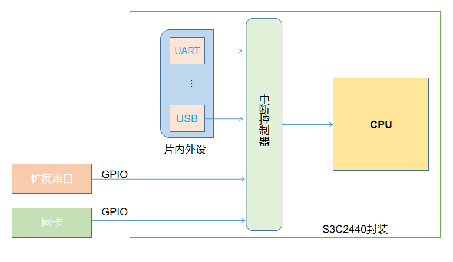
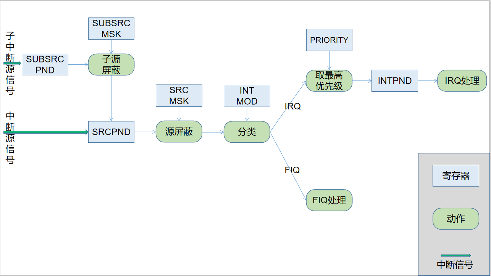
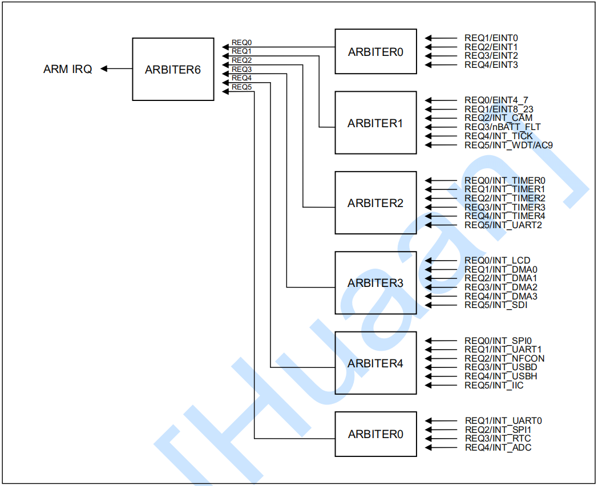
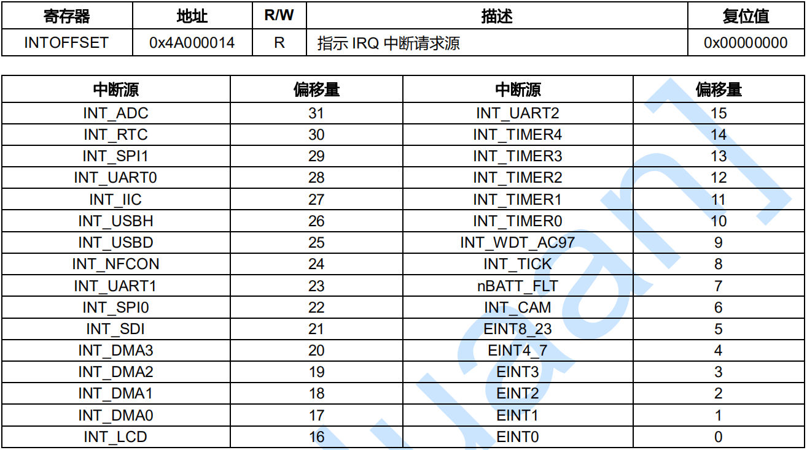
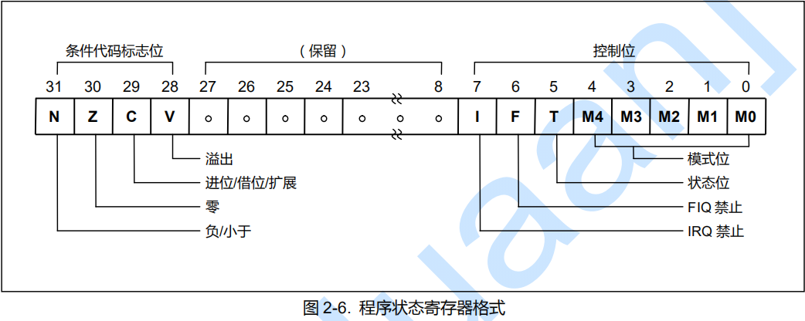

## 1.这个过程发生了什么
S3C2440处理器中集成了中断控制器来处理中断，它可以接受60个中断源的请求。中断源可以来自处理器内部，也可以来自外部。如图

图一

中断控制器在中断源触发后，依据用户对中断控制相关寄存器内容的设置来调整处理方式。中断处理过程以及要用到的寄存器如图：

图二

由图中我们知道了从中断源发出信号到CPU开始处理中断的过程中发生了什么。下面依次介绍中断信号、各寄存器相关知识。当然中断是否被允许也是CPU需要控制好的。
## 2. 中断信号
60个中断源在S3C2440中分成了**中断源**和**中断次级源**。中断源有32个。

1. 中断源可以衍生出中断次级源，中断次级源之间是相互独立的，即它们**不会同时发生**。这也意味着，使用一个中断源就可以表述它们。中断次级源一共有15个。

2. 同时中断源还有使用一个中断源表示多个中断源的情况。这种情况是使用3种中断源表示了22个中断源。（真的省钱啊）

中断源具体信息如下

源 | 描述 | 次级源/多个中断源
-|-|-
INT_ADC 		| ADC EOC 和触屏中断 	| 次级源 INT_ADC_S/INT_TC
INT_RTC 		| RTC 闹钟中断 			| -
INT_SPI1 		| SPI1 中断 			| - 
INT_UART0 		| UART0 中断 			|次级源 ERR、RXD 和 TXD
INT_IIC  		| IIC 中断 				| -
INT_USBH 		| USB 主机中断 			| - 
INT_USBD 		| USB 设备中断 			| -
INT_NFCON 		| Nand Flash 控制中断 	| -
INT_UART1 		| UART1 中断 			|次级源 ERR、RXD 和 TXD
INT_SPI0 		| SPI0 中断 			| -
INT_SDI 		| SDI 中断 				|  - 
INT_DMA3 		| DMA 通道 3 中断 		| - 
INT_DMA2 		| DMA 通道 2 中断 		| - 
INT_DMA1 		| DMA 通道 1 中断 		| - 
INT_DMA0 		| MA 通道 0 中断 		| - 
INT_LCD 		| LCD 中断 				| 多个中断源INT_FrSyn / INT_FiCnt
INT_UART2 		| UART2 中断 			| 次级源ERR、RXD 和 TXD
INT_TIMER4 		| 定时器 4 中断  		| - 
INT_TIMER3 		| 定时器 3 中断  		| - 
INT_TIMER2 		| 定时器 2 中断  		| - 
INT_TIMER1 		| 定时器 1 中断  		| - 
INT_TIMER0 		| 定时器 0 中断  		| - 
INT_WDT_AC97 	| 看门狗定时器中断 		|次级源INT_WDT/INT_AC97
INT_TICK 		| RTC 时钟滴答中断  	| - 
nBATT_FLT 		| 电池故障中断  		| - 
INT_CAM 		| 摄像头接口 			| 次级源 INT_CAM_C/INT_CAM_P
EINT8_23 		| 外部中断 8 至 23 		| 多个中断源EINT8-EINT23
EINT4_7 		| 外部中断 4 至 7  		| 多个中断源EINT4-EINT7
EINT3 			| 外部中断 3  			| - 
EINT2 			| 外部中断 2  			| - 
EINT1 			| 外部中断 1  			| - 
EINT0 			| 外部中断 0  			| - 

中断次级源具体信息如下

次级源 | 描述 | 源
-|-|-
INT_AC97  | AC97 中断 					| INT_WDT_AC97
INT_WDT   | 看门狗中断 					| INT_WDT_AC97
INT_CAM_P | 摄像头接口中 P 端口捕获中断 | INT_CAM
INT_CAM_C | 摄像头接口中 C 端口捕获中断 | INT_CAM
INT_ADC_S | ADC 中断 					| INT_ADC
INT_TC    | 触摸屏中断（笔起/落） 		| INT_ADC
INT_ERR2  | UART2 错误中断 				| INT_UART2
INT_TXD2  | UART2 发送中断 				| INT_UART2
INT_RXD2  | UART2 接收中断 				| INT_UART2
INT_ERR1  | UART1 错误中断 				| INT_UART1
INT_TXD1  | UART1 发送中断 				| INT_UART1
INT_RXD1  | UART1 接收中断 				| INT_UART1
INT_ERR0  | UART0 错误中断 				| INT_UART0
INT_TXD0  | UART0 发送中断 				| INT_UART0
INT_RXD0  | UART0 接收中断 				| INT_UART0

> 使用一个中断源表示多个中断源的情况，我并不是很了解其原因。当然节省空间这个谁都能想到。

## 3.中断过程中会使用到的寄存器
1. 源挂起寄存器、源屏蔽寄存器、次级源挂起寄存器、次级源屏蔽寄存器
2. 优先级设定寄存器、模式设定寄存器
3. 中断挂起寄存器

### 3.1 源挂起寄存器和次级源挂起寄存器

中断源信号来自S3C2440封装的内部或外部如（图一），中断源信号会被中断控制器全部接收。用来存储中断源中断信号的就是源挂起寄存器和次级源挂起寄存器。

以下为源挂起寄存器不同位的含义

**SRCPND**

寄存器 |  地址 | R/W | 描述 | 复位值
-| -|-|-|-
指示中断源请求状态 SRCPND | 0X4A000000 | R/W | 0 = 中断源源没有中断请求； 1 = 中断源有中断请求 | 0x00000000

中断源 | 位 | 0| 1  | 初始状态（复位状态）
-|-|-|-|-
INT_ADC 	 | [31] | 0 = 未请求 | 1 = 请求 | 0
INT_RTC 	 | [30] | 0 = 未请求 | 1 = 请求 | 0
INT_SPI1 	 | [29] | 0 = 未请求 | 1 = 请求 | 0
INT_UART0 	 | [28] | 0 = 未请求 | 1 = 请求 | 0
INT_IIC 	 | [27] | 0 = 未请求 | 1 = 请求 | 0
INT_USBH 	 | [26] | 0 = 未请求 | 1 = 请求 | 0
INT_USBD   	 | [25] | 0 = 未请求 | 1 = 请求 | 0
INT_NFCON    | [24] | 0 = 未请求 | 1 = 请求 | 0
INT_UART1 	 | [23] | 0 = 未请求 | 1 = 请求 | 0
INT_SPI0 	 | [22] | 0 = 未请求 | 1 = 请求 | 0
INT_SDI 	 | [21] | 0 = 未请求 | 1 = 请求 | 0
INT_DMA3 	 | [20] | 0 = 未请求 | 1 = 请求 | 0
INT_DMA2 	 | [19] | 0 = 未请求 | 1 = 请求 | 0
INT_DMA1 	 | [18] | 0 = 未请求 | 1 = 请求 | 0
INT_DMA0 	 | [17] | 0 = 未请求 | 1 = 请求 | 0
INT_LCD 	 | [16] | 0 = 未请求 | 1 = 请求 | 0
INT_UART2 	 | [15] | 0 = 未请求 | 1 = 请求 | 0
INT_TIMER4 	 | [14] | 0 = 未请求 | 1 = 请求 | 0
INT_TIMER3 	 | [13] | 0 = 未请求 | 1 = 请求 | 0
INT_TIMER2 	 | [12] | 0 = 未请求 | 1 = 请求 | 0
INT_TIMER1 	 | [11] | 0 = 未请求 | 1 = 请求 | 0
INT_TIMER0 	 | [10] | 0 = 未请求 | 1 = 请求 | 0
INT_WDT_AC97 | [9]  | 0 = 未请求 | 1 = 请求 | 0
INT_TICK 	 | [8]  | 0 = 未请求 | 1 = 请求 | 0
nBATT_FLT 	 | [7]  | 0 = 未请求 | 1 = 请求 | 0
INT_CAM 	 | [6]  | 0 = 未请求 | 1 = 请求 | 0
EINT8_23 	 | [5]  | 0 = 未请求 | 1 = 请求 | 0
EINT4_7 	 | [4]  | 0 = 未请求 | 1 = 请求 | 0
EINT3 	 	 | [3]  | 0 = 未请求 | 1 = 请求 | 0
EINT2 		 | [2]  | 0 = 未请求 | 1 = 请求 | 0
EINT1 		 | [1]  | 0 = 未请求 | 1 = 请求 | 0
EINT0 		 | [0]  | 0 = 未请求 | 1 = 请求 | 0

以下为次级源挂起寄存器不同位的含义

**SUBSRCPND**

寄存器 | 地址 | R/W | 描述 | 复位值 
-|-|-|-|-
指示中断次级源请求状态 SUBSRCPND | 0X4A000018 | R/W | 0 = 次级中断源未请求中断；1 = 次级中断源以请求中断 | 0x00000000

SUBSRCPND | 位 | 0 | 1 | 初始状态
-|-|-|-|-
保留 | [31:15] | 未使用 | 未使用 | 0
INT_AC97 	| [14] | 0 = 未请求 | 1 = 请求 | 0
INT_WDT 	| [13] | 0 = 未请求 | 1 = 请求 | 0
INT_CAM_P 	| [12] | 0 = 未请求 | 1 = 请求 | 0
INT_CAM_C 	| [11] | 0 = 未请求 | 1 = 请求 | 0
INT_ADC_S 	| [10] | 0 = 未请求 | 1 = 请求 | 0
INT_TC 		| [9]  | 0 = 未请求 | 1 = 请求 | 0
INT_ERR2 	| [8]  | 0 = 未请求 | 1 = 请求 | 0
INT_TXD2 	| [7]  | 0 = 未请求 | 1 = 请求 | 0
INT_RXD2 	| [6]  | 0 = 未请求 | 1 = 请求 | 0
INT_ERR1 	| [5]  | 0 = 未请求 | 1 = 请求 | 0
INT_TXD1 	| [4]  | 0 = 未请求 | 1 = 请求 | 0
INT_RXD1 	| [3]  | 0 = 未请求 | 1 = 请求 | 0
INT_ERR0 	| [2]  | 0 = 未请求 | 1 = 请求 | 0
INT_TXD0 	| [1]  | 0 = 未请求 | 1 = 请求 | 0
INT_RXD0 	| [0]  | 0 = 未请求 | 1 = 请求 | 0

SRCPND和SUBSRCPND之间的映射关系如下

SRCPND | SUBSRCPND
-|-
INT_UART0 	 | INT_RXD0，INT_TXD0，INT_ERR0
INT_UART1 	 | INT_RXD1，INT_TXD1，INT_ERR1
INT_UART2 	 | INT_RXD2，INT_TXD2，INT_ERR2
INT_ADC 	 | INT_ADC_S，INT_TC
INT_CAM 	 | INT_CAM_C，INT_CAM_P
INT_WDT_AC97 | INT_WDT，INT_AC97

### 3.2 源屏蔽寄存器和次级源屏蔽寄存器
（次级）中断源请求信号虽然一定会被记录到，但未必会被处理。这是因为对于某些（次级）中断源，我们并不想处理它们，一接收到它们的请求信号就直接屏蔽掉了。S3C2440使用（次级）源中断屏蔽寄存器来记录要屏蔽的（次级）源。

**INTMSK**

寄存器 | 地址 | R/W | 描述 | 复位值
-|-|-|-|-
决定屏蔽哪个中断源。被屏蔽的中断源将不会服务 INTMSK | 0X4A000008 | R/W | 0 = 中断服务可用；1 = 屏蔽中断服务 | 0xFFFFFFFF

INTMSK | 位 | 0 | 1 | 初始状态
-|-|-|-|-|
INT_ADC 	 | [31] | 0 = 可服务 | 1 = 屏蔽 | 1
INT_RTC 	 | [30] | 0 = 可服务 | 1 = 屏蔽 | 1
INT_SPI1 	 | [29] | 0 = 可服务 | 1 = 屏蔽 | 1
INT_UART0 	 | [28] | 0 = 可服务 | 1 = 屏蔽 | 1
INT_IIC 	 | [27] | 0 = 可服务 | 1 = 屏蔽 | 1
INT_USBH 	 | [26] | 0 = 可服务 | 1 = 屏蔽 | 1
INT_USBD 	 | [25] | 0 = 可服务 | 1 = 屏蔽 | 1
INT_NFCON 	 | [24] | 0 = 可服务 | 1 = 屏蔽 | 1
INT_UART1	 | [23] | 0 = 可服务 | 1 = 屏蔽 | 1
INT_SPI0 	 | [22] | 0 = 可服务 | 1 = 屏蔽 | 1
INT_SDI 	 | [21] | 0 = 可服务 | 1 = 屏蔽 | 1
INT_DMA3 	 | [20] | 0 = 可服务 | 1 = 屏蔽 | 1
INT_DMA2 	 | [19] | 0 = 可服务 | 1 = 屏蔽 | 1
INT_DMA1 	 | [18] | 0 = 可服务 | 1 = 屏蔽 | 1
INT_DMA0 	 | [17] | 0 = 可服务 | 1 = 屏蔽 | 1
INT_LCD 	 | [16] | 0 = 可服务 | 1 = 屏蔽 | 1
INT_UART2 	 | [15] | 0 = 可服务 | 1 = 屏蔽 | 1
INT_TIMER4 	 | [14] | 0 = 可服务 | 1 = 屏蔽 | 1
INT_TIMER3 	 | [13] | 0 = 可服务 | 1 = 屏蔽 | 1
INT_TIMER2 	 | [12] | 0 = 可服务 | 1 = 屏蔽 | 1
INT_TIMER1 	 | [11] | 0 = 可服务 | 1 = 屏蔽 | 1
INT_TIMER0 	 | [10] | 0 = 可服务 | 1 = 屏蔽 | 1
INT_WDT_AC97 | [9] 	| 0 = 可服务 | 1 = 屏蔽 | 1
INT_TICK 	 | [8] 	| 0 = 可服务 | 1 = 屏蔽 | 1
nBATT_FLT 	 | [7] 	| 0 = 可服务 | 1 = 屏蔽 | 1
INT_CAM 	 | [6] 	| 0 = 可服务 | 1 = 屏蔽 | 1
EINT8_23 	 | [5] 	| 0 = 可服务 | 1 = 屏蔽 | 1
EINT4_7 	 | [4] 	| 0 = 可服务 | 1 = 屏蔽 | 1
EINT3 		 | [3] 	| 0 = 可服务 | 1 = 屏蔽 | 1
EINT2 		 | [2] 	| 0 = 可服务 | 1 = 屏蔽 | 1
EINT1 		 | [1] 	| 0 = 可服务 | 1 = 屏蔽 | 1
EINT0 		 | [0] 	| 0 = 可服务 | 1 = 屏蔽 | 1

**INTSUBMSK** 

寄存器 | 地址 | R/W | 描述 | 复位值
-|-|-|-|-
决定屏蔽哪个中断次级源。被屏蔽的中断次级源将不会被服务 INTSUBMSK | 0X4A00001C | R/W | 0 = 中断服务可用 1 = 屏中断服务 | 0xFFFF

INTSUBMSK | 位 | 0 | 1 | 初始状态
-|-|-|-|-
保留        | [31:15]   | 未使用     |未使用    | 0
INT_AC97	| [14]   	| 0 = 可服务 | 1 = 屏蔽 | 1
INT_WDT 	| [13]   	| 0 = 可服务 | 1 = 屏蔽 | 1
INT_CAM_P 	| [12]   	| 0 = 可服务 | 1 = 屏蔽 | 1
INT_CAM_C 	| [11]   	| 0 = 可服务 | 1 = 屏蔽 | 1
INT_ADC_S 	| [10]   	| 0 = 可服务 | 1 = 屏蔽 | 1
INT_TC		| [9]    	| 0 = 可服务 | 1 = 屏蔽 | 1
INT_ERR2 	| [8]    	| 0 = 可服务 | 1 = 屏蔽 | 1
INT_TXD2 	| [7]    	| 0 = 可服务 | 1 = 屏蔽 | 1
INT_RXD2 	| [6]    	| 0 = 可服务 | 1 = 屏蔽 | 1
INT_ERR1 	| [5]    	| 0 = 可服务 | 1 = 屏蔽 | 1
INT_TXD1 	| [4]    	| 0 = 可服务 | 1 = 屏蔽 | 1
INT_RXD1 	| [3]    	| 0 = 可服务 | 1 = 屏蔽 | 1
INT_ERR0 	| [2]    	| 0 = 可服务 | 1 = 屏蔽 | 1
INT_TXD0 	| [1]    	| 0 = 可服务 | 1 = 屏蔽 | 1
INT_RXD0 	| [0]    	| 0 = 可服务 | 1 = 屏蔽 | 1

由此可见，S3C2440复位后，**默认不为任何中断源提供服务**。

### 3.3 模式设置寄存器
中断寄存器有两种中断类型：IRQ和FIQ。其中S3C2440只能为一个中断源提供FIQ服务，其他的只能设置为IRQ服务。这通过INTMOD寄存器来记录。

**INTMOD**

寄存器 | 地址 | R/W | 描述 | 复位值
:-:|:-:|:-:|:-:|:-:
中断模式寄存器  INTMOD | 0X4A000004 | R/W | 0 = IRQ 模式 ; 1 = FIQ 模式 | 0x00000000

INTMOD | 位 | 描述 | 初始状态
-|-|-|-
INT_ADC         | [31] | 0 = IRQ | 1 = FIQ | 0
INT_RTC         | [30] | 0 = IRQ | 1 = FIQ | 0
INT_SPI1        | [29] | 0 = IRQ | 1 = FIQ | 0
INT_UART0       | [28] | 0 = IRQ | 1 = FIQ | 0
INT_IIC         | [27] | 0 = IRQ | 1 = FIQ | 0
INT_USBH        | [26] | 0 = IRQ | 1 = FIQ | 0
INT_USBD        | [25] | 0 = IRQ | 1 = FIQ | 0
INT_NFCON       | [24] | 0 = IRQ | 1 = FIQ | 0
INT_UART1       | [23] | 0 = IRQ | 1 = FIQ | 0
INT_SPI0        | [22] | 0 = IRQ | 1 = FIQ | 0
INT_SDI         | [21] | 0 = IRQ | 1 = FIQ | 0
INT_DMA3        | [20] | 0 = IRQ | 1 = FIQ | 0
INT_DMA2        | [19] | 0 = IRQ | 1 = FIQ | 0
INT_DMA1        | [18] | 0 = IRQ | 1 = FIQ | 0 
INT_DMA0        | [17] | 0 = IRQ | 1 = FIQ | 0
INT_LCD         | [16] | 0 = IRQ | 1 = FIQ | 0
INT_UART2       | [15] | 0 = IRQ | 1 = FIQ | 0
INT_TIMER4      | [14] | 0 = IRQ | 1 = FIQ | 0
INT_TIMER3      | [13] | 0 = IRQ | 1 = FIQ | 0
INT_TIMER2      | [12] | 0 = IRQ | 1 = FIQ | 0
INT_TIMER1      | [11] | 0 = IRQ | 1 = FIQ | 0
INT_TIMER0      | [10] | 0 = IRQ | 1 = FIQ | 0
INT_WDT_AC97    | [9]  | 0 = IRQ | 1 = FIQ | 0
INT_TICK        | [8]  | 0 = IRQ | 1 = FIQ | 0
nBATT_FLT       | [7]  | 0 = IRQ | 1 = FIQ | 0
INT_CAM         | [6]  | 0 = IRQ | 1 = FIQ | 0
EINT8_23        | [5]  | 0 = IRQ | 1 = FIQ | 0
EINT4_7         | [4]  | 0 = IRQ | 1 = FIQ | 0
EINT3           | [3]  | 0 = IRQ | 1 = FIQ | 0
EINT2           | [2]  | 0 = IRQ | 1 = FIQ | 0
EINT1           | [1]  | 0 = IRQ | 1 = FIQ | 0
EINT0           | [0]  | 0 = IRQ | 1 = FIQ | 0

### 3.4 优先级设置寄存器 
在通过中断模式寄存器判定中断模式之后，只有一个FIQ请求，它会被立即提供服务；但是会有多个IRQ请求，这时中断控制器需要先找出最高优先级的请求再提供服务。

如何选取最高优先级的中断呢？中断控制器中的仲裁器依据优先级寄存器中的优先级设置信息，来选出最高优先级的中断。仲裁器分管的中断源如图

优先级寄存器中有7组 模式控制位（ARB_MODE) 和 选择控制位（ARB_SEL) 。分别介绍两种控制位的功能。

ARB_SEL一共可以有四个值：

值 | 优先级顺序
-|-
00b | REQ0->REQ1->REQ2->REQ3->REQ4->REQ5
01b | REQ0->REQ2->REQ3->REQ4->REQ1->REQ5
10b | REQ0->REQ3->REQ4->REQ1->REQ2->REQ5
11b | REQ0->REQ4->REQ1->REQ2->REQ3->REQ5

REQ0的优先级总是最高，REQ5的优先级总是最低。通过改变ARB_SEL可以改变REQ1-REQ4 的优先级顺序。而ARB_SEL有自动变化和不变化两种情况，由ARB_MODE 控制。

ARB_MODE一共有两个值：

值 | 作用
-|:-:
0 | 对应的ARB_SEL不变化
1 | 对应的ARB_SEL自动变化（自动修改REQ1-REQ4的优先级）

**PRIORITY**
寄存器 | 地址 | R/W | 描述 | 复位值
-|-|-|-|-
PRIORITY | 0X4A00000C | R/W | IRQ 优先级控制寄存器 | 0x7F

PRIORITY | 位 | 描述 | 00 | 01 | 10 | 11| 初始状态
-|-|-|-|-|-|-|-
ARB_SEL6 | [20:19] | 仲裁器组 6 优先级顺序设置 | REQ 012345 | REQ 023415 | REQ 034125 | REQ 041235 | 00
ARB_SEL5 | [18:17] | 仲裁器组 5 优先级顺序设置 | REQ 012345 | REQ 023415 | REQ 034125 | REQ 041235 | 00
ARB_SEL4 | [16:15] | 仲裁器组 4 优先级顺序设置 | REQ 012345 | REQ 023415 | REQ 034125 | REQ 041235 | 00
ARB_SEL3 | [14:13] | 仲裁器组 3 优先级顺序设置 | REQ 012345 | REQ 023415 | REQ 034125 | REQ 041235 | 00
ARB_SEL2 | [12:11] | 仲裁器组 2 优先级顺序设置 | REQ 012345 | REQ 023415 | REQ 034125 | REQ 041235 | 00
ARB_SEL1 | [10:9]  | 仲裁器组 1 优先级顺序设置 | REQ 012345 | REQ 023415 | REQ 034125 | REQ 041235 | 00
ARB_SEL0 | [8:7]   | 仲裁器组 0 优先级顺序设置 | REQ 012345 | REQ 023415 | REQ 034125 | REQ 041235 | 00

PRIORITY | 位 | 描述 | 0 | 1 | 初始状态
-|-|-|-|-|-
ARB_MODE6 | [6] | 仲裁器组6优先级轮换使能 | 优先级不轮换 | 优先级轮换使能 | 1
ARB_MODE5 | [5] | 仲裁器组5优先级轮换使能 | 优先级不轮换 | 优先级轮换使能 | 1
ARB_MODE4 | [4] | 仲裁器组4优先级轮换使能 | 优先级不轮换 | 优先级轮换使能 | 1
ARB_MODE3 | [3] | 仲裁器组3优先级轮换使能 | 优先级不轮换 | 优先级轮换使能 | 1
ARB_MODE2 | [2] | 仲裁器组2优先级轮换使能 | 优先级不轮换 | 优先级轮换使能 | 1
ARB_MODE1 | [1] | 仲裁器组1优先级轮换使能 | 优先级不轮换 | 优先级轮换使能 | 1
ARB_MODE0 | [0] | 仲裁器组0优先级轮换使能 | 优先级不轮换 | 优先级轮换使能 | 1

当最高优先级的中断被选取出来后，就可以开始为它服务。不过，中断服务也不可能随时都开始，我们需要先把它记录下来。等到可以提供中断服务之后再提供中断服务。

所以我们需要一个中断挂起寄存器来保存这个被层层筛选之后得到的中断信号。

### 3.5中断挂起寄存器

寄存器 | 地址 | R/W | 描述 | 复位值
-|-|-|-|-
指示中断请求状态 | INTPND | 0X4A000010 | R/W | 0 = 未请求中断；1 = 中断源已声明中断请求 | 0x7F

INTPND | 位 | 描述 | 初始状态
-|-|-|-
INT_ADC 	 | [31] | 0 = 未请求 | 1 = 请求 | 0
INT_RTC 	 | [30] | 0 = 未请求 | 1 = 请求 | 0
INT_SPI1 	 | [29] | 0 = 未请求 | 1 = 请求 | 0
INT_UART0 	 | [28] | 0 = 未请求 | 1 = 请求 | 0
INT_IIC 	 | [27] | 0 = 未请求 | 1 = 请求 | 0
INT_USBH 	 | [26] | 0 = 未请求 | 1 = 请求 | 0
INT_USBD   	 | [25] | 0 = 未请求 | 1 = 请求 | 0
INT_NFCON    | [24] | 0 = 未请求 | 1 = 请求 | 0
INT_UART1 	 | [23] | 0 = 未请求 | 1 = 请求 | 0
INT_SPI0 	 | [22] | 0 = 未请求 | 1 = 请求 | 0
INT_SDI 	 | [21] | 0 = 未请求 | 1 = 请求 | 0
INT_DMA3 	 | [20] | 0 = 未请求 | 1 = 请求 | 0
INT_DMA2 	 | [19] | 0 = 未请求 | 1 = 请求 | 0
INT_DMA1 	 | [18] | 0 = 未请求 | 1 = 请求 | 0
INT_DMA0 	 | [17] | 0 = 未请求 | 1 = 请求 | 0
INT_LCD 	 | [16] | 0 = 未请求 | 1 = 请求 | 0
INT_UART2 	 | [15] | 0 = 未请求 | 1 = 请求 | 0
INT_TIMER4 	 | [14] | 0 = 未请求 | 1 = 请求 | 0
INT_TIMER3 	 | [13] | 0 = 未请求 | 1 = 请求 | 0
INT_TIMER2 	 | [12] | 0 = 未请求 | 1 = 请求 | 0
INT_TIMER1 	 | [11] | 0 = 未请求 | 1 = 请求 | 0
INT_TIMER0 	 | [10] | 0 = 未请求 | 1 = 请求 | 0
INT_WDT_AC97 | [9]  | 0 = 未请求 | 1 = 请求 | 0
INT_TICK 	 | [8]  | 0 = 未请求 | 1 = 请求 | 0
nBATT_FLT 	 | [7]  | 0 = 未请求 | 1 = 请求 | 0
INT_CAM 	 | [6]  | 0 = 未请求 | 1 = 请求 | 0
EINT8_23 	 | [5]  | 0 = 未请求 | 1 = 请求 | 0
EINT4_7 	 | [4]  | 0 = 未请求 | 1 = 请求 | 0
EINT3 	 	 | [3]  | 0 = 未请求 | 1 = 请求 | 0
EINT2 		 | [2]  | 0 = 未请求 | 1 = 请求 | 0
EINT1 		 | [1]  | 0 = 未请求 | 1 = 请求 | 0
EINT0 		 | [0]  | 0 = 未请求 | 1 = 请求 | 0

这里需要说明的是，源挂起寄存器、次级源挂起寄存器和中断挂起寄存器是需要手动重置的。

如果SRCPND寄存器某一位被置1，这就说明当前该位所代表的中断源已发出了一个中断请求并正在等待服务。而对该位的清空时间由用户说了算（通过中断服务程序），如果用户希望收到来自相同中断源的其他有效请求，则应该首先清除这个有效位，并且使能IRQ中断。

清空INTPND时，则需要首先清除相应的SRCPND，否则可能会重复服务。

### 3.6 中断偏移寄存器
用来表示INTPND中哪一位置1了，普通中断跳转时查询用。清除INTPND、SRCPND时自动清除。目前我还无法体会它的意义。以下是手册上的内容。

 

## 4.是否允许中断
使用S3C2440的PSR寄存器中的I和F两个bit控制是否允许中断和快速中断的发生。如下

 

I置位，禁止IRQ中断。
F置位，禁止FIQ中断。
