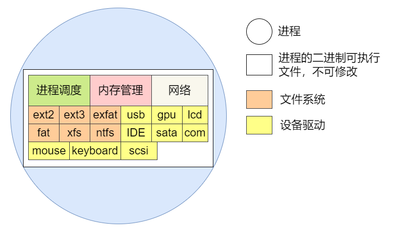
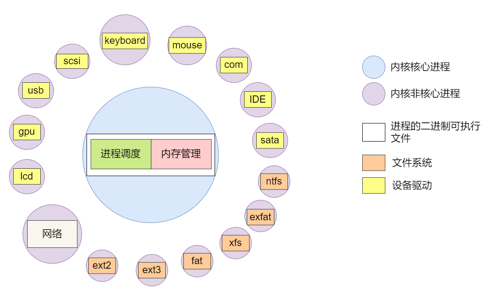
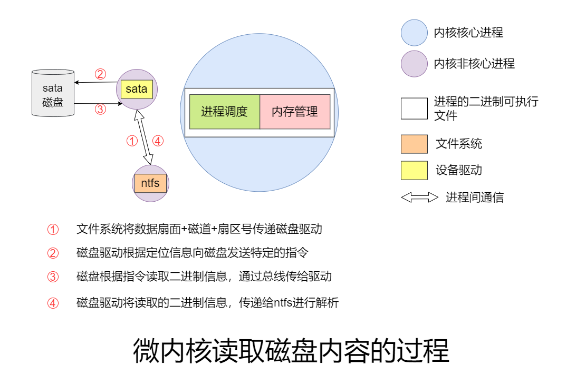
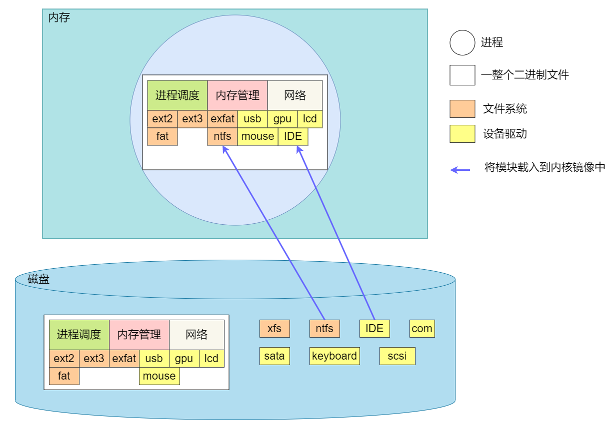

内核的主要功能如下：
1. 进程调度
2. 内存管理
3. 文件系统
4. 设备驱动
5. 网络

两种主要的内核架构有**宏内核**和**微内核**，他们采用了不同的方式实现了对上述功能的整合。

## 宏内核
宏内核就很简单，直接把所有功能写到一个二进制文件中。系统上电后，bootLoader在磁盘上找到该二进制文件并载入到内存中，将PC指针设置成二进制文件在内存中的地址，这样宏内核就可以运行起来了。如下图所示：

### 宏内核的缺点
等整个系统启动以后，应用程序能够使用哪些内核功能以及可以驱动哪些设备都是固定的。比如上图中内核所支持的ext文件系统只有ext2和ext3。如果你当前有一块文件系统为ext4的磁盘要插到这台电脑上访问，那现在内核能够提供的文件系统功能并不包括ext4，唯一的解决办法就是把ext4文件系统的代码编写到内核源码中，再重新编译一个新的内核二进制文件出来，重新烧录到电脑上才能操作这块ext4的磁盘。

这样虽然解决了问题，但是如果以后又有了ext5文件系统的磁盘要访问呢？我是不是又得重新编译内核啊。这种操作对于专业程序员来说不算难，但普通的用户真的没法短时间内完成编译内核安装内核的操作，何况他还不一定有源码。

这时候有人会说，我把世界上所有的文件系统的支持代码都编译到这个内核的二进制文件里，它不就再也不用重新编译和安装了吗？对，但问题是，除了文件系统的支持以外，还有可能出现不同类型的磁盘、不同接口的鼠标、不同接口的键盘、不同接口的显卡、不同接口的U盘，每种设备都需要相应的驱动程序提供支持，如果只是单纯的将当下所有的设备的驱动程序和所有的文件系统编译到内核当中，可想而知，你的内核会随着世界上设备类型和文件系统的增加而不断变大，总有一天，要让你的计算机跑起来，你首先得有一块巨大的硬盘保存你巨大的内核二进制文件。而这个内核当中提供的多数功能只是你做梦才能买的起设备才需要的。

为了避免这种情况，微内核应运而生。

## 微内核

如果把文件系统和设备驱动都从内核中剥离出来，编译成多个只支持特定文件系统或者只能驱动特定的设备的二进制文件，如图所示：

这些微小的二进制文件只在系统有对应的文件系统需要读写或有对应的设备需要驱动时才会需要载入到内核中，围绕着主核心进程提供服务，接受主核心的管理运行或终止。

这样一来，当你需要读一块新的ext4磁盘时，只需要找到预先就编译好的小二进制文件安装到系统中，内核核心进程识别并将其运行起来（这就会创建一个提供特定功能的进程）就可以读取ext4的磁盘了，其它的驱动程序也是如此。比如windows的驱动程序就是类似这种设计，你有新的打印机或者新的显卡时，windows都会让你安装对应的驱动程序才能驱动这个新设备（事实上windows不是微内核，而是一种混合内核，但是其驱动程序添加的原理与微内核相似）。

### 微内核的缺点

虽然架构上，微内核确实适应了**在不影响内核大小的前提下对不可预见的新设备提供驱动程序**的情形，但是这样的设计会产生很多只提供特定功能的进程。而这些特定功能的进程由于功能单一，需要与其他的进程协同工作。比如磁盘驱动程序，想要将其读取到的二进制信息传输给文件系统来解析出目录结构、文件属性等信息，它自然要把这些信息通过进程间通信的方式传递给文件系统进程，这个过程**主要的耗时就是进程间通信**，既要传递读取磁盘信息的**命令**，又要传递**读取到的磁盘信息**。如图所示：

而单内核运行起来之后，可以看做一个单进程，单进程内部的内存是不同功能模块都可以访问的，同时进程内部的各模块可以彼此调用对方的接口。文件系统调用磁盘驱动提供的接口函数，来告知磁盘驱动把磁盘上的信息读取出来放到特定地址开始的内存里，磁盘驱动读取结束后，把cpu控制权直接返回给文件系统，把读取成功的消息返回到文件系统，文件系统再去访问刚才的这块内存，内存上的信息没发生变化也没有发生转移，这就节省了数据数据传输的时间。

单内核下，磁盘驱动与文件系统之间的交流就是调用彼此提供的接口，而由于它们被编译到同一个二进制中，这些接口的调用也不过就是改一下PC上的地址而已。既节省了数据传输的时间也节省了进程间过程调用的时间。

## Linux的内核

综合上述两种内核的优缺点，Linus设计了一种特殊的内核，这种内核**在硬盘上更像是微内核**，核心的二进制与提供驱动和文件系统支持的二进制分开存放，分别叫做内核镜像和模块文件。而系统启动后，内核镜像被bootloader装载到了内存，并运行在一个单独的进程（idle进程）中，此时如果需要再安装驱动，直接把对应的模块文件中的代码段(.text)和数据段(.data)与内核进程的代码段(.text)和数据段(.data)合并起来，让驱动程序在装载到内核中时成为内核映像的一部分，这样一来，**在内存中Linux的内核更像是宏内核**。如图：

