## 编译内核源码


### 下载Linux源码
ubuntu的apt仓库提供了最直接的内核源码下载途径，可以使用

```sudo apt-cache search linux-source```

查询，如下：

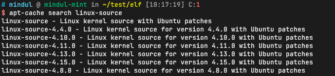

可以使用```uname -a```查询当前系统的内核版本，然后安装对应的版本，不过我这里在apt源没找到我当前系统使用的内核版本，我就随便安装了一个，如下：

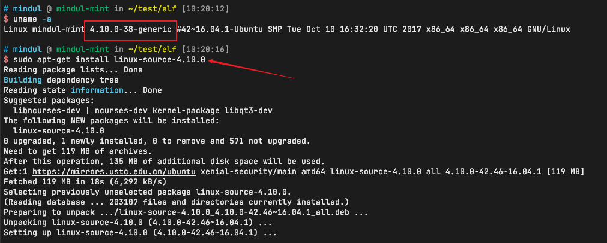

> 内核版本必须一字不差，我基于这个内核版本生成的模块无法载入当当前运行的内核上。
> 所以，本节有一定的缺憾，原因会不会是我用的ubuntu系统版本太老了，没有对应的内核源码？？？

安装好后，对应的内核源码被安装在```/usr/src```下的对应目录下，可以通过修改时间判断到底是哪个，如下：

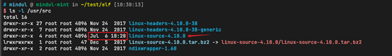

将源码解压缩后，记得用

```sudo chown -R usrname:groupname ./linux-source-4.10.0```

切换源码目录属主，避免不必要的权限问题。

### 编译内核源码
编译之前，执行

```bash
sudo apt-get install libncurses5-dev libncursesw5-dev libssl-dev
```

安装编译过程中需要的依赖。

在内核源码中，直接执行```make menuconfig```，进入如下界面：

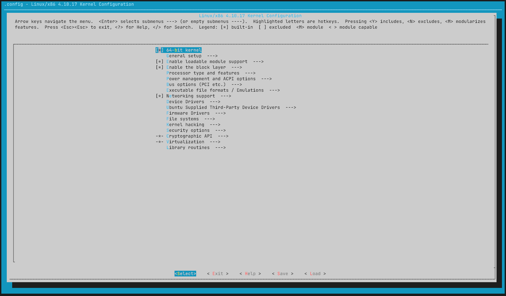

```make menuconfig```会打开一个菜单界面，让用户选择要将哪些功能编译到内核中或者编译为模块。这部分内容以后再讲，先按右键到```<save>```那里，回车保存，再跳到```<Exit>```回车，退出。此时在当前内核源码根目录下会生成一个```.config```文件。事实上，```make menuconfig```会自动去/boot/目录下找到当前系统使用的内核的配置，我的机器上如下：

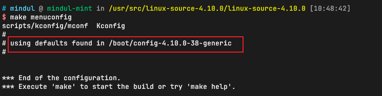

可以对两个文件做下比较，差别只在注释这里，如下：

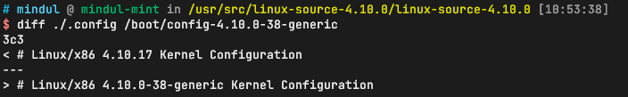

接下来执行

```
make -j32
```
编译当前内核源码，```-j32```的目的是使用多核心编译，如下：

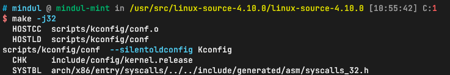

核心多了就是香啊！

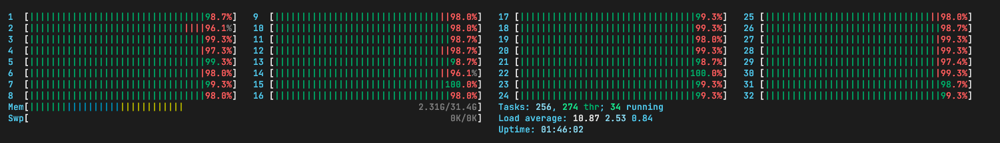

生成的内核镜像如下：
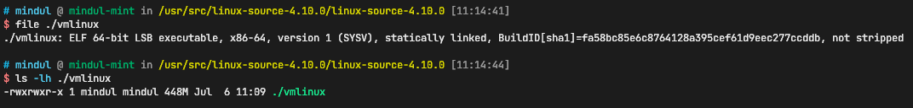


> 系统所使用的内核在哪里呢？

系统所使用的内核在/boot目录下，对应的文件如下：

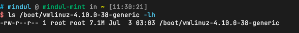

可以预见，如果替换掉/boot下这个文件的话，内核就是我们自己编译的了。内核替换相关的内容以后会介绍。(TODO: 内核替换)


## 编译、装载和卸载内核模块

模块中一般是文件系统或设备驱动代码，代码框架是固定的，module_init负责注册模块装载回调函数、module_exit注册模块卸载回调函数，就是介绍编译模块需要的Makefile和相关的命令。

代码如下：


```c
// /home/mindul/test/module_test/hello.c
#include <linux/init.h>
#include <linux/module.h>

MODULE_LICENSE("GPL");
static int hello_init(void)
{
    printk(KERN_ALERT "Hello, kernel");
    return 0;
}

static void hello_exit(void)
{
    printk(KERN_ALERT "Bye bye, kernel");
}

module_init(hello_init);
module_exit(hello_exit);
```

对应的Makefile如下：

```makefile
// /home/mindul/test/module_test/Makefile
// 编译其他内核版本的模块
obj-m :=hello.o
KERNEL :=/usr/src/linux-source-4.10.0/linux-source-4.10.0
PWD :=$(shell pwd)

all :
	$(MAKE) -C $(KERNEL) M=$(PWD)
.PHONY:clean
clean :
	rm -f *.o *.ko
```

首先需要让内核做好编译模块的准备，如下：

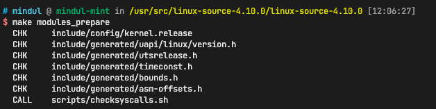

随后在module_test目录下执行
```
make [-j32]
```
如下：

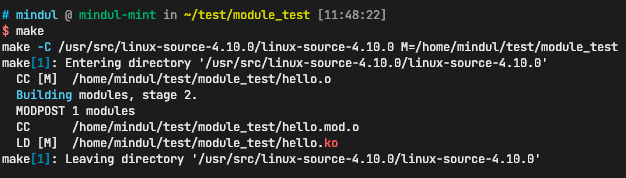

生成的模块如下:

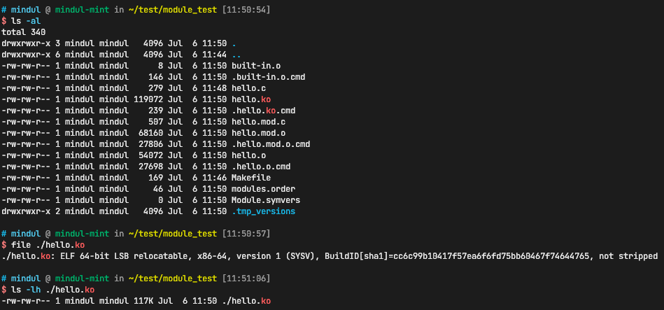

### 模块的载入与卸载

可以使用```insmod```将模块载入到当前系统的内核中，如下：

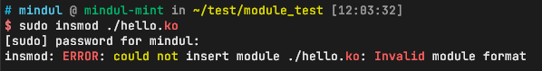

使用```sudo dmesg```查看内核日志，看刚才失败的原因：

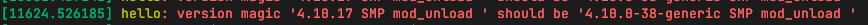

失败原因就是我编译时使用的内核版本与当前系统的内核版本不一样，不能载入。Linux系统提供了另外的途径给用户，让用户可以编译匹配的模块。Makefile修改如下：

```Makefile
// /home/mindul/test/module_test/Makefile
// 编译当前系统的模块
obj-m :=hello.o
KERNEL :=/lib/modules/`uname -r`/build
PWD :=$(shell pwd)

all :
    $(MAKE) -C $(KERNEL) M=$(PWD)
.PHONY:clean
clean :
    rm -f *.o *.ko
```
可以看到需要修改的内容只有```-C```的参数。在当前操作系统的```/lib/modules/`uname -r`/build/```目录下，有编译模块所需要的所有东西。只要将```-C```的参数设置成这个目录即可。如下：

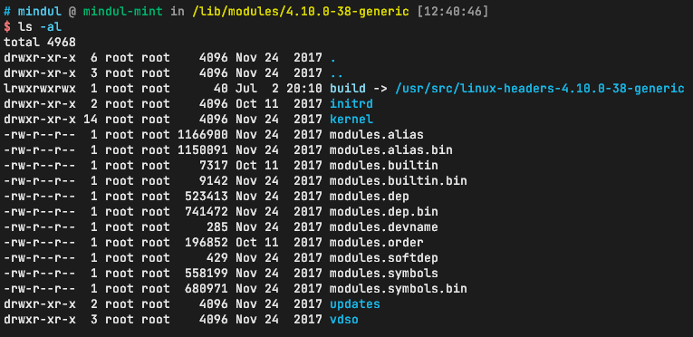

再次尝试编译模块、将模块载入到内核中或从内核中卸载模块，如下：

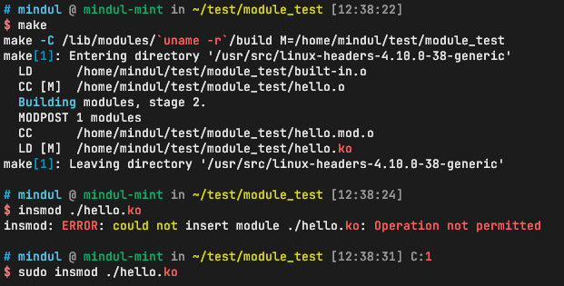

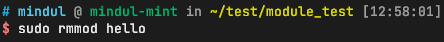

可以看到，内核模块已经可以正常载入了，可以使用```dmesg```查看内核日志中载入模块时的打印，如下：


