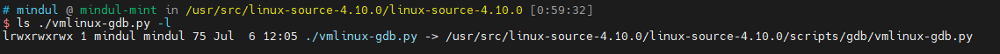
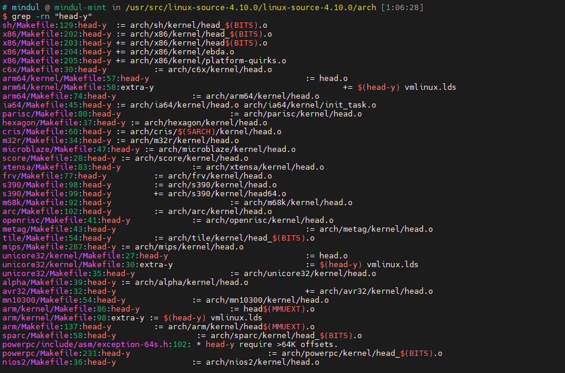
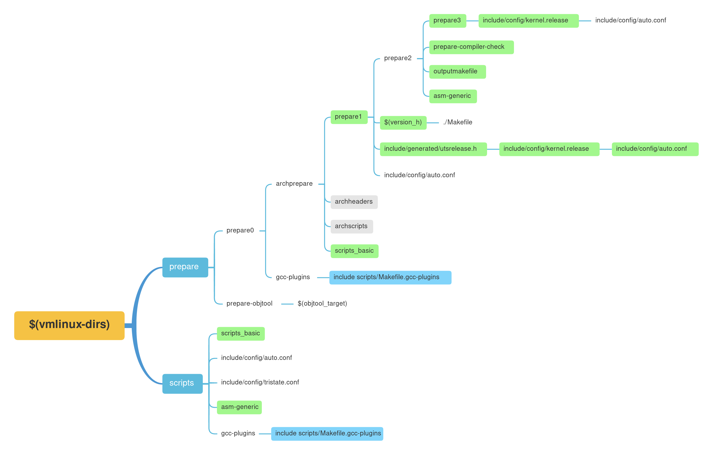

# 0. 基础知识
## make
关于make的比较好的参考资料，可以看陈皓大佬的[跟我一起写makefile](https://seisman.github.io/how-to-write-makefile/overview.html)。

# 1. Make默认目标

Makefile的第一个目标```_all```
```Makefile
# <Makefile>
# That's our default target when none is given on the command line
PHONY := _all
_all:

```
这里的```_all```是个伪目标，其值如下：
```Makefile
# <Makefile>
# If building an external module we do not care about the all: rule
# but instead _all depend on modules
PHONY += all
ifeq ($(KBUILD_EXTMOD),)    # 根据$(KBUILD_EXTMOD)的不同选择不同的目标
_all: all
else
_all: modules
endif

```
```$(KBUILD_EXTMOD)```的值如下：

```Makefile
# <Makefile>
# Use make M=dir to specify directory of external module to build
# Old syntax make ... SUBDIRS=$PWD is still supported
# Setting the environment variable KBUILD_EXTMOD take precedence
ifdef SUBDIRS
  KBUILD_EXTMOD ?= $(SUBDIRS)
endif

ifeq ("$(origin M)", "command line")
  KBUILD_EXTMOD := $(M)
endif
```

```make M=...```在[Documentation/kbuild/module.txt](https://github.com/torvalds/linux/blob/master/Documentation/kbuild/modules.rst)有详细的说明。

所以我们的分析也分成两部分，解析```all```和解析```module```。

#  2. _all:all

```Makefile
# <Makefile>
# The all: target is the default when no target is given on the
# command line.
# This allow a user to issue only 'make' to build a kernel including modules
# Defaults to vmlinux, but the arch makefile usually adds further targets
all: vmlinux

```
```vmlinux```目标如下:

```Makefile
# <Makefile>
vmlinux: scripts/link-vmlinux.sh vmlinux_prereq $(vmlinux-deps) FORCE
    +$(call if_changed,link-vmlinux)
```
接下来依次分析```vmlinux```各个依赖

## prerequisite

### vmlinux_prereq

```Makefile
# <Makefile>
# Include targets which we want to execute sequentially if the rest of the
# kernel build went well. If CONFIG_TRIM_UNUSED_KSYMS is set, this might be
# evaluated more than once.
PHONY += vmlinux_prereq
vmlinux_prereq: $(vmlinux-deps) FORCE
ifdef CONFIG_HEADERS_CHECK
    $(Q)$(MAKE) -f $(srctree)/Makefile headers_check
endif
ifdef CONFIG_GDB_SCRIPTS
    $(Q)ln -fsn `cd $(srctree) && /bin/pwd`/scripts/gdb/vmlinux-gdb.py
endif
ifdef CONFIG_TRIM_UNUSED_KSYMS
    $(Q)$(CONFIG_SHELL) $(srctree)/scripts/adjust_autoksyms.sh \
      "$(MAKE) -f $(srctree)/Makefile vmlinux"
endif
```
查看[.config](./data/.config.md)知道

```
# CONFIG_HEADERS_CHECK is not set
CONFIG_GDB_SCRIPTS=y
# CONFIG_TRIM_UNUSED_KSYMS is not set
```

所以```vmlinux_prereq```规则最终如下，如下：
```Makefile
# <Makefile>
# Include targets which we want to execute sequentially if the rest of the
# kernel build went well. If CONFIG_TRIM_UNUSED_KSYMS is set, this might be
# evaluated more than once.
PHONY += vmlinux_prereq
vmlinux_prereq: $(vmlinux-deps) FORCE
    $(Q)ln -fsn `cd $(srctree) && /bin/pwd`/scripts/gdb/vmlinux-gdb.py
```
这个命令会在源码目录下创建一个软链接vmlinux-gdb到scripts/gdb/vmlinux-gdb.py，如下图：



### FORCE

```FORCE```是一个伪目标，所以如果这个伪目标是某个target的依赖，那么这个target每次都会执行，因为```FORCE```每次都会执行，且每次都会被认为是较新的。所以，vmlinux这个目标，即便各个built-in.o没有修改，但也会会被重新生成。

### $(vmlinux-deps)

先看定义

```Makefile
# <Makefile>
vmlinux-deps := $(KBUILD_LDS) $(KBUILD_VMLINUX_INIT) $(KBUILD_VMLINUX_MAIN)
```

各个变量源码如下：
```Makefile
# <Makefile>
# Externally visible symbols (used by link-vmlinux.sh)
export KBUILD_VMLINUX_INIT := $(head-y) $(init-y)
export KBUILD_VMLINUX_MAIN := $(core-y) $(libs-y) $(drivers-y) $(net-y) $(virt-y)
export KBUILD_LDS          := arch/$(SRCARCH)/kernel/vmlinux.lds
```
init-y等变量定义如下
```Makefile
# <Makefile>
# Objects we will link into vmlinux / subdirs we need to visit
init-y      := init/
drivers-y   := drivers/ sound/ firmware/ ubuntu/
net-y       := net/
libs-y      := lib/
core-y      := usr/
virt-y      := virt/
...
init-y      := $(patsubst %/, %/built-in.o, $(init-y))
core-y      := $(patsubst %/, %/built-in.o, $(core-y))
drivers-y   := $(patsubst %/, %/built-in.o, $(drivers-y))
net-y       := $(patsubst %/, %/built-in.o, $(net-y))
libs-y1     := $(patsubst %/, %/lib.a, $(libs-y))
libs-y2     := $(patsubst %/, %/built-in.o, $(libs-y))
libs-y      := $(libs-y1) $(libs-y2)
virt-y      := $(patsubst %/, %/built-in.o, $(virt-y))
```

参考第0节的参考资料，patsubst函数会把“/”替换成“/built-in.o”。

而```head-y```在arch/目录下，如下：



在Makefile中找到图中的Makefile引入的地方，如下：

```Makefile
# <Makefile>
include arch/$(SRCARCH)/Makefile  # 使用了变量$(SRCARCH)

# 获取当前系统的架构
SUBARCH := $(shell uname -m | sed -e s/i.86/x86/ -e s/x86_64/x86/ \
                  -e s/sun4u/sparc64/ \
                  -e s/arm.*/arm/ -e s/sa110/arm/ \
                  -e s/s390x/s390/ -e s/parisc64/parisc/ \
                  -e s/ppc.*/powerpc/ -e s/mips.*/mips/ \
                  -e s/sh[234].*/sh/ -e s/aarch64.*/arm64/ )

# When performing cross compilation for other architectures ARCH shall be set
# to the target architecture. (See arch/* for the possibilities).
# ARCH can be set during invocation of make:
# make ARCH=ia64
# Another way is to have ARCH set in the environment.
# The default ARCH is the host where make is executed.

ARCH        ?= $(SUBARCH)
...
SRCARCH     := $(ARCH)        # SRCARCH := x86
```
对于x86架构，```head-y```如下：
```Makefile
# <arch/x86/Makefile>
# Kernel objects

head-y := arch/x86/kernel/head_$(BITS).o
head-y += arch/x86/kernel/head$(BITS).o
head-y += arch/x86/kernel/ebda.o
head-y += arch/x86/kernel/platform-quirks.o

# $(BITS)
ifeq ($(CONFIG_X86_32),y)
        BITS := 32
        ...
else
        BITS := 64
        ...
endif
```
所以到最后， $(vmlinux_deps)的值是：

* init/built-in.o
* drivers/built-in.o
* sound/built-in.o
* firmware/built-in.o
* ubuntu/built-in.o
* net/built-in.o
* lib/built-in.o
* lib/lib.a
* usr/built-in.o
* virt/built-in.o
* arch/x86/kernel/head_64.o
* arch/x86/kernel/head64.o
* arch/x86/kernel/edba.o
* arch/x86/kernel/platform-quirk.o
* arch/x86/kernel/vmlinux.lds

再看规则：

```Makefile
# <Makefile>
# The actual objects are generated when descending,
# make sure no implicit rule kicks in
$(sort $(vmlinux-deps)): $(vmlinux-dirs) ;    # 说明其prerequisite为$(vmlinux-dirs)，没有对应的command
```
### $(vmlinux-dirs)

先看定义

```Makefile
# <Makefile>
# Objects we will link into vmlinux / subdirs we need to visit
init-y		:= init/
drivers-y	:= drivers/ sound/ firmware/ ubuntu/
net-y		:= net/
libs-y		:= lib/
core-y		:= usr/
virt-y		:= virt/
core-y		+= kernel/ certs/ mm/ fs/ ipc/ security/ crypto/ block/

vmlinux-dirs	:= $(patsubst %/,%,$(filter %/, $(init-y) $(init-m) \
		     $(core-y) $(core-m) $(drivers-y) $(drivers-m) \
		     $(net-y) $(net-m) $(libs-y) $(libs-m) $(virt-y)))
# 注意init-y等在给$(vmlinux-dirs)赋值后才被设置成init/built-in.o，这$(vmlinux-dirs)就只是一系列目录
```

暂且不去探索init-m、core-m等变量的值，可以通过添加以下日志，打印make执行到这里时$(vmlinux-dirs)的值。

```makefile
# <Makefile>
$(vmlinux-dirs): prepare scripts
    @echo wangshaowei +: $(vmlinux-dirs)			# 注意这里必须要用$(vmlinux-dirs)，而不是$@
    $(Q)$(MAKE) $(build)=$@
```

然后执行```make -j1 -n V=1```后得到输出如下：


可以看到，输出了不只一次，按理说，这个输出应该只有一次的，因为目标只写了一次，但是Make会把```$(vmlinux-dirs)```作为```target```的规则复制成多个以```$(vmlinux-dirs)的值```作为```target```但```prerequisite```和```command```不变的规则，这个规则可以参考[**多目标**](https://seisman.github.io/how-to-write-makefile/rules.html#id7)，之后我会证明这点。

根据输出结果，vmlinux-dirs的值如下：

来源 | 值
-|-
init-y 		|	init
core-y		|	usr arch/x86 kernel certs mm fs ipc security crypto block
drivers-y	|	drivers sound firmware ubuntu
drivers-m 	|	arch/x86/pci arch/x86/power arch/x86/video arch/x86/ras arch/x86/oprofile
net-y		|	net
libs-y 		|	lib
libs-m		|	arch/x86/lib
virt-y		|	virt

> TODO: libs-m的值和drivers-m的值来自于arch/x86/Makefile，或者说来自于对应架构的Makefile，主makefile在给$(vmlinux-dirs)赋值前就已经把arch/x86/Makefile包含进来了。

再看规则

```Makefile
# <Makefile>
# Handle descending into subdirectories listed in $(vmlinux-dirs)
# Preset locale variables to speed up the build process. Limit locale
# tweaks to this spot to avoid wrong language settings when running
# make menuconfig etc.
# Error messages still appears in the original language

PHONY += $(vmlinux-dirs)
$(vmlinux-dirs): prepare scripts        
	$(Q)$(MAKE) $(build)=$@
```

### $(vmlinux-dirs)的prerequisite
由于依赖路径较长，我画了张图：



图中

* 绿色部分表示该依赖的规则中有```command```需要执行；
* 蓝色部分表示之前的依赖不在./Makefile中定义，而是在此部分include的文件中；
* 灰色部分表示该目标没有prerequisite和command。

> TODO: 这部分的依赖的command执行过程需要分析一下，放到《Kbuild系统中的特殊变量与函数》中。

### $(vmlinux-dirs)的command

```Makefile
# <Makefile>
include scripts/Kbuild.include
# $(build)定义在scripts/Kbuild.include中

------------------------------------------------------------

# <scripts/Kbuild.include>
###
# Shorthand for $(Q)$(MAKE) -f scripts/Makefile.build obj=
# Usage:
# $(Q)$(MAKE) $(build)=dir
build := -f $(srctree)/scripts/Makefile.build obj

------------------------------------------------------------

# <Makefile>
# Handle descending into subdirectories listed in $(vmlinux-dirs)
# Preset locale variables to speed up the build process. Limit locale
# tweaks to this spot to avoid wrong language settings when running
# make menuconfig etc.
# Error messages still appears in the original language

PHONY += $(vmlinux-dirs)
$(vmlinux-dirs): prepare scripts
	$(Q)$(MAKE) $(build)=$@

# $(MAKE)是make预设的变量，代表自身
# 关于$(Q)在上一章《Kbuild系统中的特殊变量与函数》有介绍
```

> TODO: $(Q)等的赋值，放到《Kbuild系统中的特殊变量与函数》中。

所以```$(vmlinux-dirs)```这个规则会自动转换成多个规则，这些规则的```target```就是```$(vmlinux-dirs)```的值，如下：

```bash
init: prepare scripts
	$(Q)$(MAKE) $(build)=$@
usr: prepare scripts
	$(Q)$(MAKE) $(build)=$@
...
virt: prepare scripts
	$(Q)$(MAKE) $(build)=$@
```

在```$(vmlinux-dirs)```规则的```command```添加如下日志打印：

```bash
$(vmlinux-dirs): prepare scripts
    @echo wangshaowei +: target is $@			# 注意这里必须要用$@，而不是$(vmlinux-dirs)
    $(Q)$(MAKE) $(build)=$@
```

得到结果如下：


所以最后```$(vmlinux-dirs)```的```command```会执行如下多个命令：

```
make build := -f $(srctree)/scripts/Makefile.build obj=init
make build := -f $(srctree)/scripts/Makefile.build obj=usr
make build := -f $(srctree)/scripts/Makefile.build obj=arch/x86
...
make build := -f $(srctree)/scripts/Makefile.build obj=net
make build := -f $(srctree)/scripts/Makefile.build obj=lib
make build := -f $(srctree)/scripts/Makefile.build obj=arch/x86/lib
make build := -f $(srctree)/scripts/Makefile.build obj=virt

$(srctree)代表内核源码根目录
```

可以看到```Makefile```直接把所有重要的工作交给了```Makefile.build```，只负责给它传递不同的```$(obj)```。这个脚本的工作，直接参考第3章。

## command

```if_changed```的详细分析过程参考[Kbuild系统中的特殊变量与函数](./3.1_Kbuild系统中的特殊变量或函数简介.md)，这里简单介绍下其大概功能：

1. 判断已经生成的依赖是否有更新以及是否有未生成的依赖，如果满足条件则执行2；否则结束；
2. 根据make命令的V参数，判断打印命令的详情或是简略信息或是原因；
3. 执行命令；
4. 将命令保存到对应的cmd隐藏文件中

所以如果执行```make```，```+$(call if_changed,link-vmlinux)```会找到```cmd_link-vmlinux```将其打印出来并执行。cmd_link-vmlinux如下：

```makefile
# Final link of vmlinux with optional arch pass after final link
    cmd_link-vmlinux =                                                 \
	$(CONFIG_SHELL) $< $(LD) $(LDFLAGS) $(LDFLAGS_vmlinux) ;       \
	$(if $(ARCH_POSTLINK), $(MAKE) -f $(ARCH_POSTLINK) $@, true)
```

随后将该命令保存到```.vmlinux.cmd```中，可以执行```make -j1 -n```查看，如下：


# 3. scripts/Makefile.build

Linux内核源码可能有很多层目录，不可能为每层目录都设置一个单独的Makefile来配置该层的编译流程，这样只是在重复写Makefile，没有意义。因此Kbuild创造了```scripts/Makefile.build```来完成这些重复的工作，各个源码目录下的Makefile只需要配置（最简单的就是配置特殊变量）哪些需要编译到内核、哪些编译成模块以及哪些编译成库，```scripts/Makefile.build```就会根据这些信息在该目录下生成对应的文件。```scripts/Makefile.build```被设计用来处理一个目录，所以理论上给它一级一级的传递目录，就能达到一种递归的效果，最终就能将整个目录处理完毕。

接下来就需要看scripts/Makefile.build做了什么，直接找```default target```，如下：

```makefile
# <scripts/Makefile.build>
PHONY := __build
__build:
...
__build: $(if $(KBUILD_BUILTIN),$(builtin-target) $(lib-target) $(extra-y)) \
	 $(if $(KBUILD_MODULES),$(obj-m) $(modorder-target)) \
	 $(subdir-ym) $(always)
	@:
```

可见```__build```rule的```command```为“:”，在bash中，这代表什么都不做。所以只需要分析其```prerequisite```，首先看两个变量的定义，如下：

```makefile
# <Makefile>
KBUILD_MODULES :=
KBUILD_BUILTIN := 1

# If we have only "make modules", don't compile built-in objects.
# When we're building modules with modversions, we need to consider
# the built-in objects during the descend as well, in order to
# make sure the checksums are up to date before we record them.

ifeq ($(MAKECMDGOALS),modules)
  KBUILD_BUILTIN := $(if $(CONFIG_MODVERSIONS),1)
endif

# If we have "make <whatever> modules", compile modules
# in addition to whatever we do anyway.
# Just "make" or "make all" shall build modules as well

ifneq ($(filter all _all modules,$(MAKECMDGOALS)),)
  KBUILD_MODULES := 1
endif

ifeq ($(MAKECMDGOALS),)
  KBUILD_MODULES := 1
endif

export KBUILD_MODULES KBUILD_BUILTIN
```

```$(MAKECMDGOALS)```是make的特殊变量，用来表示make的第一个参数，我们分析的是```__all: all```，这是默认目标，make没有参数。所以```$(KBUILD_MODULES)```和```$(KBUILD_BUILTIN)```的值都是1，于是```__build```rule就是

```makefile
__build: $(builtin-target) $(lib-target) $(extra-y) \
		 $(obj-m) $(modorder-target) \
		 $(subdir-ym) $(always)
	@:
```

接下来依次分析每个依赖的值，不过依赖的值都直接取自或间接来自```$(obj)/Kbuild```或```$(obj)/Makefile```，先介绍一下大致的过程

## 1. 读取特殊变量并处理

```makefile
# <scripts/Makefile.build>
src := $(obj)

# The filename Kbuild has precedence over Makefile
kbuild-dir := $(if $(filter /%,$(src)),$(src),$(srctree)/$(src))		# srctree在__all:all的情况下，是源码根目录
kbuild-file := $(if $(wildcard $(kbuild-dir)/Kbuild),$(kbuild-dir)/Kbuild,$(kbuild-dir)/Makefile)
include $(kbuild-file)			# 将$(obj)/Kbuild或$(obj)/Makefile包含进来，读取其中的特殊变量

include scripts/Makefile.lib	# 对特殊变量进行处理，生成新的特殊变量

```

接下来先介绍```scripts/Makefile.lib```中对特殊变量处理的过程进行介绍

### 1. 使用Makefile.lib处理obj-y和obj-m

```makefile
# <scripts/Makefile.lib>
obj-m        := $(filter-out $(obj-y),$(obj-m))				# 编译到内核中的二进制不需要再编译成模块，所以从obj-m中过滤掉obj-y指定的镜像或目录
obj-y		:= $(patsubst %/, %/built-in.o, $(obj-y))		# 将$(obj-y)中的目录替换成目录下的built-in.o
obj-m		:= $(filter-out %/, $(obj-m))					# 过滤掉$(obj-m)中的目录

obj-y		:= $(addprefix $(obj)/,$(obj-y))
obj-m		:= $(addprefix $(obj)/,$(obj-m))
```

经过上述修改后，```obj-y```和```obj-m```的值发生变化，```obj-m```中不再有目录，而是被剔除出去给了```subdir-m```；```obj-y```中也不再有目录，而是用目录下的```built-in.o```给替代了。最终```$(obj-y)```的值为```$(obj)/xx.o```或者```$(obj)/xx/built-in.o```；而```$(obj-m)```只有```$(obj)/xx.o```。```obj-y```与```obj-m```的区别，可以参考[如何使用Kbuild系统](./3/2_如何使用Kbuild系统.md)

> TODO: 如何使用Kbuild系统，介绍Kconfig和$(obj)/Makefile的功能，以及如何添加新的驱动模块或编译到内核中的模块等相关知识。

### 2. 使用Makefile.lib处理lib-y和lib-m

```makefile
# <scripts/Makefile.lib>
lib-y := $(filter-out $(obj-y), $(sort $(lib-y) $(lib-m)))
# 将lib-y和lib-m合并，将其中与obj-y重复的去掉，因为编译到内核中的模块一定不需要再编译到库中了。
lib-y		:= $(addprefix $(obj)/,$(lib-y))				# 追加前缀
```

### 3. 使用Makefile.lib处理extra-y

```makefile
# <scripts/Makefile.lib>
extra-y		:= $(addprefix $(obj)/,$(extra-y))		# 只有追加前缀的修改
```

### 4. 在Makefile.lib中处理always

```makefile
# <scripts/Makefile.lib>
always		:= $(addprefix $(obj)/,$(always))
```

### 5. 在Makefile.lib中根据obj-y和obj-m生成subdir-ym

```makefile
# <scripts/Makefile.lib>
__subdir-y	:= $(patsubst %/,%,$(filter %/, $(obj-y)))
subdir-y	+= $(__subdir-y)
__subdir-m	:= $(patsubst %/,%,$(filter %/, $(obj-m)))
subdir-m	+= $(__subdir-m)
# 在obj-y和obj-m刚从kbuild-file中读取进来后，就把其中的目录赋值给了subdir-y和subdir-m
obj-y		:= $(patsubst %/, %/built-in.o, $(obj-y))
obj-m		:= $(filter-out %/, $(obj-m))
# 在subdir-y和subdir-m赋值后，才对obj-y和obj-m做了修改，所以subdir-y和subdir-m的值是obj-y和obj-m所指定的目录。
# Subdirectories we need to descend into
# 将这些目录都放进一个变量subdir-ym中，此变量很重要，它用法以后会介绍
subdir-ym	:= $(sort $(subdir-y) $(subdir-m))
```

## 2. 默认目标__build的依赖

### 1. $(builtin-target)

先看定义

```makefile
# <scripts/Makefile.build>
include scripts/Makefile.lib
ifneq ($(strip $(obj-y) $(obj-m) $(obj-) $(subdir-m) $(lib-target)),)
builtin-target := $(obj)/built-in.o
endif
```

即，如果当前```$(kbuild-file)```中声明过或是可以生成```obj-y```、```obj-m```、```obj-```、```subdir-m```、```lib-target```等，就说明当前目录下应该生成built-in.o。

再看规则

```makefile
# <scripts/Makfile.build>
#
# Rule to compile a set of .o files into one .o file
#
ifdef builtin-target					# 如果当前$(obj)下应该生成built-in.o

ifdef CONFIG_THIN_ARCHIVES				# 根据.config文件中对CONFIG_THIN_ARCHIVES的定义来区分使用ar命令还是使用ld命令。
  cmd_make_builtin = rm -f $@; $(AR) rcST$(KBUILD_ARFLAGS)
  cmd_make_empty_builtin = rm -f $@; $(AR) rcST$(KBUILD_ARFLAGS)
  quiet_cmd_link_o_target = AR      $@
else
  cmd_make_builtin = $(LD) $(ld_flags) -r -o
  cmd_make_empty_builtin = rm -f $@; $(AR) rcs$(KBUILD_ARFLAGS)
  quiet_cmd_link_o_target = LD      $@
endif

# If the list of objects to link is empty, just create an empty built-in.o
cmd_link_o_target = $(if $(strip $(obj-y)),\
		      $(cmd_make_builtin) $@ $(filter $(obj-y), $^) \
		      $(cmd_secanalysis),\
		      $(cmd_make_empty_builtin) $@)

$(builtin-target): $(obj-y) FORCE
	$(call if_changed,link_o_target)

targets += $(builtin-target)
endif # builtin-target
```

#### prerequisite

```FORCE```表示此目标每次都会重新生成。

```$(obj-y) ```是经过```Makefile.lib```处理过的，所以其内容为```$(obj)/xx.o```和```$(obj)/xx/built-in.o```。对于```$(obj)/xx.o```，会应用如下规则：

```makefile
# <scripts/Makfile.build>
# Built-in and composite module parts
# 给此规则命名为C2O
$(obj)/%.o: $(src)/%.c $(recordmcount_source) $(objtool_obj) FORCE
	$(call cmd,force_checksrc)
	$(call cmd,force_check_kmsg)
	$(call if_changed_rule,cc_o_c)

# 给此规则命名为S2O
$(obj)/%.o: $(src)/%.S $(objtool_obj) FORCE
	$(call if_changed_rule,as_o_S)
```

此外还存在一种情形如下：

```makefile
# <init/Makefile>
obj-y                          := main.o version.o mounts.o
...
mounts-y            := do_mounts.o
mounts-$(CONFIG_BLK_DEV_RAM)    += do_mounts_rd.o
mounts-$(CONFIG_BLK_DEV_INITRD) += do_mounts_initrd.o
mounts-$(CONFIG_BLK_DEV_MD) += do_mounts_md.o
```

init目录下并不存在mounts.c或mounts.S，但是执行```make -j1 -n```时，有如下打印：


这就说明```mounts.o```是通过```mounts-y```生成的，但是这无法应用上边的规则```C2O```和```S2O```，所以一定存在一条```XXX-y```到```XXX.o```的规则。如下：

```makefile
# <scripts/Makefile.lib>
# 将obj-y中指定的$(obj)/xx.o与从$(kbuild-file)中读取到的xx-y或xx-objs做匹配，如果能匹配上将该xx.o放进multi-used-y中
multi-used-y := $(sort $(foreach m,$(obj-y), $(if $(strip $($(m:.o=-objs)) $($(m:.o=-y))), $(m))))
multi-used-y	:= $(addprefix $(obj)/,$(multi-used-y))		# 给xx.o加前缀

# <scripts/Makefile.build>
ifdef CONFIG_THIN_ARCHIVES
  quiet_cmd_link_multi-y = AR      $@
  cmd_link_multi-y = rm -f $@; $(AR) rcST$(KBUILD_ARFLAGS) $@ $(link_multi_deps)
else
  quiet_cmd_link_multi-y = LD      $@
  cmd_link_multi-y = $(cmd_link_multi-link)
endif
$(multi-used-y): FORCE				# 给此规则取名为Y2O
	$(call if_changed,link_multi-y) # 上图中的命令确实是if_changed的句式。cmd_link_multi-y也能匹配上。
```

这样一来```obj-y```中的```$(obj)/xx.o```就会自动应用```C2O```、```S2O```、```Y2O```自动生成。但是对于```$(obj)/xx/built-in.o```，由于这是xx目录下的目标，根据```Makefile.build```的设计规则，该目录应该由```obj=xx```时的```Makefile.build```做处理。

#### command

```makefile
# <scripts/Makefile.build>
# If the list of objects to link is empty, just create an empty built-in.o
cmd_make_builtin = $(LD) $(ld_flags) -r -o
cmd_make_empty_builtin = rm -f $@; $(AR) rcs$(KBUILD_ARFLAGS)
quiet_cmd_link_o_target = LD      $@
# Do section mismatch analysis for each module/built-in.o
ifdef CONFIG_DEBUG_SECTION_MISMATCH
  cmd_secanalysis = ; scripts/mod/modpost $@
endif

cmd_link_o_target = $(if $(strip $(obj-y)),\		# 先判断$(obj-y)是否为空
		      $(cmd_make_builtin) $@ $(filter $(obj-y), $^) \	# 如果不为空，使用ld命令把$(obj-y)指定的文件链接成$@，也就是$(obj)/built-in.o
		      $(cmd_secanalysis),\					# 然后调用cmd_secanalysis对$(obj)/built-in.o执行modpost，不过这个功能可以关闭
		      $(cmd_make_empty_builtin) $@)			# 否则的话，就只能构建一个空的$(obj)/built-in.o了。

$(builtin-target): $(obj-y) FORCE
	$(call if_changed,link_o_target)
```

### 2. $(lib-target)

先看定义

```makefile
# <scripts/Makefile.build>
ifneq ($(strip $(lib-y) $(lib-m) $(lib-)),)		# 如果$(kbuild-file)定义了lib-y lib-m lib-，表示此目录下应该有lib.a
lib-target := $(obj)/lib.a
obj-y += $(obj)/lib-ksyms.o						# lib-ksyms.o是内核中保存的对应的lib.a的符号表，也是要编译到内核中的（TODO: 放到BUILTIN-TARGET)
endif

```

再看规则

```makefile
# <scripts/Makefile.build>
ifdef lib-target
quiet_cmd_link_l_target = AR      $@

ifdef CONFIG_THIN_ARCHIVES
  cmd_link_l_target = rm -f $@; $(AR) rcsT$(KBUILD_ARFLAGS) $@ $(lib-y)
else
  cmd_link_l_target = rm -f $@; $(AR) rcs$(KBUILD_ARFLAGS) $@ $(lib-y)
endif

$(lib-target): $(lib-y) FORCE
	$(call if_changed,link_l_target)
```

$(lib-y)中的xx.o会通过S2O、C2O或Y2O来生成，随后调用cmd_link_l_target，用AR命令，将这些库文件打包成lib.a，如下：


### 3. $(extra-y)

先看定义


随后在脚本中修改如下：

```makefile
# <scripts/Makefile.lib>

extra-y		:= $(addprefix $(obj)/,$(extra-y))
```

并没有$(extra-y)的规则，不过$(extra-y)的值是```xx.o```文件与```vmlinux.lds```。```xx.o```如下


这些xx.o可以通过S2O或C2O生成。而```vmlinux.lds```规则如下：

```makefile
# <scripts/Makefile.lib>
# Linker scripts preprocessor (.lds.S -> .lds)
# ---------------------------------------------------------------------------
quiet_cmd_cpp_lds_S = LDS     $@
      cmd_cpp_lds_S = $(CPP) $(cpp_flags) -P -C -U$(ARCH) \
	                     -D__ASSEMBLY__ -DLINKER_SCRIPT -o $@ $<

$(obj)/%.lds: $(src)/%.lds.S FORCE
	$(call if_changed_dep,cpp_lds_S)
```

if_changed_dep的解析，可以参考[Kbuild系统中的特殊变量与函数](./3/1_Kbuild系统中的特殊变量与函数.md)，可以找到如下日志：


#### 

### 4. $(obj-m)

先看定义

```obj-m```定义在```$(obj)/Makefile```中，通过```include $(kbuild-file)```将其包含进来，随后经过如下处理：

```makefile
# <scripts/Makefile.lib>
# When an object is listed to be built compiled-in and modular,
# only build the compiled-in version

obj-m := $(filter-out $(obj-y),$(obj-m))   # 将与obj-y中重合的去掉，因为它们肯定要编译到内核中去了，不需要再编译成模块。

# o if we encounter foo/ in $(obj-m), remove it from $(obj-m)
#   and add the directory to the list of dirs to descend into: $(subdir-m)
obj-m		:= $(filter-out %/, $(obj-m)) 			# 将obj-m指定的目录移出去，只留下xx.o就行了

obj-m		:= $(addprefix $(obj)/,$(obj-m))   # 添加前缀
```

再看规则

此时，```obj-m```的值是一系列的```xxx.o```，所以可以通过```S2O```或```C2O```来直接生成，不需要规则。

### 5. $(subdir-ym)

先看定义

```makefile
# <scripts/Makefile.lib>
# Handle objects in subdirs
# ---------------------------------------------------------------------------
# o if we encounter foo/ in $(obj-y), replace it by foo/built-in.o
#   and add the directory to the list of dirs to descend into: $(subdir-y)
# o if we encounter foo/ in $(obj-m), remove it from $(obj-m)
#   and add the directory to the list of dirs to descend into: $(subdir-m)

__subdir-y	:= $(patsubst %/,%,$(filter %/, $(obj-y)))		# obj-y中的目录拿出来给subdir-y
subdir-y	+= $(__subdir-y)
__subdir-m	:= $(patsubst %/,%,$(filter %/, $(obj-m)))		# obj-m中的目录拿出来给subdir-m
subdir-m	+= $(__subdir-m)
obj-y		:= $(patsubst %/, %/built-in.o, $(obj-y))	# obj-y中的目录替换成对应目录下的built-in.o
obj-m		:= $(filter-out %/, $(obj-m))							# obj-m中的目录直接删除掉

# Subdirectories we need to descend into

subdir-ym	:= $(sort $(subdir-y) $(subdir-m))	# obj-y和obj-m中的目录最终都会被放进subdir-ym中

subdir-ym	:= $(addprefix $(obj)/,$(subdir-ym)) # 追加前缀
```

再看规则

```makefile
# <scripts/Makefile.build>
# Descending
# ---------------------------------------------------------------------------
PHONY += $(subdir-ym)
$(subdir-ym):
	$(Q)$(MAKE) $(build)=$@		
```

可见对于```subdir-ym```，也就是```$(obj)```下所有```obj-y```和```obj-m```指定的目录，最终都会被赋值给```obj```然后传递给scripts/Makefile.build，然后重复本章节的所有步骤。这也是```scripts/Makefile.build```的设计原则。

### 6. $(modorder-target)

先看定义

```makefile
# <scripts/Makefile.build>
modorder-target := $(obj)/modules.order
```

再看规则

```makefile
# <scripts/Makefile.lib>
# Determine modorder.
# Unfortunately, we don't have information about ordering between -y
# and -m subdirs.  Just put -y's first.
modorder	:= $(patsubst %/,%/modules.order, $(filter %/, $(obj-y)) $(obj-m:.o=.ko))
# obj-y和obj-m此时还未被处理过，所以modorder的值为obj-y以及obj-m中指定的目录下的modules.order

# <scripts/Makefile.build>
#
# Rule to create modules.order file
#
# Create commands to either record .ko file or cat modules.order from
# a subdirectory
modorder-cmds =						\
	$(foreach m, $(modorder),			\
		$(if $(filter %/modules.order, $m),	\
			cat $m;, echo kernel/$m;))
# 对于obj-y和obj-m指定的所有目录下的modules.order文件，将该文件打印出来并打印文件的名字。

$(modorder-target): $(subdir-ym) FORCE
	$(Q)(cat /dev/null; $(modorder-cmds)) > $@
# 将$(obj)下所有obj-y和obj-m指定的目录下的modules.order的内容和文件名放进$(obj)/modules.order中
```

#### prerequisite

依赖就是```subdir-ym```，根据上一节，也就是```scripts/Makefile.build```在处理了所有obj-y和obj-m中指定的目录后，才会执行当前规则。

#### command

将$(obj)下所有obj-y和obj-m指定的目录下的modules.order的内容和文件名放进$(obj)/modules.order中

### 7. $(always)

此变量代表一定会被生成的目标，如x86下的always


而arm64下，则是典型的必须生成的dtb文件，如下：


比如对于rockchip的芯片来说，如下：

```makefile
# <arch/arm64/boot/dts/rockchip/Makefile>
dtb-$(CONFIG_ARCH_ROCKCHIP) += rk3368-evb-act8846.dtb
dtb-$(CONFIG_ARCH_ROCKCHIP) += rk3368-geekbox.dtb
dtb-$(CONFIG_ARCH_ROCKCHIP) += rk3368-orion-r68-meta.dtb
dtb-$(CONFIG_ARCH_ROCKCHIP) += rk3368-px5-evb.dtb
dtb-$(CONFIG_ARCH_ROCKCHIP) += rk3368-r88.dtb
dtb-$(CONFIG_ARCH_ROCKCHIP) += rk3399-evb.dtb

always		:= $(dtb-y)
subdir-y	:= $(dts-dirs)
clean-files	:= *.dtb
```

而对于dts到dtb的规则，如下：

```makefile
# <scripts/Makefile.build>
quiet_cmd_dtc = DTC     $@
cmd_dtc = mkdir -p $(dir ${dtc-tmp}) ; \
	$(CPP) $(dtc_cpp_flags) -x assembler-with-cpp -o $(dtc-tmp) $< ; \
	$(DTC) -O dtb -o $@ -b 0 \
		-i $(dir $<) $(DTC_FLAGS) \
		-d $(depfile).dtc.tmp $(dtc-tmp) ; \
	cat $(depfile).pre.tmp $(depfile).dtc.tmp > $(depfile)

$(obj)/%.dtb: $(src)/%.dts FORCE
	$(call if_changed_dep,dtc)

dtc-tmp = $(subst $(comma),_,$(dot-target).dts.tmp)
```


## 3. 总结

经过上述分析之后，```$(srctree)/Makefile```将```$(srctree)```下的目录作为obj的值传递给```$(srctree)/scripts/Makefile.build```后，Makefile.build会根据$(obj)/Makefile下所定义obj-y、lib-y等变量生成编译内核时所需要的$(obj)/built-in.o等文件，为链接生成vmlinux做准备。


# 4. scripts/link-vmlinux.sh


# _all:module

TODO: 待完成


