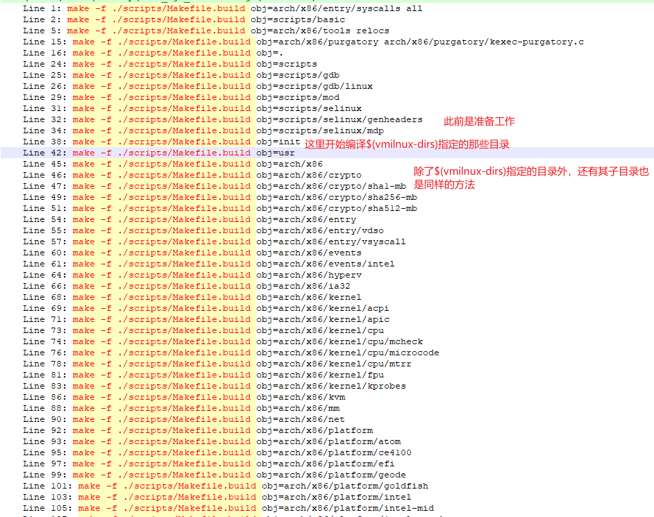

# 0. 基础知识
## make
关于make的比较好的参考资料，可以看陈皓大佬的[跟我一起写makefile](https://seisman.github.io/how-to-write-makefile/overview.html)。

# 1. kernel目录下的Makefile解析

Makefile的第一个目标```_all```
```Makefile
# <Makefile>
# That's our default target when none is given on the command line
PHONY := _all
_all:

```
这里的```_all```是个伪目标，其值如下：
```Makefile
# <Makefile>
# If building an external module we do not care about the all: rule
# but instead _all depend on modules
PHONY += all
ifeq ($(KBUILD_EXTMOD),)    # 根据$(KBUILD_EXTMOD)的不同选择不同的目标
_all: all
else
_all: modules
endif

```
$(KBUILD_EXTMOD)的值如下：

```Makefile
# <Makefile>
# Use make M=dir to specify directory of external module to build
# Old syntax make ... SUBDIRS=$PWD is still supported
# Setting the environment variable KBUILD_EXTMOD take precedence
ifdef SUBDIRS
  KBUILD_EXTMOD ?= $(SUBDIRS)
endif

ifeq ("$(origin M)", "command line")
  KBUILD_EXTMOD := $(M)
endif
```

```make M=...```在[Documentation/kbuild/module.txt](https://github.com/torvalds/linux/blob/master/Documentation/kbuild/modules.rst)有详细的说明。

所以我们的分析也分成两部分，解析```all```和解析```module```。

##  _all:all

```Makefile
# <Makefile>
# The all: target is the default when no target is given on the
# command line.
# This allow a user to issue only 'make' to build a kernel including modules
# Defaults to vmlinux, but the arch makefile usually adds further targets
all: vmlinux

```
```vmlinux```目标如下:

```Makefile
# <Makefile>
vmlinux: scripts/link-vmlinux.sh vmlinux_prereq $(vmlinux-deps) FORCE
    +$(call if_changed,link-vmlinux)
```
接下来依次分析```vmlinux```各个依赖

### vmlinux_prereq

```Makefile
# <Makefile>
# Include targets which we want to execute sequentially if the rest of the
# kernel build went well. If CONFIG_TRIM_UNUSED_KSYMS is set, this might be
# evaluated more than once.
PHONY += vmlinux_prereq
vmlinux_prereq: $(vmlinux-deps) FORCE
ifdef CONFIG_HEADERS_CHECK
    $(Q)$(MAKE) -f $(srctree)/Makefile headers_check
endif
ifdef CONFIG_GDB_SCRIPTS
    $(Q)ln -fsn `cd $(srctree) && /bin/pwd`/scripts/gdb/vmlinux-gdb.py
endif
ifdef CONFIG_TRIM_UNUSED_KSYMS
    $(Q)$(CONFIG_SHELL) $(srctree)/scripts/adjust_autoksyms.sh \
      "$(MAKE) -f $(srctree)/Makefile vmlinux"
endif
```
查看[.config](./data/.config.md)知道

```
# CONFIG_HEADERS_CHECK is not set
CONFIG_GDB_SCRIPTS=y
# CONFIG_TRIM_UNUSED_KSYMS is not set
```

所以```vmlinux_prereq```发生了变化，如下：
```Makefile
# <Makefile>
# Include targets which we want to execute sequentially if the rest of the
# kernel build went well. If CONFIG_TRIM_UNUSED_KSYMS is set, this might be
# evaluated more than once.
PHONY += vmlinux_prereq
vmlinux_prereq: $(vmlinux-deps) FORCE
    $(Q)ln -fsn `cd $(srctree) && /bin/pwd`/scripts/gdb/vmlinux-gdb.py
```
这个命令会在源码目录下创建一个软连接vmlinux-gdb到scripts/gdb/vmlinux-gdb.py，如下图：


### FORCE

```FORCE```是一个伪目标，所以如果这个伪目标是某个target的依赖，那么这个target每次都会执行，因为```FORCE```每次都会执行，且每次都会被认为是较新的。所以，vmlinux这个目标，即便各个built-in.o没有修改，但也会会被重新生成。


### $(vmlinux_deps)

```Makefile
# <Makefile>
vmlinux-deps := $(KBUILD_LDS) $(KBUILD_VMLINUX_INIT) $(KBUILD_VMLINUX_MAIN)
```

各个变量源码如下：
```Makefile
# <Makefile>
# Externally visible symbols (used by link-vmlinux.sh)
export KBUILD_VMLINUX_INIT := $(head-y) $(init-y)
export KBUILD_VMLINUX_MAIN := $(core-y) $(libs-y) $(drivers-y) $(net-y) $(virt-y)
export KBUILD_LDS          := arch/$(SRCARCH)/kernel/vmlinux.lds
```
init-y等变量定义如下
```Makefile
# <Makefile>
# Objects we will link into vmlinux / subdirs we need to visit
init-y      := init/
drivers-y   := drivers/ sound/ firmware/ ubuntu/
net-y       := net/
libs-y      := lib/
core-y      := usr/
virt-y      := virt/
...
init-y      := $(patsubst %/, %/built-in.o, $(init-y))
core-y      := $(patsubst %/, %/built-in.o, $(core-y))
drivers-y   := $(patsubst %/, %/built-in.o, $(drivers-y))
net-y       := $(patsubst %/, %/built-in.o, $(net-y))
libs-y1     := $(patsubst %/, %/lib.a, $(libs-y))
libs-y2     := $(patsubst %/, %/built-in.o, $(libs-y))
libs-y      := $(libs-y1) $(libs-y2)
virt-y      := $(patsubst %/, %/built-in.o, $(virt-y))
```

参考第一章的参考资料，patsubst函数会把“/”替换成“/built-in.o”。

而```head-y```在arch/目录下，如下：


在Makefile中找到图中的Makefile引入的地方，如下：

```Makefile
# <Makefile>
include arch/$(SRCARCH)/Makefile  # 使用了变量$(SRCARCH)

# 获取当前系统的架构
SUBARCH := $(shell uname -m | sed -e s/i.86/x86/ -e s/x86_64/x86/ \
                  -e s/sun4u/sparc64/ \
                  -e s/arm.*/arm/ -e s/sa110/arm/ \
                  -e s/s390x/s390/ -e s/parisc64/parisc/ \
                  -e s/ppc.*/powerpc/ -e s/mips.*/mips/ \
                  -e s/sh[234].*/sh/ -e s/aarch64.*/arm64/ )

# When performing cross compilation for other architectures ARCH shall be set
# to the target architecture. (See arch/* for the possibilities).
# ARCH can be set during invocation of make:
# make ARCH=ia64
# Another way is to have ARCH set in the environment.
# The default ARCH is the host where make is executed.

ARCH        ?= $(SUBARCH)
...
SRCARCH     := $(ARCH)        # SRCARCH := x86
```
故此```head-y```如下：
```Makefile
# <arch/x86/Makefile>
# Kernel objects

head-y := arch/x86/kernel/head_$(BITS).o
head-y += arch/x86/kernel/head$(BITS).o
head-y += arch/x86/kernel/ebda.o
head-y += arch/x86/kernel/platform-quirks.o

# $(BITS)
ifeq ($(CONFIG_X86_32),y)
        BITS := 32
        ...
else
        BITS := 64
        ...
endif
```
所以到最后， $(vmlinux_deps)的值是：

* init/built-in.o
* drivers/built-in.o
* sound/built-in.o
* firmware/built-in.o
* ubuntu/built-in.o
* net/built-in.o
* lib/built-in.o
* lib/lib.a
* usr/built-in.o
* virt/built-in.o
* arch/x86/kernel/head_64.o
* arch/x86/kernel/head64.o
* arch/x86/kernel/edba.o
* arch/x86/kernel/platform-quirk.o
* arch/x86/kernel/vmlinux.lds

既然$(vmlinux_deps)本身是个依赖，说明它其实也是一个目标，其规则如下：

```Makefile
# <Makefile>
# The actual objects are generated when descending,
# make sure no implicit rule kicks in
$(sort $(vmlinux-deps)): $(vmlinux-dirs) ;    # 说明其依赖为$(vmlinux-dirs)
```
而```$(vmlinux-dirs)```如下：

```Makefile
# <Makefile>
# Objects we will link into vmlinux / subdirs we need to visit
init-y		:= init/
drivers-y	:= drivers/ sound/ firmware/ ubuntu/
net-y		:= net/
libs-y		:= lib/
core-y		:= usr/
virt-y		:= virt/
core-y		+= kernel/ certs/ mm/ fs/ ipc/ security/ crypto/ block/

vmlinux-dirs	:= $(patsubst %/,%,$(filter %/, $(init-y) $(init-m) \
		     $(core-y) $(core-m) $(drivers-y) $(drivers-m) \
		     $(net-y) $(net-m) $(libs-y) $(libs-m) $(virt-y)))
# 注意init-y等在给$(vmlinux-dirs)赋值后才被设置成init/built-in.o，这$(vmlinux-dirs)就只是一系列目录
```

最终vmlinux-dirs的值如下：

来源 | 值
-|-
init-y 		|	init
core-y		|	usr arch/x86 kernel certs mm fs ipc security crypto block
drivers-y	|	drivers sound firmware ubuntu
drivers-m 	|	arch/x86/pci arch/x86/power arch/x86/video arch/x86/ras arch/x86/oprofile
net-y		|	net
libs-y 		|	lib
libs-m		|	arch/x86/lib
virt-y		|	virt

> TODO: 上述表格是我修改Makefile直接打印的$(vmlinux-dirs)获得的，具体的libs-m的值和drivers-m的值是怎么获得的，我目前还不是很清楚


```$(vmlinux-dirs)```这个```target```的依赖和命令如下：

```Makefile
# <Makefile>
# Handle descending into subdirectories listed in $(vmlinux-dirs)
# Preset locale variables to speed up the build process. Limit locale
# tweaks to this spot to avoid wrong language settings when running
# make menuconfig etc.
# Error messages still appears in the original language

PHONY += $(vmlinux-dirs)
# 以$(vmlinux-dris)为target又设置了一个新的规则
$(vmlinux-dirs): prepare scripts        
	$(Q)$(MAKE) $(build)=$@
```

### $(vmlinux-dirs)的prerequisite
由于依赖路径较长，我画了张图：


图中绿色部分表示该依赖的规则中有```command```需要执行。蓝色部分表示之前的依赖不在./Makefile中定义，而是在此部分include的文件中。

> TODO: 这部分的依赖的command执行过程需要分析一下，放到《Kbuild系统中的特殊变量与函数》中。

### $(vmlinux-dirs)的command

```Makefile
# <Makefile>

include scripts/Kbuild.include
# $(build)定义在scripts/Kbuild.include中

# <scripts/Kbuild.include>
###
# Shorthand for $(Q)$(MAKE) -f scripts/Makefile.build obj=
# Usage:
# $(Q)$(MAKE) $(build)=dir
build := -f $(srctree)/scripts/Makefile.build obj

# <Makefile>
# Handle descending into subdirectories listed in $(vmlinux-dirs)
# Preset locale variables to speed up the build process. Limit locale
# tweaks to this spot to avoid wrong language settings when running
# make menuconfig etc.
# Error messages still appears in the original language

PHONY += $(vmlinux-dirs)
$(vmlinux-dirs): prepare scripts
	$(Q)$(MAKE) $(build)=$@

# $(MAKE)是make预设的变量，代表自身
# 关于$(Q)在上一章《Kbuild系统中的特殊变量与函数》有介绍
```

所以```$(vmlinux-dirs)```这个```target```会对自己所代表的每个目录执行

```bash
make -f ./scripts/Makefile.build obj=CUR_DIR	# CUR_DIR代表$(vmlinux_dirs)中的每个目录
# -f FILE 	使用FILE作为Makefile，所以make会执行./scripts/Makefile.build
# obj=		定义变量obj，在执行上述脚本时，obj变量的值
```

执行```make -j1 V=1```的话，可以获得以下日志：



## scripts/Makefile.build


## +$(call if_changed,link-vmlinux)
规则前边的+表示，即使当前正在```make -n```（表示只打印命令，不执行），这个命令也会被执行。

函数call会调用```if_changed```

TODO: ```if_changed``` 和 ```$($(quiet)$(cmd))```

# _all:module

TODO: 待完成