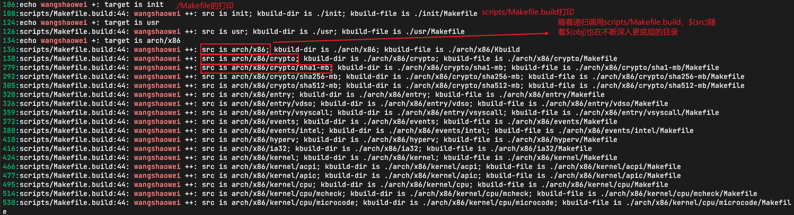

# 0. 基础知识
## make
关于make的比较好的参考资料，可以看陈皓大佬的[跟我一起写makefile](https://seisman.github.io/how-to-write-makefile/overview.html)。

# 1. Make默认目标

Makefile的第一个目标```_all```
```Makefile
# <Makefile>
# That's our default target when none is given on the command line
PHONY := _all
_all:

```
这里的```_all```是个伪目标，其值如下：
```Makefile
# <Makefile>
# If building an external module we do not care about the all: rule
# but instead _all depend on modules
PHONY += all
ifeq ($(KBUILD_EXTMOD),)    # 根据$(KBUILD_EXTMOD)的不同选择不同的目标
_all: all
else
_all: modules
endif

```
$(KBUILD_EXTMOD)的值如下：

```Makefile
# <Makefile>
# Use make M=dir to specify directory of external module to build
# Old syntax make ... SUBDIRS=$PWD is still supported
# Setting the environment variable KBUILD_EXTMOD take precedence
ifdef SUBDIRS
  KBUILD_EXTMOD ?= $(SUBDIRS)
endif

ifeq ("$(origin M)", "command line")
  KBUILD_EXTMOD := $(M)
endif
```

```make M=...```在[Documentation/kbuild/module.txt](https://github.com/torvalds/linux/blob/master/Documentation/kbuild/modules.rst)有详细的说明。

所以我们的分析也分成两部分，解析```all```和解析```module```。

#  2. _all:all

```Makefile
# <Makefile>
# The all: target is the default when no target is given on the
# command line.
# This allow a user to issue only 'make' to build a kernel including modules
# Defaults to vmlinux, but the arch makefile usually adds further targets
all: vmlinux

```
```vmlinux```目标如下:

```Makefile
# <Makefile>
vmlinux: scripts/link-vmlinux.sh vmlinux_prereq $(vmlinux-deps) FORCE
    +$(call if_changed,link-vmlinux)
```
接下来依次分析```vmlinux```各个依赖

## prerequisite

### vmlinux_prereq

```Makefile
# <Makefile>
# Include targets which we want to execute sequentially if the rest of the
# kernel build went well. If CONFIG_TRIM_UNUSED_KSYMS is set, this might be
# evaluated more than once.
PHONY += vmlinux_prereq
vmlinux_prereq: $(vmlinux-deps) FORCE
ifdef CONFIG_HEADERS_CHECK
    $(Q)$(MAKE) -f $(srctree)/Makefile headers_check
endif
ifdef CONFIG_GDB_SCRIPTS
    $(Q)ln -fsn `cd $(srctree) && /bin/pwd`/scripts/gdb/vmlinux-gdb.py
endif
ifdef CONFIG_TRIM_UNUSED_KSYMS
    $(Q)$(CONFIG_SHELL) $(srctree)/scripts/adjust_autoksyms.sh \
      "$(MAKE) -f $(srctree)/Makefile vmlinux"
endif
```
查看[.config](./data/.config.md)知道

```
# CONFIG_HEADERS_CHECK is not set
CONFIG_GDB_SCRIPTS=y
# CONFIG_TRIM_UNUSED_KSYMS is not set
```

所以```vmlinux_prereq```发生了变化，如下：
```Makefile
# <Makefile>
# Include targets which we want to execute sequentially if the rest of the
# kernel build went well. If CONFIG_TRIM_UNUSED_KSYMS is set, this might be
# evaluated more than once.
PHONY += vmlinux_prereq
vmlinux_prereq: $(vmlinux-deps) FORCE
    $(Q)ln -fsn `cd $(srctree) && /bin/pwd`/scripts/gdb/vmlinux-gdb.py
```
这个命令会在源码目录下创建一个软链接vmlinux-gdb到scripts/gdb/vmlinux-gdb.py，如下图：


### FORCE

```FORCE```是一个伪目标，所以如果这个伪目标是某个target的依赖，那么这个target每次都会执行，因为```FORCE```每次都会执行，且每次都会被认为是较新的。所以，vmlinux这个目标，即便各个built-in.o没有修改，但也会会被重新生成。

### $(vmlinux-deps)

先看定义

```Makefile
# <Makefile>
vmlinux-deps := $(KBUILD_LDS) $(KBUILD_VMLINUX_INIT) $(KBUILD_VMLINUX_MAIN)
```

各个变量源码如下：
```Makefile
# <Makefile>
# Externally visible symbols (used by link-vmlinux.sh)
export KBUILD_VMLINUX_INIT := $(head-y) $(init-y)
export KBUILD_VMLINUX_MAIN := $(core-y) $(libs-y) $(drivers-y) $(net-y) $(virt-y)
export KBUILD_LDS          := arch/$(SRCARCH)/kernel/vmlinux.lds
```
init-y等变量定义如下
```Makefile
# <Makefile>
# Objects we will link into vmlinux / subdirs we need to visit
init-y      := init/
drivers-y   := drivers/ sound/ firmware/ ubuntu/
net-y       := net/
libs-y      := lib/
core-y      := usr/
virt-y      := virt/
...
init-y      := $(patsubst %/, %/built-in.o, $(init-y))
core-y      := $(patsubst %/, %/built-in.o, $(core-y))
drivers-y   := $(patsubst %/, %/built-in.o, $(drivers-y))
net-y       := $(patsubst %/, %/built-in.o, $(net-y))
libs-y1     := $(patsubst %/, %/lib.a, $(libs-y))
libs-y2     := $(patsubst %/, %/built-in.o, $(libs-y))
libs-y      := $(libs-y1) $(libs-y2)
virt-y      := $(patsubst %/, %/built-in.o, $(virt-y))
```

参考第0节的参考资料，patsubst函数会把“/”替换成“/built-in.o”。

而```head-y```在arch/目录下，如下：


在Makefile中找到图中的Makefile引入的地方，如下：

```Makefile
# <Makefile>
include arch/$(SRCARCH)/Makefile  # 使用了变量$(SRCARCH)

# 获取当前系统的架构
SUBARCH := $(shell uname -m | sed -e s/i.86/x86/ -e s/x86_64/x86/ \
                  -e s/sun4u/sparc64/ \
                  -e s/arm.*/arm/ -e s/sa110/arm/ \
                  -e s/s390x/s390/ -e s/parisc64/parisc/ \
                  -e s/ppc.*/powerpc/ -e s/mips.*/mips/ \
                  -e s/sh[234].*/sh/ -e s/aarch64.*/arm64/ )

# When performing cross compilation for other architectures ARCH shall be set
# to the target architecture. (See arch/* for the possibilities).
# ARCH can be set during invocation of make:
# make ARCH=ia64
# Another way is to have ARCH set in the environment.
# The default ARCH is the host where make is executed.

ARCH        ?= $(SUBARCH)
...
SRCARCH     := $(ARCH)        # SRCARCH := x86
```
对于x86架构，```head-y```如下：
```Makefile
# <arch/x86/Makefile>
# Kernel objects

head-y := arch/x86/kernel/head_$(BITS).o
head-y += arch/x86/kernel/head$(BITS).o
head-y += arch/x86/kernel/ebda.o
head-y += arch/x86/kernel/platform-quirks.o

# $(BITS)
ifeq ($(CONFIG_X86_32),y)
        BITS := 32
        ...
else
        BITS := 64
        ...
endif
```
所以到最后， $(vmlinux_deps)的值是：

* init/built-in.o
* drivers/built-in.o
* sound/built-in.o
* firmware/built-in.o
* ubuntu/built-in.o
* net/built-in.o
* lib/built-in.o
* lib/lib.a
* usr/built-in.o
* virt/built-in.o
* arch/x86/kernel/head_64.o
* arch/x86/kernel/head64.o
* arch/x86/kernel/edba.o
* arch/x86/kernel/platform-quirk.o
* arch/x86/kernel/vmlinux.lds

再看规则：

```Makefile
# <Makefile>
# The actual objects are generated when descending,
# make sure no implicit rule kicks in
$(sort $(vmlinux-deps)): $(vmlinux-dirs) ;    # 说明其prerequisite为$(vmlinux-dirs)，没有对应的command
```
### $(vmlinux-dirs)

先看定义

```Makefile
# <Makefile>
# Objects we will link into vmlinux / subdirs we need to visit
init-y		:= init/
drivers-y	:= drivers/ sound/ firmware/ ubuntu/
net-y		:= net/
libs-y		:= lib/
core-y		:= usr/
virt-y		:= virt/
core-y		+= kernel/ certs/ mm/ fs/ ipc/ security/ crypto/ block/

vmlinux-dirs	:= $(patsubst %/,%,$(filter %/, $(init-y) $(init-m) \
		     $(core-y) $(core-m) $(drivers-y) $(drivers-m) \
		     $(net-y) $(net-m) $(libs-y) $(libs-m) $(virt-y)))
# 注意init-y等在给$(vmlinux-dirs)赋值后才被设置成init/built-in.o，这$(vmlinux-dirs)就只是一系列目录
```

暂且不去探索init-m、core-m等变量的值，可以通过添加以下日志，打印make执行到这里时$(vmlinux-dirs)的值。

```makefile
# <Makefile>
$(vmlinux-dirs): prepare scripts
    @echo wangshaowei +: $(vmlinux-dirs)			# 注意这里必须要用$(vmlinux-dirs)，而不是$@
    $(Q)$(MAKE) $(build)=$@
```

然后执行```make -j1 -n V=1```后得到输出如下：


可以看到，输出了不只一次，按理说，这个输出应该只有一次的，因为目标只写了一次，但是Make会把```$(vmlinux-dirs)```作为```target```的规则复制成多个以```$(vmlinux-dirs)的值```作为```target```但```prerequisite```和```command```不变的规则，这个规则可以参考[**多目标**](https://seisman.github.io/how-to-write-makefile/rules.html#id7)，之后我会证明这点。

根据输出结果，vmlinux-dirs的值如下：

来源 | 值
-|-
init-y 		|	init
core-y		|	usr arch/x86 kernel certs mm fs ipc security crypto block
drivers-y	|	drivers sound firmware ubuntu
drivers-m 	|	arch/x86/pci arch/x86/power arch/x86/video arch/x86/ras arch/x86/oprofile
net-y		|	net
libs-y 		|	lib
libs-m		|	arch/x86/lib
virt-y		|	virt

> TODO: libs-m的值和drivers-m的值来自于arch/x86/Makefile，或者说来自于对应架构的Makefile，主makefile在给$(vmlinux-dirs)赋值前就已经把arch/x86/Makefile包含进来了。

再看规则

```Makefile
# <Makefile>
# Handle descending into subdirectories listed in $(vmlinux-dirs)
# Preset locale variables to speed up the build process. Limit locale
# tweaks to this spot to avoid wrong language settings when running
# make menuconfig etc.
# Error messages still appears in the original language

PHONY += $(vmlinux-dirs)
$(vmlinux-dirs): prepare scripts        
	$(Q)$(MAKE) $(build)=$@
```

### $(vmlinux-dirs)的prerequisite
由于依赖路径较长，我画了张图：


图中

* 绿色部分表示该依赖的规则中有```command```需要执行；
* 蓝色部分表示之前的依赖不在./Makefile中定义，而是在此部分include的文件中；
* 灰色部分表示该目标没有prerequisite和command。

> TODO: 这部分的依赖的command执行过程需要分析一下，放到《Kbuild系统中的特殊变量与函数》中。

### $(vmlinux-dirs)的command

```Makefile
# <Makefile>
include scripts/Kbuild.include
# $(build)定义在scripts/Kbuild.include中

------------------------------------------------------------

# <scripts/Kbuild.include>
###
# Shorthand for $(Q)$(MAKE) -f scripts/Makefile.build obj=
# Usage:
# $(Q)$(MAKE) $(build)=dir
build := -f $(srctree)/scripts/Makefile.build obj

------------------------------------------------------------

# <Makefile>
# Handle descending into subdirectories listed in $(vmlinux-dirs)
# Preset locale variables to speed up the build process. Limit locale
# tweaks to this spot to avoid wrong language settings when running
# make menuconfig etc.
# Error messages still appears in the original language

PHONY += $(vmlinux-dirs)
$(vmlinux-dirs): prepare scripts
	$(Q)$(MAKE) $(build)=$@

# $(MAKE)是make预设的变量，代表自身
# 关于$(Q)在上一章《Kbuild系统中的特殊变量与函数》有介绍
```

> TODO: $(Q)等的赋值，放到《Kbuild系统中的特殊变量与函数》中。

所以```$(vmlinux-dirs)```这个规则会自动转换成多个规则，这些规则的```target```就是```$(vmlinux-dirs)```的值，如下：

```bash
init: prepare scripts
	$(Q)$(MAKE) $(build)=$@
usr: prepare scripts
	$(Q)$(MAKE) $(build)=$@
...
virt: prepare scripts
	$(Q)$(MAKE) $(build)=$@
```

在```$(vmlinux-dirs)```规则的```command```添加如下日志打印：

```bash
$(vmlinux-dirs): prepare scripts
    @echo wangshaowei +: target is $@			# 注意这里必须要用$@，而不是$(vmlinux-dirs)
    $(Q)$(MAKE) $(build)=$@
```

得到结果如下：


所以最后```$(vmlinux-dirs)```的```command```会执行如下多个命令：

```
make build := -f $(srctree)/scripts/Makefile.build obj=init
make build := -f $(srctree)/scripts/Makefile.build obj=usr
make build := -f $(srctree)/scripts/Makefile.build obj=arch/x86
...
make build := -f $(srctree)/scripts/Makefile.build obj=net
make build := -f $(srctree)/scripts/Makefile.build obj=lib
make build := -f $(srctree)/scripts/Makefile.build obj=arch/x86/lib
make build := -f $(srctree)/scripts/Makefile.build obj=virt

$(srctree)代表内核源码根目录
```

可以看到```Makefile```直接把所有重要的工作交给了```Makefile.build```，只负责给它传递不同的```$(obj)```。这个脚本的工作，直接参考第3章。

## command

```if_changed```的详细分析过程参考[Kbuild系统中的特殊变量与函数](./3/1_Kbuild系统中的特殊变量与函数.md)，这里简单介绍下其大概功能：

1. 判断已经生成的依赖是否有更新以及是否有未生成的依赖，如果满足条件则执行2；否则结束；
2. 根据make命令的V参数，判断打印命令的详情或是简略信息或是原因；
3. 执行命令；
4. 将命令保存到对应的cmd隐藏文件中

所以如果执行```make```，```+$(call if_changed,link-vmlinux)```会找到```cmd_link-vmlinux```将其打印出来并执行。cmd_link-vmlinux如下：

```makefile
# Final link of vmlinux with optional arch pass after final link
    cmd_link-vmlinux =                                                 \
	$(CONFIG_SHELL) $< $(LD) $(LDFLAGS) $(LDFLAGS_vmlinux) ;       \
	$(if $(ARCH_POSTLINK), $(MAKE) -f $(ARCH_POSTLINK) $@, true)
```

随后将该命令保存到```.vmlinux.cmd```中，可以执行```make -j1 -n```查看，如下：


# 3. scripts/Makefile.build

接下来就需要看scripts/Makefile.build做了什么，直接找```default target```，如下：

```makefile
# <scripts/Makefile.build>
PHONY := __build
__build:
...
__build: $(if $(KBUILD_BUILTIN),$(builtin-target) $(lib-target) $(extra-y)) \
	 $(if $(KBUILD_MODULES),$(obj-m) $(modorder-target)) \
	 $(subdir-ym) $(always)
	@:
```

可见```__build```rule的```command```为“:”，在bash中，这代表什么都不做。所以只需要分析其```prerequisite```，首先看两个变量的定义，如下：

```makefile
# <Makefile>
KBUILD_MODULES :=
KBUILD_BUILTIN := 1

# If we have only "make modules", don't compile built-in objects.
# When we're building modules with modversions, we need to consider
# the built-in objects during the descend as well, in order to
# make sure the checksums are up to date before we record them.

ifeq ($(MAKECMDGOALS),modules)
  KBUILD_BUILTIN := $(if $(CONFIG_MODVERSIONS),1)
endif

# If we have "make <whatever> modules", compile modules
# in addition to whatever we do anyway.
# Just "make" or "make all" shall build modules as well

ifneq ($(filter all _all modules,$(MAKECMDGOALS)),)
  KBUILD_MODULES := 1
endif

ifeq ($(MAKECMDGOALS),)
  KBUILD_MODULES := 1
endif

export KBUILD_MODULES KBUILD_BUILTIN
```

```$(MAKECMDGOALS)```是make的特殊变量，用来表示make的第一个参数，我们分析的是```__all: all```，这是默认目标，make没有参数。所以```$(KBUILD_MODULES)```和```$(KBUILD_BUILTIN)```的值都是1，于是```__build```rule就是

```makefile
__build: $(builtin-target) $(lib-target) $(extra-y) \
		 $(obj-m) $(modorder-target) \
		 $(subdir-ym) $(always)
	@:
```

接下来依次分析每个变量的值

## $(builtin-target)

定义如下：

```makefile
# <scripts/Makefile.build>
src := $(obj)

# The filename Kbuild has precedence over Makefile
kbuild-dir := $(if $(filter /%,$(src)),$(src),$(srctree)/$(src))		# srctree在__all:all的情况下，是源码根目录
kbuild-file := $(if $(wildcard $(kbuild-dir)/Kbuild),$(kbuild-dir)/Kbuild,$(kbuild-dir)/Makefile)
# $(warning wangshaowei [obj]: src is $(src); kbuild-dir is $(kbuild-dir); kbuild-file is $(kbuild-file))	# 注释去掉打印日志
include $(kbuild-file)
...
ifneq ($(strip $(obj-y) $(obj-m) $(obj-) $(subdir-m) $(lib-target)),)
builtin-target := $(obj)/built-in.o
endif

```

首先看```kbuild-file```，可以追加一些日志后，执行```make -j1 -n```，打印如下



随后，```include $(kbuild-file)```就会将```$(obj)```指定的目录下的```Kbuild```或```Makefile```包含进来，这些文件中一般会定义```obj-y```等变量，可以参考[驱动程序员需要知道的Kbuild知识](./驱动程序员需要知道的Kbuild知识.md)。在```obj```作为给定条件的情况下，```builtin-target```为```$(obj)/built-in.o```。

接下来看```$(builtin-target)```的规则

```makefile
# <scripts/Makfile.build>
#
# Rule to compile a set of .o files into one .o file
#
ifdef builtin-target

ifdef CONFIG_THIN_ARCHIVES				# 根据.config文件中对CONFIG_THIN_ARCHIVES的定义来区分使用ar命令还是使用ld命令。
  cmd_make_builtin = rm -f $@; $(AR) rcST$(KBUILD_ARFLAGS)
  cmd_make_empty_builtin = rm -f $@; $(AR) rcST$(KBUILD_ARFLAGS)
  quiet_cmd_link_o_target = AR      $@
else
  cmd_make_builtin = $(LD) $(ld_flags) -r -o
  cmd_make_empty_builtin = rm -f $@; $(AR) rcs$(KBUILD_ARFLAGS)
  quiet_cmd_link_o_target = LD      $@
endif

# If the list of objects to link is empty, just create an empty built-in.o
cmd_link_o_target = $(if $(strip $(obj-y)),\
		      $(cmd_make_builtin) $@ $(filter $(obj-y), $^) \
		      $(cmd_secanalysis),\
		      $(cmd_make_empty_builtin) $@)

$(builtin-target): $(obj-y) FORCE
	$(call if_changed,link_o_target)

targets += $(builtin-target)
endif # builtin-target
```

### prerequisite


# _all:module

TODO: 待完成