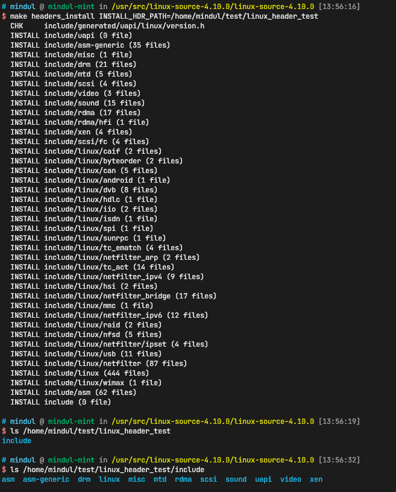

```make headers_install```命令将内核的头文件导出成方便用户空间使用的形式。

Linux内核导出的头文件描述了用户空间程序调用内核服务时可以使用的```API```，而系统上的C库（比如glibc和uClibc）基于这些API定义了**系统调用**以及这些系统调用使用的**常量**和**数据结构**。C库的头文件所在目录的```linux```子目录下包含了系统调用的头文件。系统的libc头文件默认安装位置是```/usr/include```而内核头文件通常是```/usr/include/linux```或者```/usr/include/asm```中。

内核头向后兼容，但不向前兼容。这意味着一个使用旧内核头根据C库构建的程序可以在更新的内核上运行（尽管它可能无法访问新的功能），但基于较新内核头构建的程序可能无法在旧内核上运行。

```make headers_install```可以运行在内核源码的根目录下（或者使用标准的**树外构建**），这个命令接受两个可选参数：```ARCH```和```INSTALL_HDR_PATH```，如：

```bash
make headers_install ARCH=i386 INSTALL_HDR_PATH=/usr
```

```ARCH```指定要生成的头文件所适用的架构，默认是当前的架构。导出的内核头文件的```linux```和```asm```目录是架构特定的，在内核源码中使用如下命令查看所有被支持的架构

```bash
ls -d include/asm-* | sed 's/.*-//'
```

```INSTALL_HDR_PATH```指定要安装内核头文件的位置，默认是```usr```，linux头文件会被安装到```INSTALL_HDR_PATH/include/```下。

```make headers_install_all```会导出所有架构的头文件。这主要是发行版维护人员感兴趣的，他们从生成的include目录创建了一个与体系结构无关的原始代码。该命令可以用```HDR_ARCH_LIST```来指定多个架构。请记住，在构建以这种方式导出标头的C库之前，通过```mv```或```ln -s```提供适当的```linux/asm```目录。

内核头导出基础设施由David Woodhouse<dwmw2@infradead.org>维护。

## 示例

如下：



可以看到只有一个asm-generic和默认架构的asm目录。


