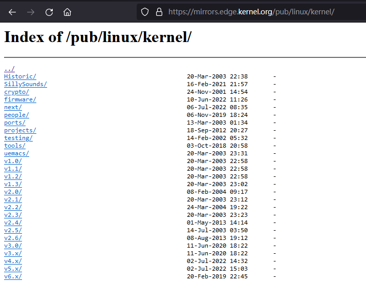
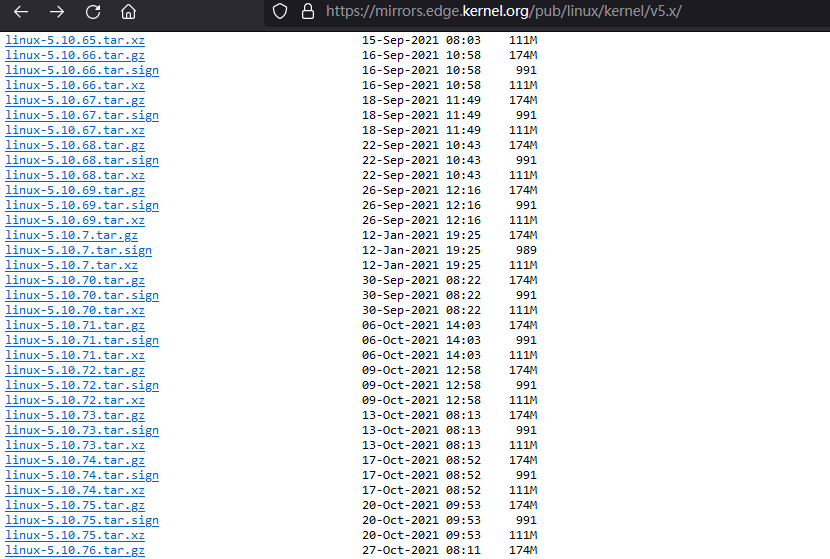
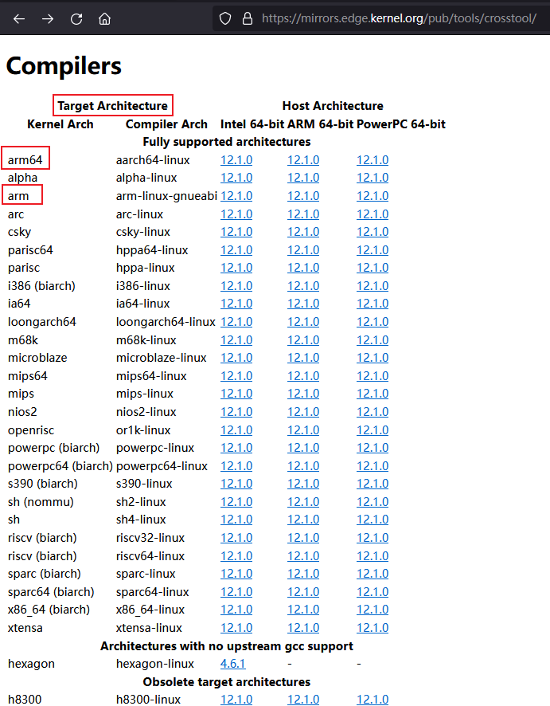
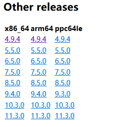

## 内核源码与交叉编译器

[https://mirrors.edge.kernel.org/pub/](https://mirrors.edge.kernel.org/pub/)

本站上有各个版本的内核源码镜像，如下：

此外在下边的路径下还有不同版本的交叉编译器。

[https://mirrors.edge.kernel.org/pub/tools/crosstool/](https://mirrors.edge.kernel.org/pub/tools/crosstool/)

